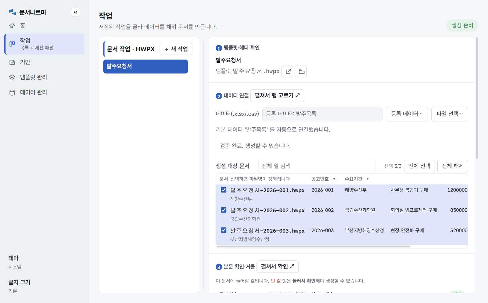

# 문서나르미

[](../../releases)
[](LICENSE)


**엑셀 데이터로 한글(HWPX) 문서를 일괄 생성합니다.**

누름틀 템플릿을 준비해 두면 데이터 건수만큼 완성 문서가 나옵니다. 한글(HWP)
프로그램이 없어도 동작합니다 — COM 자동화나 매크로 없이 `zipfile` + `lxml` 로
HWPX 파일을 직접 읽고 씁니다.

공고서, 계약서, 발주요청서. 행정·조달 실무에는 같은 서식에 값만 바꿔 수십 건씩
만드는 문서가 많습니다. 한글을 띄워 놓고 복사-붙여넣기를 반복하던 그 일을
템플릿·매핑·파일명을 한 번 저장해 둔 **작업(Job)** 으로 바꿔서, 다음부터는 데이터만
갈아 끼우면 되게 합니다.



## 설치

Windows 10/11 전용입니다. WebView2 런타임이 필요한데 Win11 에는 기본 탑재되어
있고 Win10 도 Edge 업데이트로 대개 이미 설치되어 있습니다.

- **설치본**: [Releases](../../releases)에서 `HWPX-Filler-*-Setup.exe`
- **포터블**: 같은 곳의 `HWPX-Filler-*-portable.zip` 을 풀고 `hwpx-filler-web.exe` 실행
- **소스에서**: 아래 [개발](#개발) 참고

## 빠른 시작

앱을 띄우면 「작업」 화면이 열립니다. 첫 문서까지 세 걸음입니다.

1. **[＋ 첫 작업 만들기]** — 라이브러리에서 누름틀 템플릿을 고르고, 엑셀/CSV 를
   골라 필드를 매핑한 뒤, 작업 이름과 파일명 패턴을 붙여 저장합니다.
2. 목록에서 작업을 고르고 **[이 작업으로 문서 생성]** — 저장 폴더에 완성 HWPX 가
   데이터 건수만큼 생깁니다.
3. 다음부터는 작업만 고르고 생성합니다. 데이터가 바뀌면 그때의 파일을 다시
   겨눠 주면 됩니다.

예제 템플릿·데이터가 갖춰진 **[101 사용설명서](examples/quickstart-101/README.md)**
를 따라가면 15~20분 안에 전 과정을 볼 수 있습니다 (스크린샷 포함, 저장소
체크아웃 필요).

## 무엇을 할 수 있나

- **HWPX 일괄 생성** — 템플릿에서 필드를 자동 추출하고, CSV/엑셀 헤더와 자동
  매칭을 제안합니다. 파일명 패턴(`발주요청서-{{공고번호}}`)으로 건별 이름을 찍고,
  생성 내역은 원장(JSON)에 남습니다.
- **기안문 즉시 채움** — 평문 `{{토큰}}` 초안에 같은 데이터를 채워 미리보고
  클립보드로 복사합니다. 여러 행을 큐로 넘기며 연달아 처리할 수 있습니다.
- **템플릿 관리** — HWPX·TXT 라이브러리, 위생 점검(유사 필드명·미치환 토큰),
  평문 초안을 누름틀 템플릿으로 컴파일하는 저작 보조.
- **데이터 참조 등록** — 자주 쓰는 데이터 파일을 등록해 두고 재사용합니다.
  경로만 저장하고 생성할 때마다 그 순간의 파일을 다시 읽습니다.

### 조용히 틀리지 않습니다

이 앱의 규칙은 하나입니다: **묻고 확정하게 하거나, 시끄럽게 알린다.** 법적 효력이
있는 문서를 만드는 도구라서, 애매할 때 조용히 추측하고 넘어가는 일이 없습니다.

- 빈 값이 있으면 생성이 잠깁니다. 확인하고 진행한 빈 값은 `〘미입력·필드명〙`
  표식으로 문서에 남아 눈에 띕니다.
- 같은 이름 파일이 있으면 덮어쓰기 확인이 먼저 섭니다.
- 데이터에 없는 토큰은 기안 미리보기에 빨갛게 그대로 남습니다. 빈칸으로 새지
  않습니다.
- 생성 직전에 실제 채워질 본문을 거울처럼 보여주고 확인을 받습니다.

## 제약

- Windows 전용 (WebView2). 한글 프로그램은 결과물을 열어볼 때만 있으면 됩니다.
- 지원 데이터: `.xlsx` / `.csv` (utf-8-sig 권장).
- 나라장터(조달청 API) 연동은 어댑터·CLI 수준으로만 유지 중이고 앱 화면에는
  노출되지 않습니다.

## CLI

앱과 같은 엔진을 얇게 감싼 CLI 가 있습니다. 자동화 파이프라인이나 검증용이고,
일상 사용은 앱이 낫습니다.

```bash
python -m hwpxfiller.cli --template T.hwpx --fields              # 요구 필드 출력
python -m hwpxfiller.cli --template T.hwpx --data data.xlsx \
    --out ./out --pattern "공고서-{{계약명}}" --ledger            # 엑셀 일괄 생성
python -m hwpxfiller.cli schema T.hwpx --out schema.json         # 스키마 추출
python -m hwpxfiller.cli lint T.hwpx                             # 템플릿 위생 점검
```

하위명령 전체는 `python -m hwpxfiller.cli --help` 에 있습니다.

## 자매 도구: hwpxdiff

같은 저장소에 공통 파서 `hwpxcore` 를 공유하는 읽기 쪽 도구가 하나 더 있습니다.
`hwpxdiff` 는 규격서·공고서 두 판본을 의미 기반으로 비교해 좌우 대조(신구대비표)로
렌더합니다. filler 가 문서를 *쓰는* 도구라면 diff 는 *읽고 견주는* 도구입니다.
filler 만 쓸 거라면 무시해도 됩니다.

```bash
python -m hwpxdiff.webapp                                  # GUI 리뷰어
python -m hwpxdiff.cli v2025.hwpx v2026.hwpx --html report.html
```

## 개발

Python·의존성은 [`uv`](https://docs.astral.sh/uv/) 로 관리합니다. 고정된 Python
3.13 도 `uv` 가 설치하므로 시스템 Python 이나 수동 venv 는 필요 없습니다.

```powershell
# 최초 1회 — uv 설치 후
uv python install 3.13
uv sync --locked --all-extras --group dev --group build

.\run-filler.ps1        # 앱 실행 (= python -m hwpxfiller.webapp)
.\test.ps1              # 품질·타입 검사 + 전체 테스트 + coverage
.\build.ps1             # PyInstaller onedir 포터블 빌드 + self-check
.\package-installer.ps1 # Inno Setup 6 설치 후 설치 EXE 생성
```

`pyproject.toml` 버전과 같은 `vX.Y.Z` 태그를 push 하면 GitHub Actions 가
테스트·빌드·설치/제거 스모크·SHA-256 생성을 거쳐 릴리스를 게시합니다. 저장소
secret `WINDOWS_CERTIFICATE_BASE64` / `WINDOWS_CERTIFICATE_PASSWORD` 가 있으면
Authenticode 서명까지 합니다.

### 구조

사용자에게 보이는 제품명은 **문서나르미**, 저장소·패키지·실행 파일 등 기술
식별자는 `hwpx-filler`(`hwpxfiller`) 계열입니다.

공통 파서 `hwpxcore` 위에 제품 `hwpxfiller` 가 서고, 의존은 아래로만 흐릅니다
(`hwpxfiller → hwpxcore ← hwpxdiff`, 두 제품 간 상호 임포트 금지).

| 모듈 | 역할 |
|------|------|
| `hwpxcore/package.py` | HWPX OCF ZIP 열기/저장 |
| `hwpxcore/text_extract.py` | 본문 텍스트 추출 + 커버리지 원장 |
| `hwpxcore/validate.py` | 사전검증(누락/빈값) |
| `core/fields.py` | 누름틀 XML DOM 주입 |
| `core/schema.py` | 템플릿 스키마 추출(필드·타입·표 영역·라벨) |
| `core/authoring.py` | 평문 `{{토큰}}` → 누름틀 컴파일 |
| `core/lint.py` | 템플릿 위생 lint + 판본 간 필드 드리프트 |
| `core/mapping.py` | 소스 레코드 → 템플릿 필드 매핑 |
| `core/engine.py` / `batch.py` | 단일/일괄 문서 생성 |
| `core/job.py` | 작업(Job) 앵커 + 레지스트리 |
| `core/dataset_pool.py` | 데이터 참조 레지스트리(실행 시 재읽기) |
| `core/fill_ledger.py` | 생성 원장 |
| `data/excel.py` | 엑셀·CSV 데이터 소스 |
| `data/nara.py` | 나라장터 API 소스 (동결, 앱 미노출) |
| `webapp/` · `gui/` | pywebview 웹 UI |

### 문서

- [101 사용설명서](examples/quickstart-101/README.md) ·
  [102 실전 조합](examples/quickstart-101/PATTERNS.md)
- [개발·빌드·배포 환경](docs/DEVELOPMENT_ENVIRONMENT.md)
- [문서 지도](docs/README.md) — 설계 결정 기록과 탐색 순서

## 만든 배경

사내에서 쓰던 조달 공고서 생성용 VBA 매크로(UnivContractor)를 Python 으로
포팅하다가, 원본에 없던 것들이 필요해져서 다시 세운 프로젝트입니다. 일급
작업(Job) 개념, 데이터 소스 플러그인, 생성 원장, 템플릿 위생 점검이 그렇게
붙었습니다. 범용 문서 툴킷을 쓰지 않고 따로 만든 이유를 요약하면,
기계가 읽기 좋은 문서를 빨리 만드는 것과 법적 효력이 있는 문서를 틀리지 않게
만드는 것은 다른 문제라서입니다.

## 라이선스

[MIT](LICENSE). 동봉 폰트 Pretendard 는 SIL OFL 1.1 입니다.
