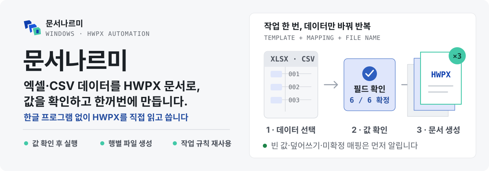
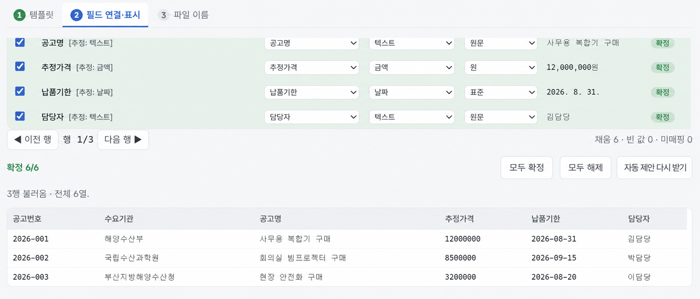
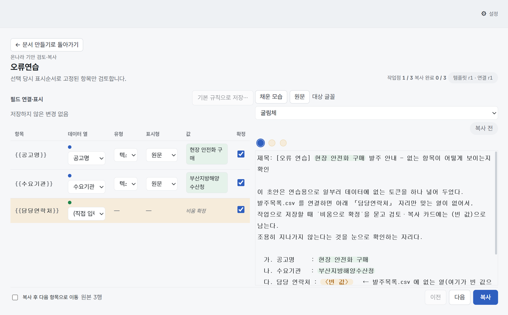

<p align="center">
  <picture>
    <source media="(max-width: 520px)" srcset="./assets/readme/hero-mobile.svg">
    
  </picture>
</p>

<p align="center">
  <a href="https://github.com/rfastball/hwpx-filler/releases"></a>
  <a href="./LICENSE"></a>
  
</p>

<p align="center">
  <a href="https://github.com/rfastball/hwpx-filler/releases">다운로드</a> ·
  <a href="./examples/quickstart-101/README.md">15분 실습</a> ·
  <a href="#조용히-틀리지-않는-안전장치">안전장치</a> ·
  <a href="#개발">개발</a>
</p>

문서나르미는 같은 HWPX 서식에 값만 바꿔 반복 작성하는 일을 위한 Windows 앱입니다.
엑셀·CSV의 각 행을 누름틀 템플릿에 채워 완성 문서를 만들며, 한글 프로그램이나 COM
자동화 없이 HWPX 파일을 직접 읽고 씁니다.

공고서, 계약서, 발주요청서처럼 같은 서식을 수십 건 만드는 일을
`템플릿 + 필드 연결 + 파일 이름`으로 저장한 **작업(Job)** 으로 바꿉니다. 다음부터는
저장한 작업에 연결된 데이터를 열고 만들 행을 선택해 생성합니다.

## 실제 화면

자동 연결은 제안일 뿐입니다. 템플릿 필드와 데이터 열을 사람이 확인해 `6/6`을
확정하는 연결 확인 화면입니다. 아래 이미지는 촬영 당시의 예시이며 현재 화면 계약은 문서 지도를 따릅니다.

[](examples/quickstart-101/img/04-mapping-confirm.png)

*핵심 매핑 영역을 확대한 화면입니다. 이미지를 누르면 전체 화면을 볼 수 있습니다.*

*[101 사용설명서](examples/quickstart-101/README.md)는 실제 앱에서 HWPX 3건과 채운 기안
텍스트 1건을 만들고, 빈 값 경고까지 확인하는 15~20분 실습입니다.*

## 작동 방식

1. **작업을 한 번 저장합니다.** 템플릿·필드 연결·데이터 참조를 묶고, HWPX 작업에는
   파일명 규칙을 정합니다. 자동 연결 제안은 사람이 확인합니다.
2. **연결된 데이터를 엽니다.** 작업은 파일 경로·시트·헤더 행·종류를 기억하지만 데이터
   행을 저장하지 않습니다. 열린 데이터에서 이번에 만들 행을 직접 고릅니다.
3. **실행 조건을 확인합니다.** 필요한 연결·빈 값·템플릿 변경·포함할 내용의 게이트를
   해소합니다. 별도의 생성 직전 승인 시트는 없습니다.
4. **행별 결과를 만듭니다.** HWPX는 파일로 만들고 결과를 화면에서 확인합니다. TXT
   작업은 채운 내용을 한 건씩 검토해 복사합니다. JSON 원장은 CLI에서 `--ledger`로
   요청할 때만 남깁니다.

## 설치

기준 환경은 **Windows 11 x64 + WebView2 Runtime**입니다.

- **설치본** — [Releases](https://github.com/rfastball/hwpx-filler/releases)에서
  `HWPX-Filler-*-Setup.exe` 다운로드
- **포터블** — 같은 곳의 `HWPX-Filler-*-portable.zip`을 풀고
  `hwpx-filler-web.exe` 실행
- **소스 실행** — 아래 [개발](#개발) 절 참고

## 빠른 시작

1. **문서 작업** → **＋ 새 작업**에서 누름틀 템플릿과 엑셀·CSV를 고르고, 필드 연결과
   파일명 규칙을 확인해 작업을 저장합니다.
2. **문서 작업**에서 저장한 작업을 골라 **문서 만들기에서 사용**을 누릅니다.
3. **문서 만들기**에서 연결된 데이터의 행을 선택하고 필요한 확인을 마친 뒤 생성합니다.
   만들어진 문서는 **내용 보기**로 확인합니다.

저장소를 내려받았다면 예제 템플릿과 데이터가 들어 있는
**[101 사용설명서](examples/quickstart-101/README.md)** 를 따라 처음부터 끝까지 재현할 수
있습니다. 새 체크아웃에서는 먼저 `.\build-web.ps1`로 프런트를 빌드해야 합니다. 이 실습
세트는 아직 설치본·포터블 배포본에는 포함되지 않습니다.

## 주요 기능

- **HWPX 일괄 생성** — 템플릿 필드를 추출하고 데이터 열 연결을 제안합니다. 선택한
  행마다 파일명 패턴(`발주요청서-{{공고번호}}`)을 적용하고 결과를 화면에서 확인합니다.
- **기안문 검토·복사** — 평문 `{{토큰}}` 초안을 같은 데이터로 채우고, 여러 행을 한
  건씩 검토해 클립보드로 복사합니다.
- **템플릿 관리** — HWPX·TXT 라이브러리, 유사 필드명·미치환 토큰 점검, 평문 초안을
  누름틀 템플릿으로 바꾸는 저작 보조를 제공합니다.
- **데이터 참조 재사용** — 자주 쓰는 데이터 경로를 저장하되, 명시적으로 데이터를 열거나 새로고침할 때 원본을
  읽습니다.

## 조용히 틀리지 않는 안전장치

> **묻고 확정하게 하거나, 시끄럽게 알립니다.** 법적 효력이 있는 문서를 만들기 때문에
> 애매한 값을 조용히 추측하고 넘어가지 않습니다.

- 자동 연결 제안은 사람이 확정해야 사용할 수 있습니다.
- 빈 값이 있으면 생성이 잠깁니다. 승인한 빈 값은 `〘미입력·필드명〙`으로 문서에 남습니다.
- 같은 이름의 파일이 있으면 덮어쓰기 전에 목록을 보여주고 확인을 받습니다.
- 데이터에 없는 토큰은 먼저 기안 미리보기에서 빨간 표식으로 남습니다. 사용자가 비움을
  확정하면 검토·복사 화면에도 `〈빈 값〉`으로 남아 빈칸처럼 사라지지 않습니다.
- 생성 뒤 배달된 파일을 다시 읽어 내용을 확인합니다. 입력이 바뀌면 과거 결과와 구분합니다.



*데이터에 없는 `{{담당연락처}}`를 일부러 넣고 비움을 확정한 뒤의 오류 연습입니다.
오른쪽 결과에도 `〈빈 값〉`이 그대로 보입니다.*

## 호환성과 제약

- Windows 전용이며 기준 환경은 Windows 11 + WebView2입니다.
- 지원 데이터는 `.xlsx`, `.xlsm`, `.csv`입니다. CSV는 UTF-8(`utf-8-sig` 포함)을 읽습니다.
- 시트가 여러 개인 엑셀 파일은 사용할 시트를 직접 확정해야 합니다. 수식은 엑셀에 저장된
  계산 결과를 읽으며, 저장된 값이 없으면 오류로 멈춥니다.
- 문서 생성에는 한글 프로그램이 필요하지 않습니다. 결과 확인·편집에는 HWPX를 여는
  프로그램이 필요합니다.
- 나라장터 연동은 어댑터·CLI 수준으로만 유지하며 앱 화면에는 노출하지 않습니다.

## CLI

앱과 같은 엔진을 감싼 소스용 CLI입니다. 자동화와 검증에는 유용하지만, 일상 작업에는
앱을 권장합니다.

```powershell
uv run hwpxfiller --template T.hwpx --fields
uv run hwpxfiller --template T.hwpx --data data.xlsx --out .\out --pattern "공고서-{{계약명}}" --ledger
uv run hwpxfiller schema T.hwpx --out schema.json
uv run hwpxfiller lint T.hwpx
```

전체 명령은 `uv run hwpxfiller --help`에서 확인할 수 있습니다.

## 자매 도구: hwpxdiff

같은 파서 계층을 사용하는 **[hwpxdiff](https://github.com/rfastball/hwpx-diff)** 는 두 HWPX
판본을 의미 기반으로 비교해 신구대비표로 보여줍니다. 문서나르미가 문서를 *쓰는* 도구라면,
hwpxdiff는 문서를 *읽고 견주는* 도구입니다.

## 개발

`.python-version`의 Python과 의존성은 [`uv`](https://docs.astral.sh/uv/)가 관리합니다. 프런트엔드는
`.node-version`의 Node와 `package.json`에 고정된 npm을 사용합니다.

```powershell
uv python install
uv sync --locked --all-extras --group dev --group build

.\build-web.ps1         # 101 런처 전 프런트 빌드
.\run-filler.ps1        # 소스 앱 실행
.\test.ps1              # web build → Node 테스트 → Ruff → Pyright → pytest
.\build.ps1             # GUI 포터블 빌드 + self-check
.\package-installer.ps1 # Inno Setup 설치본
```

제품 `hwpxfiller`는 형식 kernel `hwpxcore` 위에 서며 의존은 `hwpxfiller → hwpxcore`로만
흐릅니다. kernel은 제품 로직이나 환경 효과 없이 HWPX bytes만 파싱·직렬화합니다.

- [개발·빌드·배포 환경](docs/DEVELOPMENT_ENVIRONMENT.md)
- [현재 계약과 문서 지도](docs/README.md)
- [102 실전 조합](examples/quickstart-101/PATTERNS.md)


## 라이선스

[MIT](LICENSE). 동봉 폰트 Pretendard는 SIL OFL 1.1입니다.
