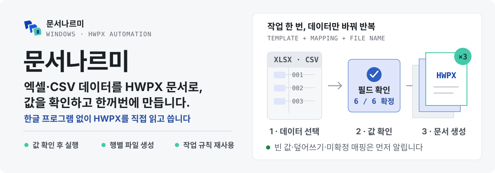

<p align="center">
  <picture>
    <source media="(max-width: 520px)" srcset="./assets/readme/hero-mobile.svg">
    
  </picture>
</p>

<p align="center">
  <a href="https://github.com/rfastball/hwpx-filler/releases"></a>
  <a href="LICENSE"></a>
  
</p>

<p align="center">
  <a href="https://github.com/rfastball/hwpx-filler/releases">다운로드</a> ·
  <a href="#빠른-시작">빠른 시작</a> ·
  <a href="#조용히-틀리지-않는-안전장치">안전장치</a> ·
  <a href="#개발">개발</a>
</p>

문서나르미는 같은 서식에 값만 바꿔 반복 작성하는 일을 위한 Windows 앱입니다.
엑셀·CSV의 각 행을 누름틀 템플릿에 채워 HWPX 문서를 만들고, 평문 기안 초안은 채운
내용을 한 건씩 검토해 복사합니다. 한글 프로그램이나 COM 자동화 없이 HWPX 파일을
직접 읽고 씁니다.

공고서, 계약서, 발주요청서처럼 같은 서식을 수십 건 만드는 일을
`템플릿 + 데이터 + 필드 연결 + 파일 이름 규칙`으로 저장한 **문서 작업**으로 바꿉니다.
다음부터는 데이터를 고르거나 저장한 작업을 골라, 만들 행만 선택해 생성합니다.

## 작동 방식

1. **작업을 한 번 저장합니다.** 편집기에서 템플릿과 데이터를 함께 고르고, 필드
   연결을 확인한 뒤 파일 이름 규칙을 정해 저장합니다. 자동 연결은 제안이며 사람이 확인합니다.
2. **데이터를 열고 행을 고릅니다.** 작업은 데이터의 경로·시트·헤더 행을 기억하지만 데이터
   행을 저장하지 않습니다. 열 때마다 원본을 읽으며, 처음에는 선택된 행이 없습니다.
3. **확인할 것을 해소합니다.** 빠진 데이터 열, 바뀐 원본 템플릿, 포함할 내용 같은 항목이
   남아 있으면 「문서 만들기」가 사유와 함께 닫혀 있습니다. 생성 직전의 별도 승인 시트는 없습니다.
4. **결과를 만들고 확인합니다.** HWPX는 행마다 파일로 저장하고 「내용 보기」로 결과를 다시
   읽어 봅니다. TXT 작업은 채운 내용을 한 건씩 검토해 클립보드로 복사합니다.

## 설치

기준 환경은 **Windows 11 x64 + WebView2 Runtime**입니다.
[Releases](https://github.com/rfastball/hwpx-filler/releases)에서 내려받습니다.

- **설치본** — `HWPX-Filler-<버전>-Setup.exe`
- **포터블** — `HWPX-Filler-<버전>-portable.zip`을 풀고 `hwpx-filler-web.exe` 실행
- **소스 실행** — 아래 [개발](#개발) 절 참고

릴리스에는 파일별 해시 `SHA256SUMS.txt`가 함께 올라갑니다. 서명되지 않은 릴리스는
설치 전에 이 해시로 파일을 확인하세요.

## 빠른 시작

앱 위쪽 탭은 **문서 만들기**와 **문서 작업** 두 개이고, 오른쪽 **⚙ 설정**에서 테마·글자
크기·저장 폴더·서식 폴더를 고릅니다.

1. **문서 작업** → **＋ 새 작업**으로 편집기를 엽니다.
   - **고르기**: 서식 폴더의 템플릿과 데이터 파일을 한 쌍으로 고릅니다.
   - **연결 확인**: 템플릿 필드마다 데이터 열·가공·표시형을 확인하고 미리보기 값을 봅니다.
   - **이름·저장**: 작업 이름과 파일 이름 규칙(예: `발주요청서-{{공고번호}}`)을 정해 저장합니다.
2. **문서 작업**에서 저장한 작업을 고르고 **문서 만들기에서 사용**을 누릅니다.
   **문서 만들기**에서 **데이터 선택…**으로 데이터를 먼저 고르면 그 데이터에 연결된 작업이 표시됩니다.
3. 만들 행을 고르고 **문서 만들기**를 누릅니다. 결과 목록의 **내용 보기**로 만들어진
   문서를 확인합니다.

저장소를 내려받았다면 예제 템플릿과 데이터가 든
**[101 사용설명서](examples/quickstart-101/README.md)** 로 HWPX 3건과 기안 텍스트 1건을
처음부터 만들어 볼 수 있습니다. 새 체크아웃에서는 의존성 설치 뒤 `.\build-web.ps1`로
프런트를 먼저 빌드하세요. 이 실습 세트는 설치본·포터블에는 들어 있지 않습니다.

## 주요 기능

- **HWPX 일괄 생성** — 선택한 행마다 파일 이름 규칙을 적용해 문서를 만듭니다. 규칙에는
  템플릿 필드와 `{{date}}`·`{{seq:001}}`을 쓸 수 있습니다. 템플릿 작성자가 항목·선택을
  선언했다면 **포함할 내용**에서 넣을 갈래를 고릅니다.
- **온나라 기안 검토·복사** — 평문 `{{필드}}` 초안을 같은 데이터로 채우고, 선택한 행을
  한 건씩 검토해 클립보드로 복사합니다.
- **필드 연결과 가공** — 연결마다 유형(텍스트·날짜·금액·고정값·오늘 날짜)과 표시형을
  정합니다. **가공**은 칸의 일부만 쓰거나(기준 글자 앞·뒤·사이, 구분자로 나눈 조각, 앞·뒤
  N글자, 글자 범위) 글자를 바꾸거나 지웁니다. 데이터 값은 언제나 글자 그대로 읽습니다.
- **템플릿 저작 작업대** — 템플릿 목록의 **템플릿 편집**(TXT는 **내용 편집**)이나
  편집기의 **템플릿 만들기**로 엽니다. HWPX는 함께 배포하는 rhwp 편집기, TXT는 텍스트
  편집기로 문서 위에서 필드·항목·선택을 만들고, 시험 값으로 결과를 확인합니다. 저장한
  템플릿은 영향 확인을 거쳐 기존 작업에 명시적으로 적용합니다.
- **데이터 고르기와 필터** — 엑셀·CSV와 계약 목록(.db)을 데이터로 씁니다. 자주 쓰는
  파일은 **이 데이터 고정…**으로 남깁니다. 검색·열 조건과 이름 붙인 **저장한 필터**로 행을
  좁히고, 표시순서대로 생성합니다.
- **문서 작업 관리** — 즐겨찾기·최근 사용·확인 필요 보기, 이름 변경·복제·삭제를 제공하고
  손상된 작업은 숨기지 않고 따로 보여 줍니다.

## 조용히 틀리지 않는 안전장치

> **묻고 확정하게 하거나, 시끄럽게 알립니다.** 법적 효력이 있는 문서를 만들기 때문에
> 애매한 값을 조용히 추측하고 넘어가지 않습니다.

- 자동 연결은 제안입니다. 연결 확인 단계에서 사람이 확인합니다.
- 행 안의 빈 값은 생성을 막지 않습니다. 대신 어느 필드가 비는지 알리고, 문서의 그 자리에는
  `〘미입력·필드명〙` 표식이 들어가 빈칸처럼 사라지지 않습니다. 작업이 쓰는 데이터 열이
  데이터에서 사라졌으면 생성을 막습니다.
- 같은 이름의 파일이 있으면 덮어쓸 목록을 보여 주고 **덮어쓰고 생성**을 눌러야 진행합니다.
- 한 행이라도 문서를 만들지 못하면 파일을 하나도 저장하지 않습니다. 저장 중 실패는 그
  자리에서 멈추고 앞서 저장한 문서와 실패를 구분해 알립니다.
- 저장한 문서를 다시 읽어 기록과 대조합니다. 생성 결과는 저장 폴더의
  `fill-ledger-*.json` 원장에 쌓입니다. 입력이 바뀌면 이전 결과를 현재 결과와 구분합니다.
- 원본 템플릿이 바뀌면 변경사항을 확인하기 전까지 생성하지 않습니다.
- 기안 검토·복사 화면은 빈 값을 `〈빈 값〉`으로 남겨 보여 줍니다.

## 호환성과 제약

- Windows 전용이며 기준 환경은 Windows 11 x64 + WebView2 Runtime입니다.
- 데이터는 `.xlsx`, `.xlsm`, `.csv`와 계약 목록 SQLite(`.db`)의 뷰·표입니다.
  CSV는 UTF-8(`utf-8-sig` 포함)로 읽습니다.
- 시트가 여러 개인 엑셀 파일은 쓸 시트를 직접 골라야 합니다. 빈 헤더나 중복 헤더는 쓸 수
  없습니다. 수식은 엑셀에 저장된 계산 결과를 읽으며, 저장된 값이 없으면 오류로 멈춥니다.
- 문서 생성에는 한글 프로그램이 필요하지 않습니다. 결과 확인·편집에는 HWPX를 여는
  프로그램이 필요합니다.
- 템플릿 저작 작업대는 HWPX·TXT만 엽니다. HWP 가져오기, HWPX→PDF 내보내기, 여러 행을
  한 문서로 합치기는 제공하지 않습니다.
- 나라장터 연동은 어댑터·CLI 수준으로만 유지하며 앱 화면에는 노출하지 않습니다.

제공 범위의 정본은 [지원 경계](docs/product.md#product-scope)입니다.

## CLI

앱과 같은 HWPX 생성 경로를 창 없이 실행하는 소스용 CLI입니다. 자동화와 검증에는
유용하지만 일상 작업에는 앱을 권장합니다. 파일 이름 규칙의 `{{필드}}`는 템플릿 필드 이름입니다.

```powershell
uv run hwpxfiller --template T.hwpx --fields
uv run hwpxfiller --template T.hwpx --data data.xlsx --out .\out --pattern "공고서-{{계약명}}" --ledger
uv run hwpxfiller schema T.hwpx --out schema.json
uv run hwpxfiller lint T.hwpx
```

앱과 달리 CLI는 빈 값이 있으면 생성을 막습니다. `--ack-empty`를 주면 미입력 표식을 넣고
진행합니다. 같은 이름의 파일은 `--overwrite`를 줄 때만 덮어쓰며, 원장은 `--ledger`를 줄
때만 남깁니다. 전체 명령은 `uv run hwpxfiller --help`에서 확인할 수 있습니다.

## 자매 도구: hwpxdiff

같은 파서 계층을 사용하는 **[hwpxdiff](https://github.com/rfastball/hwpx-diff)** 는 두 HWPX
판본을 의미 기반으로 비교해 신구대비표로 보여줍니다. 문서나르미가 문서를 *쓰는* 도구라면,
hwpxdiff는 문서를 *읽고 견주는* 도구입니다.

## 개발

`.python-version`의 Python과 의존성은 [`uv`](https://docs.astral.sh/uv/)가 관리합니다. 프런트엔드는
`.node-version`의 Node와 `package.json`에 고정된 npm을 사용합니다. 첫 웹 빌드는 HWPX 편집기
rhwp의 원천과 도구를 준비하느라 네트워크가 필요합니다.

```powershell
uv python install
uv sync --locked --all-extras --group dev --group build

.\run-filler.ps1        # 프런트 빌드 후 소스 앱 실행
.\run-filler.ps1 -Cli --help
.\build-web.ps1         # 프런트만 빌드(101 실습 런처 전)
.\test.ps1              # web build → Node 테스트 → Ruff → Pyright → pytest
.\build.ps1             # GUI 포터블 빌드 + self-check
.\package-installer.ps1 # Inno Setup 설치본
```

제품 `hwpxfiller`는 형식 kernel `hwpxcore` 위에 서며 의존은 `hwpxfiller → hwpxcore`로만
흐릅니다. kernel은 제품 로직이나 환경 효과 없이 HWPX bytes만 파싱·직렬화합니다.

- [개발·빌드·배포 환경](CONTRIBUTING.md#development)
- [현재 계약과 문서 지도](docs/README.md)
- [작업 흐름](docs/workflow.md) · [화면 규칙](docs/ui-style.md) · [아키텍처](docs/architecture.md)

## 라이선스

[MIT](LICENSE). 함께 배포하는 제3자 구성요소와 글꼴의 고지는 [THIRD_PARTY_NOTICES](THIRD_PARTY_NOTICES)에 있습니다.
