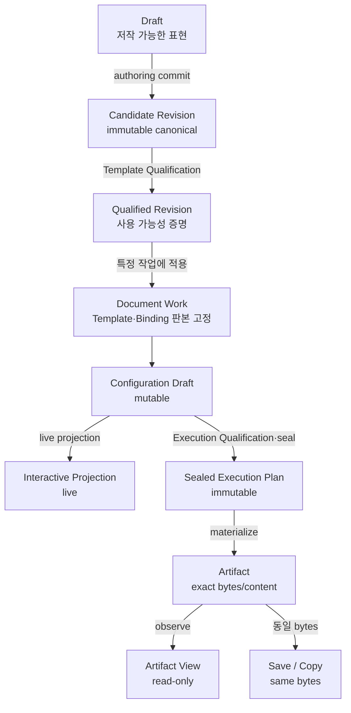
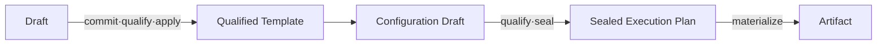
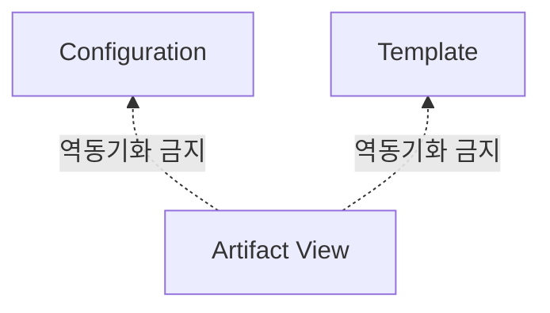
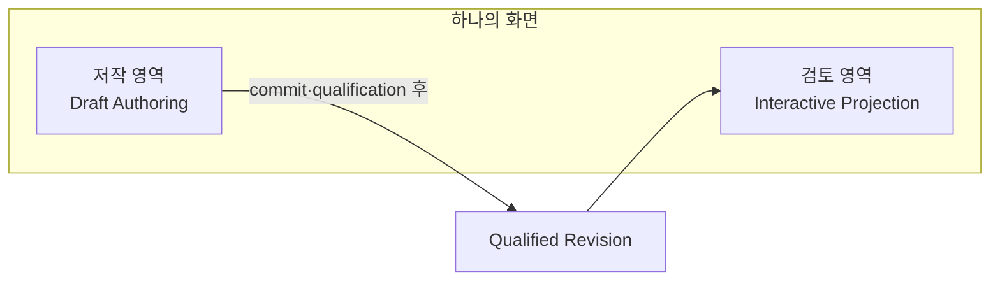
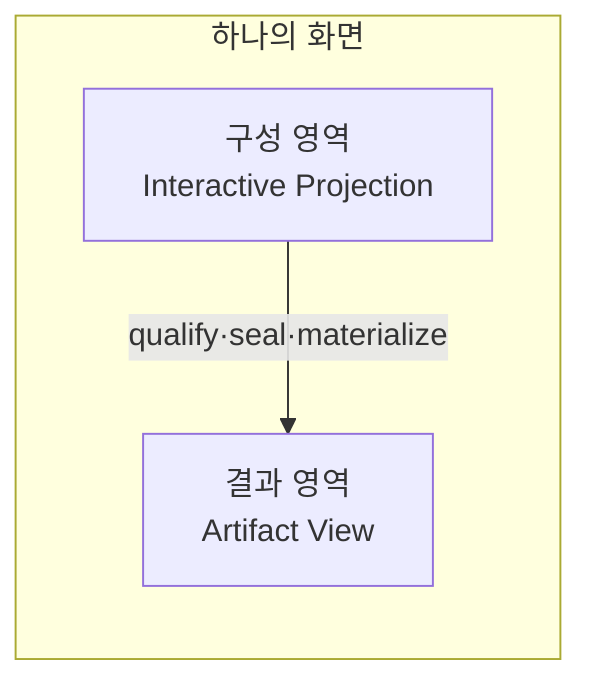
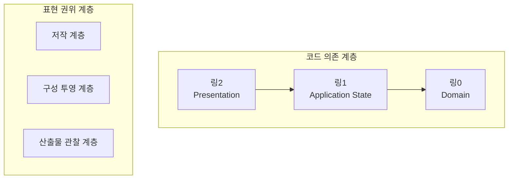

# 문서 표현과 변경 권위 계층 이론

> **문서 상태:** 유효 결정 · 최종 정본  
> **권위 범위:** 문서 표현 상호작용 영역의 계층 분류, 변경 권위, 갱신 사건, 승격 경계와 역방향 흐름 금지  
> **이론 자체의 후속 정본:** 없음  
> **구체 적용 정본:** 템플릿 생애주기, 도메인 모델, 실행계획, 매체별 문법, UI 계약은 별도 문서가 소유  
> **편집 정책:** 계층 판정 원칙이나 핵심 불변식이 바뀔 때만 갱신  
> **구현 효과:** 이 문서만으로 현재 화면·영속 모델·실행 동작이 변경되지는 않는다

## 0.0 이 저장소에서의 지위 (등재 시 부기, 2026-08-09)

이론 본문은 저장소 밖에서 확정돼 들어왔다. 이 절만 저장소 쪽 부기이고, 아래 세 가지를
고정한다. 나머지 본문은 원문 그대로다.

### 이 이론은 **미래 제품 모델**이다 — P 로드맵의 입력이 아니다

**#433 P-00** 과 **#511 P1-00** 이 「제외」로 똑같이 든다: *"Draft/Candidate/Qualified/Slot/
Revision 신규 기능 구현"*. **#520 P1-99** 판정 체크리스트에는 이 줄이 있다:

> 미래 제품 모델 `ABSENT`를 현재 결함으로 오인한 항목 0

따라서 이 문서의 어휘를 P1 계측기·권위 원장·감사의 입력으로 쓰지 않는다. 여기서 `ABSENT` 인
것은 오늘의 결함이 아니라 **아직 짓지 않은 모델**이다. 적용은 **#530 [T-00]** 이 소유한다.

### 하위 도메인 정본 — 명사와 불변식의 상당수는 이미 다른 문서에 있다

이 이론은 상위 판정 기준이고, 구체 적용은 아래가 계속 소유한다.

| 문서 | 소유하는 것 |
|---|---|
| [핵심 워크플로 계약](core-workflow.md) | `Template revision` · `Binding revision` · `Run context` · `Preview approval` 등 명사와 §13 불변식. **편집 정책이 동결이므로 이 이론이 그 문서를 고치지 않는다** |
| [UI 계약](UI_CONTRACT.md) | 현재 웹 UI 의 계층·화면 소유권·계약 테스트 |
| [UI 표면 ADR](UI_DESIGN_DECISIONS.md) | ADR C 개정(2026-07-31) — 렌더뷰는 **조기 발견 표면**이지 검증 표면이 아니고, 한글이 권위 렌더러다. ADR H — TXT 축의 지위. ADR L — 프로버넌스의 범위 경계 |

### 알려진 미분류 1 — TXT 축 (§16.4 절차 진행 중)

작업대의 **TXT 검토·복사**가 세 계층으로 나뉘지 않는다.

- 화면 계약: *"복사되는 것 = 눈에 보이는 것"*, 완결 동사 = 클립보드 복사
- ADR H: *"평문엔 외부 권위 렌더러가 없으므로 **렌더된 view 가 곧 진실이자 산출물**"*
- 이 이론 **L21**: *"Projection 은 실제 Artifact 인 척 표현하지 않는다"*

TXT 축에서는 구성 투영의 결과가 곧 Artifact 이고 materialization 경계가 클립보드 복사다.
§16.4 가 요구하는 대로 **지역 예외로 구현하지 않고** 여기에 기록해 둔다 — TXT 축에 명시적
materialization 사건을 두거나 이론에 매체별 예외를 여는 것 중 하나를 고르는 일은 **#530** 이
진다. §20.3 의 개정 사유 *"반례가 현재 불변식을 깨지만 제품상 허용돼야 함"* 후보다.

---

## 0. 목적과 범위

이 문서는 문서 표현을 사용자에게 보여주거나 변경하게 하는 상호작용 영역이 다음 중 어디에 속하는지를 판정하는 상위 기준이다.

1. 문서의 구조와 내용을 저작하는가?
2. 확정된 문서 구조에 데이터와 업무 구성을 적용하는가?
3. 실제로 만들어진 결과를 관찰하는가?

이 분류는 화면 이름, UI 컴포넌트, 사용하는 프로그램, 앱 안팎의 위치로 결정하지 않는다.

분류 기준은 다음 세 가지다.

```text
1. 무엇을 보고 있는가?
2. 무엇을 변경할 권위가 있는가?
3. 어떤 사건을 거쳐 새 표현이 되는가?
```

세 계층은 전체 생애주기의 모든 기능을 분류하는 체계가 아니다. 다음은 표현 계층이 아니라 표현 사이의 **경계 사건 또는 애플리케이션 서비스**다.

```text
저작 커밋
Template Qualification
특정 Document Work에 판본 적용
Execution Qualification
실행계획 봉인
Materialization
동일 바이트 저장·복사
```

이 이론은 구체적인 템플릿 생애주기, 판본 저장 방식, 문서 문법, 렌더러 또는 화면 배치를 결정하지 않는다. 그런 하위 결정이 서로 모순되지 않도록 판정 기준과 금지선을 제공한다.

---

## 1. 핵심 명제

> **문서 표현의 계층은 물리적 화면이나 도구가 아니라 대상 표현, 변경 권위, 갱신 사건으로 구분한다.**

세 계층은 다음과 같다.

```text
저작 계층
  Draft Authoring
  별칭: 편집-2

구성 투영 계층
  Interactive Projection
  별칭: 렌더/편집-1

산출물 관찰 계층
  Materialized Artifact View
  별칭: 렌더-2
```

`편집-2`, `렌더/편집-1`, `렌더-2`의 숫자는 코드 아키텍처의 링 번호나 실행 순서를 뜻하지 않는다. 이 문서에서는 의미가 더 분명한 `저작 계층`, `구성 투영 계층`, `산출물 관찰 계층`을 주명칭으로 사용한다.

---

## 2. 먼저 지켜야 할 세 가지 구분

### 2.1 Canonical, Qualified, 작업 적용은 서로 다르다

```text
Candidate Revision
  = immutable canonical Template Revision
  = 구조가 정본으로 기록됨
  = 아직 사용 가능성이 증명되지 않았을 수 있음

Qualified Revision
  = Template Qualification을 통과한 Candidate Revision
  = 기계적으로 사용할 수 있음이 증명됨

Document Work에 적용된 Revision
  = 특정 작업이 사용하도록 고정한 Qualified Revision
  = 사용자의 운영 선택
```

따라서 다음 식을 항상 유지한다.

```text
Canonical ≠ Qualified ≠ 특정 작업에 적용됨
```

`canonical`은 정본성, `qualified`는 기계적으로 증명된 사용 가능성, `적용됨`은 특정 작업의 운영 선택을 뜻한다.

새 Qualified Revision이 존재한다는 이유만으로 기존 Document Work가 자동으로 그 판본을 사용하지 않는다. 적용 사건은 해당 작업이 가진 Template Revision 참조를 명시적으로 바꾼다.

### 2.2 Configuration Draft와 Sealed Execution Plan은 서로 다르다

```text
Configuration Draft
  mutable
  live projection의 근거
  invalid 또는 pending 가능
        │
        │ Execution Qualification
        ▼
Sealed Execution Plan
  immutable
  실행 권위 보유
  materialization의 유일한 제품 입력
```

따라서 다음 식을 항상 유지한다.

```text
Configuration Draft ≠ Sealed Execution Plan
```

화면에 반영된 구성은 아직 실행계획이 아니다. 실행계획은 특정 입력 집합을 검증하고 봉인한 별도의 immutable 표현이다.

### 2.3 Artifact, Artifact View, 외부 후편집 파생물은 서로 다르다

```text
Artifact
  = materialization이 만든 실제 bytes/content
  + immutable Artifact identity
  + 생성 근거

Artifact View
  = 특정 Artifact를 읽기 전용으로 관찰하는 표면

외부 후편집 파생물
  = Artifact bytes를 외부 도구에서 변경해 생긴 별도 파일
  = 원래 Artifact와 다른 bytes와 identity
```

따라서 다음 식을 항상 유지한다.

```text
Artifact ≠ Artifact View ≠ 외부 후편집 파생물
```

---

## 3. 세 개의 판정 축

### 3.1 표현 축

```text
Draft
  ↓ authoring commit
Canonical Candidate Revision
  ↓ Template Qualification
Qualified Revision
  ↓ 특정 Document Work에 적용
작업에 고정된 Template·Binding 판본
  + Data·Configuration Draft
  ↓ Execution Qualification·seal
Sealed Execution Plan
  ↓ materialize
Artifact
  ↓ observe
Artifact View
```

- `Draft`는 작성 중인 표현이다.
- `Candidate Revision`은 구조가 정본으로 기록된 immutable canonical Template Revision이다.
- `Qualified Revision`은 Template Qualification을 통과한 같은 revision이다.
- `Document Work`는 특정 작업이 사용할 Qualified Template Revision과 적용 가능한 Binding Revision을 고정한다.
- `Configuration Draft`는 해당 작업의 데이터·바인딩·업무 구성을 조정하는 mutable 표현이다.
- `Sealed Execution Plan`은 검증된 특정 입력 집합을 immutable하게 봉인한 실행 표현이다.
- `Artifact`는 materialization이 끝난 실제 결과다.
- `Artifact View`는 특정 Artifact를 읽기 전용으로 관찰하는 표현이다.

Template, Binding, Configuration 사이의 세부 소유권은 하위 도메인 정본이 결정한다. 이 이론은 구성 투영이 canonical Template 구조를 바꾸지 않는다는 경계만 확정한다.

### 3.2 권위 축

```text
자유 저작
  ↓
정본 기록
  ↓
사용 가능성 판정
  ↓
작업 판본 선택
  ↓
제한된 업무 구성
  ↓
실행 권위 봉인
  ↓
관찰
```

- 저작 권위는 Draft의 문서 구조와 내용을 변경한다.
- 저작 커밋은 canonical Candidate Revision을 만든다.
- Template Qualification은 Candidate의 사용 가능성을 판정한다.
- 판본 적용은 특정 Document Work가 사용할 Qualified Revision을 선택한다.
- 구성 권위는 고정된 Template 구조를 바꾸지 않고 데이터·바인딩·업무 구성을 변경한다.
- Execution Qualification과 seal은 검증된 입력에 실행 권위를 부여한다.
- 관찰 권위는 upstream 표현이나 Artifact bytes를 변경하지 않는다.

### 3.3 갱신 사건 축

```text
저작 거래
  ↓
authoring commit
  ↓
Template Qualification
  ↓
작업 적용
  ↓
구성 변경과 live projection
  ↓
Execution Qualification·seal
  ↓
Materialization
  ↓
Artifact 관찰 대상 선택
```

- Draft의 변경은 저작 거래다.
- Candidate 출생은 authoring commit이다.
- Qualified 상태는 Template Qualification의 결과다.
- 특정 작업의 판본 변경은 명시적인 적용 사건이다.
- Interactive Projection은 잠정적인 Configuration Draft를 즉시 보여줄 수 있다.
- Sealed Execution Plan은 Execution Qualification과 seal을 거쳐 새로 생긴다.
- Artifact는 materialization이 완료돼야 새로 생긴다.
- Artifact View 갱신은 이미 만들어진 Artifact 가운데 관찰 대상을 선택하는 사건이다.

---

## 4. 전체 관계



이 다이어그램은 구체 구현의 모든 상태를 확정하는 상태 머신이 아니다. 다음 경계를 생략하거나 합치면 안 된다는 상위 관계를 나타낸다.

```text
authoring commit
Template Qualification
작업 적용
Execution Qualification·seal
materialization
```

---

## 5. 저작 계층

### 5.1 정의

> **저작 계층은 Draft의 문서 구조와 내용을 변경할 권위를 가진다.**

저작 계층이 보는 주 대상은 Draft다.

```text
저작 계층
├─ 문서 본문 작성
├─ 문단·표·서식 변경
├─ 구조적 요소의 저작 의도 정의
├─ 식별 가능한 영역의 생성·삭제
└─ 저작 중간 상태 보존
```

Draft는 불완전할 수 있다.

```text
Draft
├─ 구조가 아직 완성되지 않을 수 있음
├─ 임시 표식이 남아 있을 수 있음
├─ 잘못된 구조를 포함할 수 있음
├─ 중간 상태로 저장될 수 있음
└─ 화면에 보인다는 이유만으로 실행 권위를 얻지 않음
```

### 5.2 저작 계층의 종료

Draft 저장, Candidate 출생, qualification, 작업 적용은 서로 다른 사건이다.

```text
Draft 중간 저장
  = 저작 상태 보존

authoring commit
  = immutable canonical Candidate Revision 생성

Template Qualification
  = Candidate의 사용 가능성 판정

특정 작업에 적용
  = Document Work가 Qualified Revision을 사용하도록 참조 변경
```

```text
Draft 수정
≠ Candidate Revision 생성
≠ Template Qualification 통과
≠ 특정 작업의 판본 변경
```

Candidate가 canonical이라는 사실만으로 qualification 또는 실행 권위를 얻지 않는다.

### 5.3 Draft 미리보기

Draft를 작성 중에 빠르게 보여주는 기능은 허용할 수 있다. 다만 그것은 실행 구성을 다루는 `Interactive Projection`이 아니라 별도의 `Authoring Preview`다.

```text
Draft
  ↓
Authoring Preview
  = 저작 보조 파생 표현
  = 실행 권위 없음
  = 작업 구성의 근거가 아님
```

데이터와 업무 구성을 적용해 revision을 검토하려면 Qualified Revision 또는 Document Work에 고정된 Qualified Revision을 사용한다.

### 5.4 저작 계층이 소유하지 않는 것

```text
저작 계층이 소유하지 않음
├─ 특정 작업의 데이터 선택
├─ 특정 작업의 Binding·Configuration
├─ Sealed Execution Plan
├─ 실제 생성 결과의 identity와 bytes
├─ Artifact View의 viewport 상태
└─ 이미 만들어진 Artifact의 역편집
```

---

## 6. 구성 투영 계층

### 6.1 정의

> **구성 투영 계층은 Qualified Template 구조에 데이터·바인딩·업무 구성을 적용해 그 의미를 조작하고 보여준다.**

일반 작업에서는 Document Work에 고정된 판본을 사용한다. 새 Qualified Revision을 작업에 적용하기 전 검토할 때는 검토 대상 revision identity를 명시적으로 분리한다.

사용자에게는 문서처럼 보일 수 있지만, 직접 변경하는 대상은 문서 문자열이나 native 구조가 아니다.

```text
Interactive Projection
        ↕
Data · Binding · Configuration Draft
```

구성 투영은 다음 질문에 답한다.

> 이 작업에 고정된 문서 구조에 이번 데이터와 업무 구성을 어떻게 적용할 것인가?

저작 계층은 다른 질문에 답한다.

> 이 문서의 구조와 내용은 무엇인가?

### 6.2 구성 투영의 허용 범위

```text
구성 투영에서 허용
├─ 데이터와 문서 항목의 연결
├─ 고정된 값과 의도적인 비움
├─ Template이 이미 정의한 선택지의 선택
├─ 데이터 행과 적용 범위 선택
├─ 구성 규칙 선택
└─ 출력 관련 업무 설정
```

어느 항목이 Binding에 속하고 어느 항목이 Configuration에 속하는지는 하위 도메인 정본이 결정한다.

### 6.3 구성 투영의 금지 범위

```text
구성 투영에서 금지
├─ 문단 구조 직접 변경
├─ 표 구조 직접 변경
├─ canonical 문법 직접 변경
├─ Field·Slot 같은 구조적 요소 자체의 정의·삭제
├─ canonical 서식 변경
└─ 화면 DOM을 통한 native 문서 역수정
```

구성 중 구조 변경이 필요하다고 판정되면 저작 계층에서 새 Draft 거래를 시작해야 한다.

### 6.4 즉시 표현과 실행 권위

구성 투영은 사용자의 변경을 즉시 보여줄 수 있다.

```text
사용자 구성 변경
  ↓
Configuration Draft 변경
  ↓
Projection 갱신
  ↓
화면 즉시 반영
```

그러나 즉시 반영은 실행 가능성을 증명하지 않는다.

```text
화면에 반영됨
≠ 검증됨
≠ 실행계획이 봉인됨
≠ Artifact가 만들어짐
```

구성 투영은 최소한 다음 상태를 구분해야 한다.

```text
현재 실행 가능
화면에는 반영됐지만 검사 중
구성 오류로 실행 불가
이전 Sealed Plan보다 변경됨
```

### 6.5 Execution Qualification과 seal

```text
Document Work에 고정된 입력 판본
        +
Data
        +
Configuration Draft
        │
        ▼
Execution Qualification
        │
        ├─ FAIL → Configuration 오류 표시
        │
        └─ PASS
             │
             ▼
      Sealed Execution Plan
```

Sealed Execution Plan은 구성 투영 계층의 화면 상태가 아니다. 실행 경계가 만든 immutable 실행 표현이며 materialization의 유일한 제품 입력이다.

### 6.6 적용 전 revision 검토

새 Qualified Revision은 sample 또는 현재 데이터를 사용한 Interactive Projection으로 검토할 수 있다.

```text
Qualified Revision R8
        +
sample/current data
        │
        ▼
Interactive Projection 검토 모드
        │
        └─ 사용자 "변경 적용"
```

검토 중인 revision과 현재 Document Work에 고정된 revision은 서로 다른 identity로 표시한다. 검토만으로 작업 판본은 바뀌지 않는다.

---

## 7. 산출물 관찰 계층

### 7.1 정의

> **산출물 관찰 계층은 실제로 materialize된 Artifact를 읽기 전용으로 보여준다.**

입력은 예상 모델이나 구성 상태가 아니라 실제 결과다.

```text
잘못된 입력
├─ Template Descriptor
├─ Binding·Configuration State
├─ 예상 레이아웃
└─ Interactive Projection DOM
```

```text
올바른 입력
└─ 실제 Artifact identity, 생성 근거, bytes/content
```

Artifact라고 주장하려면 다음이 함께 있어야 한다.

```text
materialization 완료
  + immutable Artifact identity
  + 실제 bytes/content
  + 생성 근거
  = Artifact
```

materialization 근거나 identity가 없으면 Artifact라고 주장할 수 없다. identity만 있다는 사실도 Artifact의 충분조건은 아니다.

### 7.2 Artifact identity와 관찰 선택

Artifact identity는 materialization이 생성한다. 산출물 관찰 계층은 identity 자체를 만들거나 소유하지 않는다.

```text
materialization이 소유
├─ Artifact identity 생성
├─ Artifact bytes/content 생성
└─ 생성 근거 기록

산출물 관찰 계층이 소유
├─ 현재 관찰 대상으로 선택한 Artifact identity의 참조
├─ 페이지 또는 위치 선택
├─ 확대·축소
├─ 검색
├─ 스크롤
├─ 렌더 진단
└─ viewport 수명주기
```

```text
산출물 관찰 계층이 소유하지 않음
├─ Template 구조
├─ Data
├─ Binding
├─ Configuration
├─ Sealed Execution Plan의 의미
├─ Artifact identity 생성
└─ Artifact bytes 변경
```

### 7.3 동일 바이트 저장·복사

Artifact View에서 확인한 결과를 저장하거나 복사하는 제품 경로는 같은 Artifact bytes를 사용한다.

```text
Artifact bytes
  ├─ Artifact View의 렌더 입력
  └─ 저장·복사의 출력
```

```text
Artifact View에서 저장·복사
  → 동일 bytes 유지
  → 새 문서 의미를 만들지 않음
```

매체별 renderer의 fidelity는 다를 수 있지만, 관찰 도구가 Artifact를 몰래 재생성하거나 저장 바이트를 변경해서는 안 된다.

### 7.4 새 Artifact와 stale 판정

Artifact 갱신은 기존 Artifact의 의미가 변하는 사건이 아니다.

```text
현재 작업 입력 변경
  ↓
새 Execution Qualification·seal
  ↓
새 materialization
  ↓
새 Artifact identity
```

```text
금지되는 해석

기존 Artifact
  → 내부 내용만 조용히 변경
  → 같은 Artifact라고 계속 표시
```

stale은 **현재 Document Work가 고정한 입력 집합과 현재 구성 의도**가 Artifact의 생성 근거와 달라졌을 때 발생한다.

```text
현재 작업 입력·구성
  C8

현재 표시 중인 Artifact의 생성 근거
  C7

판정
  STALE
```

새 Candidate나 Qualified Revision이 존재하기만 하고 현재 Document Work에 적용되지 않았다면 기존 Artifact는 그 이유만으로 stale이 아니다.

자동으로 자주 materialize하더라도 같은 원칙이 적용된다.

```text
자동 갱신
≠ 같은 Artifact의 변이

자동 갱신
= 새 materialization
→ 새 Artifact identity
→ 관찰 대상 교체
```

### 7.5 생성 실패와 관찰 실패

```text
Generation Failure
  Artifact가 만들어지지 않음

Render Failure
  Artifact는 존재하지만 관찰 도구가 표시하지 못함
```

두 실패를 같은 상태로 취급하지 않는다. 관찰 도구의 한계는 Artifact 자체의 무효성을 자동으로 뜻하지 않는다.

반대로 관찰 도구가 성공적으로 표시했다는 사실도 Template Qualification, Execution Qualification 또는 외부 권위 렌더러와의 동일성을 증명하지 않는다. Artifact View는 조기 발견과 결과 관찰의 표면이지 실행 게이트의 근거가 아니다.

---

## 8. 권위 소유권

| 소유 영역 | 소유하는 사실과 사건 | 소유하지 않는 것 |
|---|---|---|
| 저작 계층 | Draft 내용, 구조화 의도, 저작 거래 | qualification, 작업 적용, 실행 구성 |
| 저작 커밋 경계 | immutable Candidate Revision 생성 | 사용 가능성 판정, 작업 적용 |
| Template Qualification | Candidate 구조 판정, qualification evidence | 사용자 운영 선택 |
| Document Work·적용 경계 | 사용할 Qualified Template·Binding 판본 참조 | revision 내용의 변이 |
| 구성 투영 계층 | Configuration Draft, live projection, 잠정 상태 표현 | Template 구조, Sealed Plan |
| 실행 경계 | Execution Qualification, Sealed Plan, materialization, Artifact identity | Draft 저작, viewport |
| 산출물 관찰 계층 | 관찰 대상 identity 참조, render·viewport 상태 | Artifact 생성·변경, upstream 구성 |

어느 영역도 다른 영역의 권위를 몰래 가져오지 않는다.

정본에 기록되는 변경 가능한 제품 사실마다 단일 변경 권위자를 둔다. 파생 표현은 그 사실을 보여줄 수 있지만 별도의 정본으로 다시 판정하지 않는다.

---

## 9. 허용되는 흐름



다이어그램의 축약 화살표는 여러 경계 사건을 하나의 사건으로 합친다는 뜻이 아니다. 상세 순서는 §3과 §4가 소유한다.

허용되는 방향은 상류 권위를 하류 표현으로 명시적으로 투영하는 방향이다.

```text
Draft
  → canonical Candidate Revision

Candidate Revision
  → Qualified Revision

Qualified Revision
  → 특정 Document Work의 판본 참조

작업 입력 + Configuration Draft
  → Sealed Execution Plan

Sealed Execution Plan
  → Artifact

Artifact
  → 읽기 전용 관찰 또는 동일 bytes 저장·복사
```

---

## 10. 금지되는 역방향 흐름

### 10.1 Artifact에서 upstream으로 역편집



```text
금지
├─ Artifact DOM의 문구를 수정해 Data에 반영
├─ 렌더된 문단을 이동해 Template 구조에 반영
├─ 결과 화면의 값을 Binding으로 역추론
└─ 외부 후편집을 Template 변경으로 간주
```

### 10.2 구성 투영에서 Template 구조 수정

```text
허용

Interactive Projection
  ↓
정의된 업무 구성 변경
```

```text
금지

Interactive Projection
  ↓
구조적 요소의 정의 변경
  ↓
canonical Template 수정
```

구조 변경은 저작 계층의 새 Draft 거래여야 한다.

### 10.3 Draft 저장으로 작업 판본 변경

```text
금지

Draft 저장
  ↓
현재 Document Work의 Template 판본 즉시 덮어쓰기
```

Draft 보존, Candidate 생성, Template Qualification, 작업 적용 사이에는 명시적인 경계가 있어야 한다.

### 10.4 Projection이나 View에서 Plan을 조립

```text
금지

화면 DOM 또는 viewport 상태
  ↓
실행 의미 역추론
  ↓
Sealed Execution Plan 생성
```

Plan은 화면 표현이 아니라 검증된 제품 입력으로부터 실행 경계가 만든다.

---

## 11. 하나의 화면에 여러 계층이 있을 수 있다

분류 단위는 화면이 아니라 권위 영역이다.

### 11.1 저작과 Qualified Revision 검토의 병치



왼쪽이 Draft를 수정하고 오른쪽이 Qualified Revision에 sample/current data를 적용한 의미를 보여준다면 두 영역은 서로 다른 계층이다.

Draft를 직접 보여주는 오른쪽 영역이라면 `Interactive Projection`이 아니라 실행 권위 없는 `Authoring Preview`로 분류한다.

### 11.2 구성과 결과의 병치



두 영역이 같은 화면에 있다는 이유로 같은 상태나 갱신 주기를 공유해서는 안 된다.

### 11.3 혼합 화면의 의무

```text
혼합 화면은 다음을 구분해야 한다.

├─ 어느 영역이 무엇을 수정하는가
├─ 변경이 어느 저장 객체에 기록되는가
├─ 어느 결과가 아직 잠정 상태인가
├─ 검토 중인 revision과 작업에 적용된 revision은 무엇인가
├─ 어느 Artifact가 어떤 입력에서 만들어졌는가
└─ 계층을 이동시키는 명시적 행동이 무엇인가
```

---

## 12. 같은 도구가 여러 역할에 사용될 수 있다

도구나 컴포넌트는 계층을 결정하지 않는다.

```text
mutable text editor
  Draft를 수정
  → 저작 계층

read-only text editor
  실제 TXT Artifact를 표시
  → 산출물 관찰 계층
```

```text
문서 프로그램에서 Template Draft 편집
  → 저작 계층

문서 프로그램에서 생성 결과 후편집
  → 외부 후편집 파생물 생성
  → 제품 내부 Artifact 생애주기와 별개
```

제품 내부에서 Artifact는 immutable하다. 외부 프로그램에서 결과를 후편집하면 기존 Artifact가 변한 것으로 취급하지 않는다.

```text
원래 Artifact A7
  ↓ 외부 후편집
파생 파일 E8
├─ A7과 다른 bytes
├─ 새 identity 필요
├─ 원래 Sealed Plan의 exact-byte Artifact가 아님
├─ Artifact View의 동일 bytes 저장·복사 경로 밖
└─ Template·Binding·Configuration으로 역반영 금지
```

외부 파생 파일을 다시 제품에 들이는 별도 기능이 필요하다면 가져오기·저작·새 revision 생성 중 어느 생애주기에 속하는지 하위 결정으로 명시해야 한다.

---

## 13. 코드 3링 아키텍처와의 관계

이 이론은 코드 의존 방향을 정하는 3링 아키텍처와 직교한다.

```text
3링 아키텍처
  코드가 어디에 의존할 수 있는가를 판정

표현 권위 계층
  어떤 표현이 무엇을 변경할 수 있는가를 판정
```



각 표현 권위 계층은 여러 코드 링을 가로지를 수 있다.

| 표현 권위 | 도메인 책임 | 애플리케이션 책임 | 표현 책임 |
|---|---|---|---|
| 저작 계층 | Draft·구조화 규칙 | 저작 거래·검사 상태 | 편집 UI |
| 구성 투영 계층 | 구성 의미·판정 | projection·selector | live 표현 |
| 산출물 관찰 계층 | Artifact·provenance 규칙 | stale·render 상태 | viewer·viewport |

다음과 같은 단순 대응은 금지한다.

```text
잘못된 대응

저작 계층 = 링0
구성 투영 계층 = 링1
산출물 관찰 계층 = 링2
```

---

## 14. 분류 절차

새 기능이나 영역을 설계할 때 다음 질문에 순서대로 답한다.

### Q1. 이것은 표현 상호작용 영역인가, 경계 사건인가?

```text
사용자에게 문서 표현을 보여주거나 변경하게 하는가?
아니면 qualification·적용·봉인·materialization 같은 경계 사건인가?
```

경계 사건이라면 세 표현 계층 중 하나로 억지로 분류하지 않는다.

### Q2. 무엇을 보고 있는가?

```text
Draft인가?
Qualified Revision인가?
Configuration Draft의 Projection인가?
Sealed Execution Plan인가?
실제 Artifact인가?
```

### Q3. 사용자가 무엇을 변경하는가?

```text
문서 구조와 내용인가?
업무 구성인가?
관찰 상태뿐인가?
```

### Q4. 변경은 어디에 기록되는가?

```text
Draft Workspace인가?
Template·Binding 계열의 정본인가?
Configuration Draft인가?
어디에도 기록되지 않는 viewport 상태인가?
```

### Q5. 실행 권위가 있는가?

```text
잠정적인 화면 표현인가?
Template Qualification을 통과했는가?
특정 작업에 적용됐는가?
실행 입력이 검증·봉인됐는가?
이미 materialize된 결과인가?
```

### Q6. upstream 변경 시 어떻게 되는가?

```text
같은 Draft의 변경인가?
새 Candidate Revision이 필요한가?
작업의 판본 참조를 바꿔야 하는가?
새 Sealed Plan이 필요한가?
기존 Artifact가 STALE이 되는가?
```

### Q7. 역방향 흐름이 있는가?

```text
하류 표현의 변경이
상류 Template·Binding·Configuration을 몰래 바꾸는가?
```

### Q8. 권위자가 겹치거나 비어 있지 않은가?

```text
정본에 기록되는 같은 변경 가능한 제품 사실을
둘 이상의 영역이 각각 판정하는가?

어느 영역도 책임지지 않는 사실이 있는가?
```

---

## 15. 분류 기록 형식

새 표면이나 기능의 설계 문서는 최소한 다음을 기록한다.

```text
영역 종류: 표현 상호작용 / 경계 사건 / 애플리케이션 서비스
대상 표현:
변경 권위:
저장 대상:
실행 권위:
갱신 사건:
identity와 provenance:
stale 판정:
허용되는 상류 입력:
금지되는 역방향 흐름:
```

예시:

```text
영역 종류:
  표현 상호작용

대상 표현:
  실제 Artifact

변경 권위:
  Artifact와 upstream에 대해 없음

저장 대상:
  viewport 상태만

실행 권위:
  이미 materialize된 결과를 관찰

갱신 사건:
  새 Artifact identity를 관찰 대상으로 선택

identity와 provenance:
  materialization이 만든 Artifact identity와 생성 근거 참조

stale 판정:
  현재 작업 입력·구성과 Artifact 생성 근거가 다름

허용되는 상류 입력:
  실제 Artifact identity와 bytes/content

금지되는 역방향 흐름:
  화면 변경을 Template·Binding·Configuration으로 역동기화
```

---

## 16. 충돌 판정

### 16.1 한 영역이 두 변경 권위를 주장하는 경우

```text
한 영역에서
  Template 구조 변경
  +
  Configuration 변경
```

이 경우 하나의 저장 거래로 합치지 않는다.

```text
해결
├─ 영역을 권위별로 분리
├─ 거래를 분리
├─ 승격 경계를 명시
└─ 각 변경의 무효화 범위를 별도로 정의
```

### 16.2 표시 상태와 실행 상태가 같은 이름을 쓰는 경우

```text
화면 반영 완료
≠ Template Qualification 완료
≠ Execution Qualification 완료
≠ Sealed Plan 생성 완료
≠ Artifact 생성 완료
```

같은 상태명이나 배지로 합치지 않는다.

### 16.3 Artifact라고 주장하지만 근거가 불충분한 경우

```text
materialization 근거 또는 identity가 없음
  → Artifact라고 주장할 수 없음

identity만 있음
  → Artifact의 충분조건이 아님

materialization 완료
  + immutable identity
  + 실제 bytes/content
  + 생성 근거
  → Artifact
```

### 16.4 분류할 수 없는 문서 표현 상호작용 영역

기존 세 계층으로 분류할 수 없는 **문서 표현 상호작용 영역**을 지역 예외로 구현하지 않는다.

```text
분류 불가
  ↓
이론의 누락인지 확인
  ↓
이론 개정 또는 기능 경계 재설계
  ↓
그 뒤 구현
```

경계 사건이나 애플리케이션 서비스가 세 계층에 속하지 않는 것은 분류 실패가 아니다.

---

## 17. 핵심 불변식

```text
L1. 계층은 화면·컴포넌트·도구·앱 경계가 아니라 대상 표현, 변경 권위, 갱신 사건으로 분류한다.

L2. 정본에 기록되는 변경 가능한 제품 사실마다 변경 권위자는 정확히 하나여야 한다.

L3. 저작 권위와 구성 권위를 하나의 암묵적 거래에 섞지 않는다.

L4. 하류 표현은 상류 정본을 역으로 수정하지 않는다.

L5. 화면에 즉시 반영됐다는 사실은 실행 권위를 부여하지 않는다.

L6. Canonical, Qualified, 특정 작업에 적용됨을 서로 다른 성질과 사건으로 유지한다.

L7. Configuration Draft와 Sealed Execution Plan을 같은 표현이나 상태로 취급하지 않는다.

L8. 실행 권위는 Execution Qualification과 seal을 거친 Sealed Execution Plan에만 있다.

L9. Materialization은 Sealed Execution Plan만 제품 입력으로 소비한다.

L10. Artifact View는 실제로 materialize된 Artifact만 관찰한다.

L11. Artifact identity는 materialization이 만들며, View는 관찰 대상 identity의 참조만 소유한다.

L12. Artifact 갱신은 기존 Artifact의 변이가 아니라 새 materialization과 새 identity의 생성이다.

L13. 현재 작업 입력·구성과 Artifact 생성 근거가 달라져 stale이면 그 사실을 숨기지 않는다.

L14. 새 revision의 존재만으로 현재 작업의 Artifact를 stale로 만들지 않는다.

L15. 생성 실패와 관찰 실패를 같은 실패로 취급하지 않는다.

L16. 한 화면에 여러 계층을 배치할 수 있지만 영역별 권위 경계는 유지한다.

L17. 같은 도구도 다루는 표현과 변경 권위에 따라 다른 계층에 속할 수 있다.

L18. 관찰 계층의 편의 상태는 Template·Binding·Configuration의 정본이 될 수 없다.

L19. Draft 보존, Candidate 생성, qualification, 작업 적용은 서로 다른 사건이다.

L20. Draft 직접 미리보기는 Authoring Preview이며 Interactive Projection이나 Artifact가 아니다.

L21. Projection은 실제 Artifact인 것처럼 표현하지 않는다.

L22. Artifact View의 저장·복사는 관찰한 Artifact와 동일한 bytes를 사용한다.

L23. 외부 후편집은 기존 Artifact의 변이가 아니라 별도 파생 파일과 새 identity를 만든다.

L24. 외부 후편집 파생물을 Template·Binding·Configuration으로 자동 역반영하지 않는다.

L25. 계층에 맞지 않는 새 표현 상호작용 영역은 지역 예외로 우회하지 않고 경계를 상향 결정한다.
```

---

## 18. 음성 사례

다음 설계는 이 이론을 위반한다.

### 18.1 Artifact DOM 역편집

```text
Artifact View에서 문구 수정
  ↓
Data 또는 Template에 자동 반영
```

위반:

```text
L4  하류에서 상류로 역수정
L10 관찰 계층의 권위 초과
```

### 18.2 구조 정의와 업무 선택의 혼합 저장

```text
한 patch에서
  구조적 요소 정의 변경
  +
  현재 업무의 선택 변경
```

위반:

```text
L2 변경 권위 중복
L3 저작과 구성 거래 혼합
```

### 18.3 live 화면을 실행 증거로 사용

```text
화면에 값이 보임
  ↓
검증과 봉인 없이 materialize
```

위반:

```text
L5 표시와 실행 권위 혼동
L7 Configuration Draft와 Plan 혼동
L8 실행 권위 경계 생략
```

### 18.4 오래된 결과의 무성 재사용

```text
현재 작업 입력 또는 Configuration 변경
  ↓
이전 Artifact를 계속 현재 결과로 표시
```

위반:

```text
L12 Artifact identity 무시
L13 stale 상태 은폐
```

### 18.5 미적용 revision 때문에 기존 결과를 stale 처리

```text
새 Qualified Revision 생성
  ↓
현재 Document Work에는 적용하지 않음
  ↓
기존 Artifact를 STALE 처리
```

위반:

```text
L6  revision 존재와 작업 적용 혼동
L14 stale 근거 오류
```

### 18.6 Draft에서 Interactive Projection으로 직접 이동

```text
미완성 Draft
  ↓
실행 구성 검토용 Interactive Projection
```

위반:

```text
L6  canonical·qualified 경계 생략
L20 Authoring Preview와 Interactive Projection 혼동
```

### 18.7 Artifact View가 identity를 생성

```text
렌더러가 화면을 열면서 임의 identity 생성
  ↓
Artifact라고 선언
```

위반:

```text
L10 실제 materialization 결과가 아님
L11 identity 생성 권위 역전
```

### 18.8 외부 후편집을 같은 Artifact로 유지

```text
Artifact bytes 외부 수정
  ↓
같은 Artifact identity 유지
```

위반:

```text
L12 Artifact 무성 변이
L23 파생 파일 identity 누락
```

### 18.9 화면 단위 분류

```text
같은 화면에 있으므로
편집 영역과 결과 영역을 같은 계층으로 분류
```

위반:

```text
L1  분류 기준 오류
L16 혼합 화면의 권위 경계 소실
```

---

## 19. 이 문서가 답하지 않는 질문

이 이론은 다음을 의도적으로 결정하지 않는다.

```text
- Draft와 canonical Template Revision의 구체적인 저장 포맷
- Template·Binding·Configuration의 세부 소유권
- 판본, identity, provenance의 구체적인 형식
- qualification 상태의 세부 단계와 규칙
- Document Work의 영속 모델과 적용 UI
- Sealed Execution Plan의 데이터 구조
- 문서 매체별 구조 문법
- 조건부·반복 구조의 도메인 모델
- 렌더러 또는 편집기의 기술 선택
- 자동 갱신·지연·취소·캐시 정책
- 화면의 개수와 배치
- 라우트·컴포넌트·파일 소유권
- 외부 후편집 파생물의 재가져오기 정책
```

이 질문들은 후속 생애주기 문서, 도메인 ADR, 기능 ADR과 현재 UI 계약이 각각 소유한다.

---

## 20. 적용과 변경 규율

### 20.1 후속 설계의 의무

문서 표현을 다루는 후속 설계는 다음을 명시해야 한다.

```text
- 표현 상호작용 영역인지 경계 사건인지
- 어느 표현 권위 계층에 속하는지
- 무엇을 변경할 수 있는지
- 무엇을 변경할 수 없는지
- 어떤 사건으로 다음 표현이 만들어지는지
- qualification, 작업 적용, 실행 권위가 어디에서 생기는지
- identity, provenance, stale 상태를 어떻게 다루는지
- 동일 바이트 저장·복사 규칙을 어떻게 지키는지
```

### 20.2 이론과 현재 구현의 차이

이 문서는 현재 구현의 상세 계약이 아니다.

```text
이론과 현재 구현이 다름
  → 자동으로 현재 구현의 결함을 뜻하지 않음

이 이론을 적용하는 후속 결정이 확정됨
  → 그때 변경 범위와 이행 계획을 별도로 확정
```

### 20.3 이론 변경

다음 경우에만 이 문서를 갱신한다.

```text
- 세 계층으로 분류할 수 없는 정당한 표현 상호작용 영역이 확인됨
- 변경 권위의 단일 소유 원칙을 바꿔야 함
- 상류·하류 방향의 정의가 바뀜
- Canonical·Qualified·작업 적용의 구분이 바뀜
- Configuration Draft·Sealed Plan의 구분이 바뀜
- Artifact·Artifact View·외부 파생물의 구분이 바뀜
- 반례가 현재 불변식을 깨지만 제품상 허용돼야 함
```

구현 기술, 화면 배치, 파일 구조 또는 특정 기능의 추가만으로는 이 문서를 갱신하지 않는다.

---

## 21. 최종 결정문

> 문서 표현의 계층은 화면, 컴포넌트, 도구 또는 앱 안팎의 위치가 아니라 대상 표현, 변경 권위, 갱신 사건으로 구분한다. 세 계층은 문서 표현 상호작용 영역을 분류하며, qualification·적용·봉인·materialization·저장·복사는 계층 사이의 경계 사건 또는 애플리케이션 서비스다.
>
> 저작 계층은 Draft의 구조와 내용을 변경한다. authoring commit은 immutable canonical Candidate Revision을 만들지만 canonical이라는 사실만으로 qualification이나 작업 적용 권위를 얻지는 않는다. Template Qualification을 통과한 Qualified Revision만 특정 Document Work에 적용할 수 있으며, 작업은 사용할 Template·Binding 판본을 명시적으로 고정한다.
>
> 구성 투영 계층은 고정된 문서 구조를 바꾸지 않고 Data·Binding·Configuration Draft를 live로 조작하고 보여준다. 화면에 즉시 반영된 상태는 실행 권위가 아니다. Configuration Draft는 Execution Qualification과 seal을 거쳐 immutable Sealed Execution Plan이 되며, materialization은 그 Plan만 제품 입력으로 소비한다.
>
> 산출물 관찰 계층은 materialization이 실제로 만든 Artifact identity와 bytes/content를 읽기 전용으로 관찰한다. View는 identity를 생성하지 않고 관찰 대상의 참조만 소유한다. 저장·복사는 관찰한 Artifact와 동일한 bytes를 사용하며, 새 결과는 기존 Artifact의 변이가 아니라 새 materialization과 새 identity로 생긴다.
>
> 하류 표현은 상류 Template·Binding·Configuration을 역으로 수정하지 않는다. 외부 후편집은 원래 Artifact를 변경한 것이 아니라 별도 파생 파일과 새 identity를 만든 것이다. 하나의 화면에 여러 계층이 공존할 수 있지만 각 영역의 변경 권위와 저장 거래는 분리돼야 한다. 새 표현 상호작용 영역이 어느 계층인지 판정할 수 없거나 둘 이상의 변경 권위를 동시에 주장한다면 구현 전에 경계를 먼저 확정한다.
