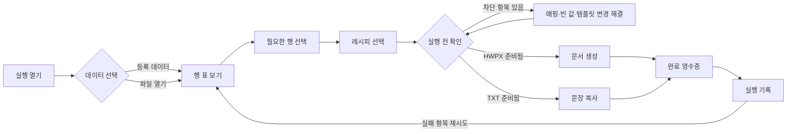
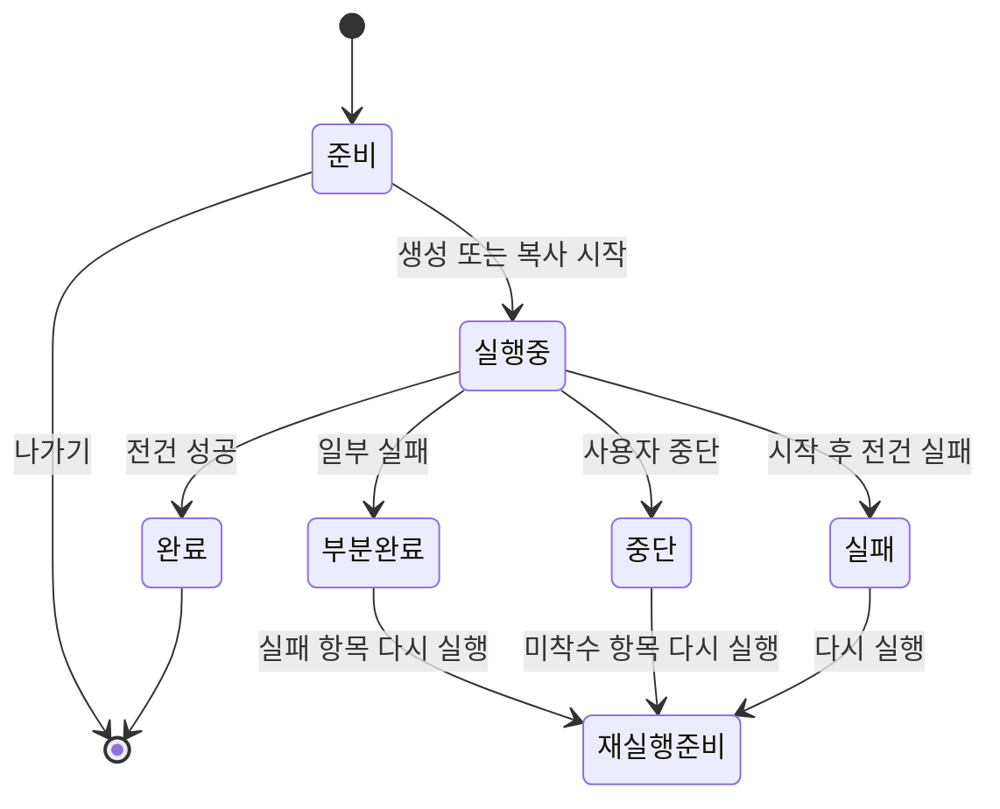

# 실행 중심 UX·정보구조 제안

> **문서 상태:** 백지 UI 실험 제안
> **권위 범위:** 다음 UI 실험의 목표 사용자 흐름, 화면 정보구조, 상태·행동 계약
> **후속 정본:** 채택 후 `UI_CONTRACT.md`, `UI_VOCABULARY.md`
> **편집 정책:** 실험 결과에 따라 변경

## 0. 한 문장 결론

문서나르미의 기본 진입점을 `실행`으로 바꾸고, 사용자가 **데이터를 열어 행을 고른 뒤
저장된 레시피를 적용하고, 결과와 주입 증거를 영구 기록으로 확인**하게 한다.

이 제안은 현재 화면 배치나 라우트에 얽매이지 않는다. 보존할 것은 다음 제품 계약뿐이다.

- 레시피와 실행 데이터는 서로 독립이다.
- 오류 가능성은 생성·복사 전에 드러난다.
- 빈 값, 템플릿 변경, 미치환 토큰, 덮어쓰기는 조용히 통과하지 않는다.
- 실행 결과와 증거는 성공뿐 아니라 실패·중단·검증 실패까지 남는다.
- HWPX와 TXT는 같은 시작 문법을 쓰고 마지막 행동만 `생성`과 `복사`로 갈라진다.

---

## 1. 사용자에게 보이는 제품 객체

내부 `Job`은 유지하되 사용자에게는 **레시피**라고 부른다.

| 객체 | 사용자 정의 | 저장 범위 | 저장하지 않는 것 |
|---|---|---|---|
| 레시피 | 어떤 템플릿에 어떤 데이터 열을 어떻게 넣을지 정한 재사용 규칙 | 형식, 템플릿, 매핑, 표시형, 파일명 규칙 | 현재 데이터, 선택한 행, 저장 폴더 |
| 실행 준비 | 지금 열어 둔 데이터로 무엇을 할지 정하는 임시 작업 공간 | 실행 전에는 영구 저장하지 않음 | 해당 없음 |
| 실행 기록 | 한 번의 생성·복사 시도와 그 결과 | 데이터 출처, 선택 범위, 레시피 판본, 결과, 증거 | 원본 데이터 파일 사본 |
| 템플릿 | HWPX 누름틀 또는 TXT 원문 | 파일 참조와 관리 정보 | 실행 상태 |
| 등록 데이터 | 다시 열기 위한 데이터 참조 | 파일 위치, 시트, 이름, 메모 | 데이터 행 사본 |

`실행 준비`와 `실행 기록`은 구분한다. 사용자가 데이터만 열어 보고 나가면 기록을 만들지 않는다.
`생성` 또는 `복사`를 시작한 순간부터 실행 ID를 발급하고 기록한다.

---

## 2. 최상위 정보구조

### 기본 내비게이션

```text
실행                 기본 진입
├─ 데이터 선택
├─ 실행 작업대
└─ 완료 영수증

기록
├─ 실행 목록
└─ 실행 상세
   ├─ 요약
   ├─ 산출물·복사 결과
   └─ 필드 증거

레시피
├─ HWPX·TXT 통합 목록
└─ 레시피 편집기

템플릿
├─ HWPX
└─ TXT

데이터
├─ 등록 데이터
└─ 참조 상태·수명 관리
```

설정은 내비게이션의 동급 업무 화면이 아니라 레일 하단의 전역 행동으로 둔다.

### 없애는 최상위 구분

- `홈`: 실행 시작과 최근 결과를 나누는 중간 허브를 두지 않는다.
- `작업`과 `기안`: 형식별 런타임 현관을 나누지 않는다.
- `데이터 관리에서 실행 불가`: 모든 등록 데이터에 `이 데이터로 실행` 행동을 둔다.

### 보조 진입점

기본 흐름은 데이터에서 시작하지만 객체별 지름길은 허용한다.

| 출발점 | 행동 | 실행 화면에서 고정되는 것 |
|---|---|---|
| 등록 데이터 | 이 데이터로 실행 | 데이터 |
| 레시피 | 이 레시피 실행 | 레시피 |
| 실행 기록 | 다시 실행 | 데이터 참조와 레시피, 행은 미선택 |
| 부분 실패 기록 | 실패한 항목 다시 실행 | 데이터·레시피·실패/미착수 행 |
| 템플릿 | 레시피 만들기 | 템플릿과 형식 |

지름길도 같은 `실행 작업대`로 모인다. 별도 간이 실행 UI를 만들지 않는다.

---

## 3. 목표 사용자 흐름



데이터를 연 뒤에는 행 선택과 레시피 선택의 순서를 강제하지 않는다. 사용자는 행을 먼저
좁히거나, 레시피를 먼저 골라 그 레시피 기준의 이전 처리 상태를 본 뒤 선택할 수 있다.
최종 행동만 두 조건을 모두 요구한다.

### 실행 상태 수명



`완료`, `부분완료`, `중단`, `실패`는 모두 기록이다. 성공한 실행만 역사로 인정하지 않는다.

---

## 4. 화면 1: 실행 시작

### 목적

사용자가 앱을 켠 뒤 첫 결정을 **어떤 데이터를 처리할지**로 만든다.

### 구조

```text
┌ 실행 ──────────────────────────────────────────────┐
│ 어떤 데이터를 처리할까요?                          │
│                                                    │
│ [파일 열기]  [등록 데이터에서 선택]                │
│                                                    │
│ 최근 사용한 데이터                                 │
│  인사발령.xlsx · 인사 시트 · 18분 전    [열기]     │
│  계약목록.xlsx · 본표 · 어제            [열기]     │
│                                                    │
│ 등록 데이터                                        │
│  2026 계약대장 · 연결됨                 [열기]      │
└────────────────────────────────────────────────────┘
```

### 규칙

- 화면의 주 행동은 `파일 열기`다. 등록 데이터는 같은 수준의 대안이다.
- 최근 항목은 원본 위치를 기억한 참조다. 행 내용을 캐시해 보여 주지 않는다.
- 파일에 여러 시트가 있으면 데이터 표를 열기 전에 시트를 확정한다.
- 파일을 읽지 못하면 이 화면에 머물며 문제와 다음 행동만 말한다.
- 일반 상태 카드, 작업 수 KPI, 템플릿 수 KPI는 두지 않는다.

---

## 5. 화면 2: 실행 작업대

### 목적

데이터 행 선택, 레시피 선택, 실행 전 확인을 한 화면에서 끝낸다.

### 전체 배치

```text
┌ 데이터: 인사발령.xlsx · 인사 시트 ─ [데이터 바꾸기] ┐
│ 선택 12/248              레시피: 인사발령 통지서     │
├──────────────────────────────┬───────────────────────┤
│ 데이터 표                    │ 실행 검사기           │
│                              │                       │
│ [검색] [필터]                │ 1. 레시피             │
│ [새 행] [실패] [현재 보기]   │    HWPX · 사용 가능   │
│                              │    [다른 레시피]       │
│ □ 문서  이름  부서  발령일   │                       │
│ ☑ ...                        │ 2. 채울 값             │
│ ☑ ...                        │    준비 8 · 빈 값 1   │
│ □ ...                        │    [필드별 확인]       │
│                              │                       │
│                              │ 3. 결과                │
│                              │    폴더 / 파일명       │
├──────────────────────────────┴───────────────────────┤
│ 선택 12건 · 확인할 빈 값 1개       [문서 12건 생성] │
└──────────────────────────────────────────────────────┘
```

넓은 화면에서는 데이터 표가 주 면적을 차지하고 실행 검사기는 오른쪽에 둔다. 좁은 화면에서는
`데이터 행`과 `실행 확인` 두 구획으로 세로 전환하되, 하단 행동줄의 선택 수와 차단 사유는
항상 보이게 한다.

### 5.1 데이터 표

데이터 표는 실행의 중심 작업 공간이다.

- 첫 열은 선택 체크박스다.
- 다음 열은 이 실행의 결과 이름 또는 TXT 행 식별 요약이다.
- 원본 데이터 열을 이어서 보여 준다.
- 필터는 보이는 행을 바꾸고, 선택은 필터를 관통해 유지한다.
- 필터 밖에 선택한 행이 있으면 수치와 함께 별도 표시한다.
- 레시피를 고른 뒤에는 각 행의 이전 실행 상태를 표시할 수 있다.

#### 선택 기본값

새 데이터 연결 시 **0건 선택**을 기본으로 한다.

자동 전체 선택도, 과거 기록을 근거로 한 자동 선택도 하지 않는다. 대신 사용자가 의미를 아는
선택 행동을 제공한다.

| 행동 | 의미 | 노출 조건 |
|---|---|---|
| 새 행 선택 | 같은 레시피 판본의 성공 기록에서 찾지 못한 행 | 비교 가능한 기록과 레시피가 있음 |
| 실패·미착수 선택 | 직전 부분완료·중단 기록의 대상 | 해당 기록에서 다시 실행 |
| 현재 보기 선택 | 현재 필터 결과 전체 | 필터가 활성 |
| 전체 선택 | 읽은 데이터 전체 | 항상, 총 건수 재진술 |
| 전체 해제 | 모든 선택 해제 | 1건 이상 선택 |

`새 행`은 “이전에 처리하지 않았다”는 절대 판정이 아니다. **현재 데이터와 같은 레시피 판본의
성공 기록에서 동일한 행을 찾지 못했다**는 비교 결과다. 레시피가 바뀌면 새 비교로 본다.

### 5.2 레시피 선택

데이터를 읽으면 필요한 데이터 열을 기준으로 레시피를 세 등급으로 정렬한다.

1. `바로 사용`: 필요한 데이터 열이 있고 템플릿 상태가 정상
2. `확인 필요`: 빈 값 가능성, 새 데이터 열, 이전 판본과의 차이
3. `사용 불가`: 필요한 데이터 열 누락, 템플릿 부재·구조 변경

카드에는 다음만 표시한다.

- 레시피 이름
- 결과 형식 `HWPX` 또는 `TXT`
- 호환 상태와 한 줄 사유
- 마지막 실행 결과

`사용 불가`도 숨기지 않는다. 선택하면 검사기에 정확한 차단 사유와 `레시피 편집` 행동을
보여 준다.

### 5.3 실행 검사기

검사기는 세 구획만 가진다.

#### 레시피

- 현재 레시피와 형식
- 템플릿 이름
- 레시피 판본
- 다른 레시피 선택
- 레시피 편집

레시피에 기본 데이터가 있더라도 자동으로 연결하지 않는다. 레시피에서 실행을 시작한 경우
추천 데이터로만 제시한다.

#### 채울 값

선택한 행 전체의 집계와 대표 행의 실제 값을 함께 보여 준다.

```text
준비 8개 · 빈 값 1개 · 항목 없음 0개 · 템플릿 변경 0개

대표 행: 12 / 12
필드       데이터 열      들어갈 값              상태
성명       이름           김나르미                준비
발령일     발령일         2026년 7월 24일         준비
직위       직위           〈빈 값〉                확인 필요
```

- 빈 값 확인은 행·필드 조합별 사실을 보존하되, 반복 확인을 줄이도록 같은 사유를 묶어 표시한다.
- 사용자가 확정한 빈 값은 실제 산출물에 표식을 남긴다는 결과를 확인 문구에 포함한다.
- 템플릿 변경과 항목 없음은 실행을 차단한다.
- 값 표는 HWPX 렌더 미리보기가 아니라 들어갈 텍스트 값임을 짧게 표시한다.

#### 결과

HWPX와 TXT가 이 구획에서 갈라진다.

| HWPX | TXT |
|---|---|
| 저장 폴더 | 현재 완성 문장 |
| 파일명 규칙과 선택 행별 이름 | 이전·다음 행 |
| 신규·덮어쓰기 수 | 미치환 토큰 수 |
| 예상 문서 수 | 복사 진행 수 |

HWPX 파일명 충돌은 실행 버튼을 누른 뒤 한 번의 덮어쓰기 확인으로 모은다. TXT 미치환 토큰은
본문에서 빨갛게 보이고 복사 시 다시 확인한다.

### 5.4 하단 행동줄

하단 행동줄은 현재 상태를 다음 형식으로 재진술한다.

```text
선택 12건 · HWPX · 확인할 빈 값 1개                 [문서 12건 생성]
선택 3건 · TXT · 복사 준비됨                         [첫 문장 복사]
```

- 차단 중이면 버튼을 비활성화하고 바로 옆에 첫 해결 행동을 둔다.
- 버튼 라벨은 결과와 수량을 말한다.
- 생성 중에는 진행 수, 현재 파일, `다음 건부터 중단`을 표시한다.
- TXT는 복사할 때마다 다음 행으로 이동한다. 마지막 행 뒤에 완료 영수증을 연다.

---

## 6. 화면 3: 완료 영수증

### 목적

실행이 끝났다는 알림이 아니라, **무엇이 일어났고 무엇이 증명됐는지** 보여 준다.

### 공통 구조

```text
┌ 실행 결과 ─────────────────────────────────────────┐
│ 부분 완료 · 성공 11/12 · 실패 1                    │
│ 인사발령.xlsx + 인사발령 통지서 · 14:32             │
│                                                    │
│ [실패 1건 다시 실행] [기록에서 보기]                │
├────────────────────────────────────────────────────┤
│ 결과 목록                                          │
│ ✓ 김나르미.hwpx   값 확인 8/8          [열기]       │
│ ! 이문서.hwpx     생성 실패             [원인]      │
│                                                    │
│ 증거                                               │
│ 레시피 판본 · 템플릿 · 데이터 출처 · 원장 저장됨   │
└────────────────────────────────────────────────────┘
```

### HWPX 완료

- 성공·실패·미착수 수를 분리한다.
- 산출물마다 `생성 성공`과 `값 확인`을 별도 상태로 표시한다.
- 생성은 성공했지만 되읽기 검증이나 원장 저장에 실패하면 성공색 하나로 덮지 않는다.
- `폴더 열기`, `파일 열기`, `필드 증거 보기`를 제공한다.
- 실패·미착수 재실행은 새 실행을 만들며 이전 기록을 수정하지 않는다.

### TXT 완료

- `클립보드에 복사함`까지만 주장한다. 외부 문서에 붙여넣었는지는 증명하지 않는다.
- 행별 복사 시각, 미치환 토큰 여부, 중단 시 남은 건수를 기록한다.
- 복사한 전체 텍스트를 실행 목록 카드에 그대로 노출하지 않는다.

### 영속 규칙

영수증은 닫혀도 `기록`에서 같은 내용을 다시 볼 수 있어야 한다. 토스트나 세션 로그만으로
완료를 대신하지 않는다.

---

## 7. 화면 4: 기록

### 실행 목록

기본 정렬은 최신순이다.

```text
기록
[상태] [형식] [레시피] [기간] [검색]

오늘 14:32  부분 완료  HWPX
인사발령 통지서 · 인사발령.xlsx · 성공 11/12 · 값 확인 88/88

오늘 13:10  완료       TXT
회의 안내 기안 · 참석자.xlsx · 복사 8/8 · 미치환 0
```

목록의 필수 정보는 다음이다.

- 시작 시각과 종료 상태
- HWPX 또는 TXT
- 레시피와 데이터 출처
- 대상·성공·실패·미착수 수
- 증거 상태

필터는 `상태`, `형식`, `레시피`, `기간`까지만 기본 제공한다. 실행 기록의 원시 필드값 검색은
민감 정보 노출과 복잡도를 늘리므로 포함하지 않는다.

### 실행 상세

상단 요약 아래에 결과 목록과 선택한 결과의 증거를 나란히 둔다.

```text
실행 #20260724-143210
부분 완료 · HWPX · 2026-07-24 14:32

출처
데이터: C:\...\인사발령.xlsx · 인사 시트
레시피: 인사발령 통지서 · 판본 7
템플릿: 인사발령.hwpx · 구조 지문 …

결과 목록                     선택한 결과의 필드 증거
✓ 김나르미.hwpx               필드    예정값    읽은 값    판정
! 이문서.hwpx                 성명    김나르미  김나르미   일치
                              직위    주무관    주무관     일치
```

#### 증거 판정

| 상태 | 의미 |
|---|---|
| 일치 | 예정값과 생성물을 되읽은 값이 같음 |
| 불일치 | 생성물에서 읽은 값이 예정값과 다름 |
| 확인 못함 | 생성은 성공했지만 생성물을 읽지 못함 |
| 해당 없음 | 비움 확정, 생성 실패, TXT 복사처럼 되읽을 산출물이 없음 |

`일치`는 문서 레이아웃이나 서식 전체가 옳다는 뜻이 아니다. 필드에 들어간 텍스트 값을
되읽어 확인했다는 뜻으로 제한한다.

### 기록에서 가능한 행동

- 산출물 열기
- 산출물 폴더 열기
- 원장 JSON 열기
- 같은 데이터와 레시피로 다시 실행
- 실패·미착수만 새 실행으로 보내기
- 경로가 끊긴 데이터·템플릿 다시 연결

기록 삭제는 이 마일스톤에 넣지 않는다. 증거의 수명 정책을 별도로 결정하기 전까지 사용자가
실수로 실행 증거를 지우는 행동을 만들지 않는다.

---

## 8. 화면 5: 레시피

HWPX와 TXT를 한 목록에서 형식 필터로 나눈다. 사용자는 “어떤 문서를 만들지”를 관리하며,
런타임 현관은 이 화면이 아니다.

### 목록

각 행은 다음을 표시한다.

- 레시피 이름
- 형식
- 템플릿
- 마지막 실행 결과와 시각
- 상태 `사용 가능`, `템플릿 확인 필요`, `연결 끊김`

행의 주 행동은 `편집`이다. `이 레시피 실행`은 보조 행동이며 실행 시작 화면으로 이동한다.

### 편집기 공통 골격

1. **결과 원본**: HWPX 템플릿 또는 TXT 원문
2. **맞추기**: 템플릿 필드·토큰과 데이터 열, 유형, 표시형
3. **결과 규칙**: HWPX 파일명 또는 TXT 복사 방식
4. **이름과 저장**

샘플 데이터는 매핑 검토를 위해서만 연결한다. 레시피 저장물에는 데이터와 선택 행을 넣지 않는다.

---

## 9. 화면 6: 데이터와 템플릿

### 데이터

데이터 관리는 참조 수명 관리와 실행 진입을 함께 맡는다.

각 항목은 다음을 보여 준다.

- 이름, 파일, 시트
- 연결 상태
- 이 데이터로 실행한 최근 기록
- 이 데이터를 추천 데이터로 쓰는 레시피
- `이 데이터로 실행`

`활성`, `보관`, `삭제`, `다시 연결`은 관리 행동으로 남긴다. 보관 데이터는 일반 실행 선택에서
숨기되 기록의 출처에서는 계속 보인다.

### 템플릿

각 항목은 다음을 보여 준다.

- 이름과 형식
- 구조·토큰 상태
- 이 템플릿을 쓰는 레시피
- `레시피 만들기`

파이프라인, 나라장터, 새 커넥터는 이 정보구조에 자리를 미리 만들지 않는다.

---

## 10. 실행 전·후 상태 계약

| 상태 | 실행 전 표면 | 최종 행동 | 기록 |
|---|---|---|---|
| 데이터 없음 | 실행 시작 화면 | 불가 | 없음 |
| 선택 0건 | 데이터 표와 행동줄 | 불가, 선택 행동 제시 | 없음 |
| 레시피 없음 | 호환 레시피 목록 | 불가 | 없음 |
| 필요한 데이터 열 없음 | 필드별 항목 없음 | 불가, 레시피 편집 | 없음 |
| 템플릿 구조 변경 | 바뀐 필드 목록 | 불가, 레시피 편집·다시 연결 | 없음 |
| 빈 값 미확인 | 행·필드와 결과 표식 | 불가, 빈 값 확인 | 없음 |
| 파일명 토큰 미치환 | 영향받는 행·토큰 | 불가, 레시피 편집 | 없음 |
| 기존 파일 충돌 | 신규·덮어쓰기 수 | 확인 후 가능 | 승인 사실 포함 |
| 생성 중 | 진행 수와 현재 파일 | 다음 건부터 중단 | `실행중` |
| 일부 실패 | 완료 영수증 | 실패만 새 실행 | `부분완료` |
| 사용자 중단 | 성공·실패·미착수 분리 | 미착수 새 실행 | `중단` |
| 되읽기 불일치 | 산출물별 불일치 | 파일은 유지, 검토 요구 | `완료/부분완료` + 증거 경고 |
| 원장 저장 실패 | 문서 결과와 분리해 경고 | 기록 복구·폴더 열기 | 최소 실행 기록에 실패 사실 보존 |

---

## 11. 실행 기록의 최소 데이터 계약

화면 설계가 사실이 되려면 실행 기록이 다음을 가져야 한다.

```text
run_id
created_at / started_at / finished_at
status: running | completed | partial | cancelled | failed
action: hwpx_generate | txt_copy

recipe
  id / name / version
  실행 시점 레시피 스냅샷 또는 불변 지문

template
  path / 형식 / 실행 시점 지문

source
  종류 / 파일 경로 또는 등록 참조 / 시트 / 실행 시점 지문

selection
  선택 방식
  원본 행 위치
  비교용 행 지문

output
  저장 폴더
  산출물별 성공·실패·오류·주의
  TXT 행별 복사 시각·미치환 상태

evidence
  필드별 예정값
  HWPX 되읽기 값과 판정
  검증 오류
  원장 파일 경로
```

### 비교용 행 지문

`새 행`, `이전 성공`, `실패 항목`을 말하려면 행 식별 규칙이 필요하다.

- 레시피가 실제로 읽는 데이터 열의 정규화된 값으로 지문을 만든다.
- 같은 값의 중복 행은 출현 순번을 함께 쓴다.
- 지문은 원본 값 자체를 복제하지 않고 로컬 해시로 저장한다.
- 레시피 판본이 바뀌면 이전 성공 여부를 새로 계산한다.
- 사용자가 지정하는 업무 키 열은 후속 확장으로 남긴다.

이 규칙으로도 외부 편집 때문에 동일성 판단이 모호하면 `새 행`을 단정하지 않고
`이전 기록과 비교할 수 없음`으로 표시한다.

### 원자성

- 최종 행동을 시작할 때 `running` 기록을 먼저 만든다.
- 산출물 한 건이 끝날 때마다 결과를 누적한다.
- 앱이 비정상 종료돼도 `running` 기록과 이미 끝난 산출물을 복구할 수 있어야 한다.
- 원장 JSON은 내보내기 부속물이 아니라 실행 기록이 가리키는 증거 파일이다.

---

## 12. 시각적 우선순위

1. 데이터 표
2. 실행을 막는 문제
3. 선택 수와 최종 행동
4. 들어갈 값
5. 레시피·출처 메타데이터

이 우선순위에 따라 다음을 피한다.

- 레시피 목록이 데이터 표보다 넓은 master 영역을 차지함
- 정상 상태 배지가 문제보다 더 강하게 보임
- 완료 결과가 로그 문자열 하나로 끝남
- 경로·지문·원장 같은 증거 메타데이터가 실행 전 주 작업을 밀어냄
- HWPX와 TXT를 최상위 화면 둘로 분리함

---

## 13. 핵심 수용 시나리오

### A. 처음 HWPX 생성

1. 앱을 열면 `실행`이 보인다.
2. 파일을 열고 시트를 고른다.
3. 0건 선택 상태에서 필요한 3건을 고른다.
4. 호환 레시피를 고른다.
5. 필드값과 저장 폴더를 확인한다.
6. 문서 3건을 생성한다.
7. 영수증에서 파일 3건과 값 확인 결과를 본다.
8. 앱을 다시 열어도 `기록`에서 같은 증거를 찾는다.

### B. 누적 데이터에서 새 행만 생성

1. 같은 데이터와 레시피를 연다.
2. 표에서 이전 성공 행과 새 행의 비교 상태를 본다.
3. `새 행 선택`을 직접 누른다.
4. 선택된 새 행만 생성한다.

### C. 부분 실패 재시도

1. 12건 중 11건 성공, 1건 실패한다.
2. 영수증은 성공 파일을 유지하고 실패 원인을 표시한다.
3. `실패 1건 다시 실행`을 누른다.
4. 새 실행 작업대에 그 1건만 선택돼 있다.
5. 이전 기록과 재시도 기록은 별도로 남는다.

### D. 템플릿 변경

1. 데이터와 레시피를 골라도 구조 변경이 있으면 실행할 수 없다.
2. 바뀐 필드와 영향을 받는 매핑을 본다.
3. 레시피를 편집한 뒤 같은 실행 작업대로 돌아온다.
4. 사용자가 고른 데이터와 행은 안전하게 복원된다.

### E. TXT 복사

1. 데이터를 열고 행을 고른다.
2. TXT 레시피를 선택한다.
3. 전체 완성 문장과 미치환 토큰을 본다.
4. 행별로 복사하고 다음 행으로 이동한다.
5. 기록에는 복사 요청과 토큰 상태가 남고, 외부 붙여넣기 성공을 주장하지 않는다.

### F. 증거 실패

1. HWPX 파일은 생성됐지만 되읽지 못한다.
2. 영수증은 `생성 성공`과 `값 확인 못함`을 분리한다.
3. 기록에서 파일과 검증 오류를 다시 확인할 수 있다.

---

## 14. 이번 실험에서 하지 않는 것

- 조건부 문서 조립, 반복문, 사용자 작성 함수
- PDF 생성
- 다중 전송·결재·메일 발송
- 외부 SaaS·CRM 커넥터
- 파이프라인·나라장터 UI 부활
- 기록 삭제·보존 기간 정책
- HWPX 페이지 렌더 미리보기
- 여러 레시피를 한 번에 실행하는 매트릭스

이 실험의 성공 기준은 기능 수가 아니라 **데이터에서 시작한 한 번의 실행이 증거까지 끊기지
않고 닫히는가**다.
