# 101 워크스루 UX findings 원장 (F1~F41)

> **출처.** 2026-07-18, 샌드박스에서 `examples/quickstart-101` 시나리오를 화면만으로 직접 실행하며
> 캡처+피드백을 수집한 라운드. 사용자가 화면을 순회하고(대시보드 → 작업 에디터 1~4단계 → 실행 →
> 즉시 기안) 관측을 주면, confirm-or-alarm·altitude 렌즈로 구조화해 처분까지 배치했다.
> **이 문서는 그 findings의 유실 방지 아카이브다** — 후속 라운드/이슈 발행의 단일 출처.
>
> **상태 표기.** 이 원장은 *트리아지 스냅샷*이다(착수 전). 실제 조치는 GitHub 이슈로 발행하며,
> 이 문서는 서사·판정·결정값·라운드 지형을 보존한다([[docs-vs-issues-boundary]] 준수 —
> done 상태는 이슈가 들고, 여기엔 원칙·설계·결정 서사만).

## 범례

- **판정**: 관측의 성격 (개발언어 누출 · altitude/과노출 · confirm-or-alarm 위반 · 레이아웃 · 설계 재고 …).
- **심각도**: `막힘(blocker)` > `마찰(friction)` > `다듬기(polish)` · `향상(제안)`.
- **처분**: `즉시수정` · `이슈화` · `설계 라운드` · `삭제` · `토의 필요` · `반증=정상`.
- **상태**: `기록` · `방향 확정` · `결정` · `미결(토의)` · `후순위`.

---

## 라운드 지형 (findings → 묶음) · 우선순위순

| 라운드 | 성격 | 포함 findings | 우선순위 |
|---|---|---|---|
| **즉시수정(blocker)** | 순수 정합성 버그 | **F34·F34b** (파일명 토큰 검증 부재), F33(레코드 정체 불투명·동뿌리) | **1 (최우선)** |
| **즉시수정(CSS/동작)** | 상위 설계 무종속 | F2·F5·F14 · F10·F11 · F24 · F6 · F30·F32 | 2 |
| **R-scope** | 재사용 파워 추상 제거 | F9 matrix · F8 패싯태그 · F22 매핑프로파일 (· F40 파이프라인=후순위) | 3 |
| **R-copy** | 어휘 전수조사·중앙화 | F1·F3·F4·F15·F17·F25·F31·F35 | 4 |
| **R-css** | 버튼/아이콘/열 레이아웃 전수조사 | F2·F5·F16·F23·F28·F29 (공유 뿌리 의심) | 4 |
| **R-flow** | 에디터↔실행 흐름·트랙 파리티 | F18·F20·F21·F19 · F26·F27 · F36·F37·F38·F39 | 5 |
| **R-info** | 정보구조·홈 정체성·라이브러리 | F8·F12·F13·F41 (토의 필수) — **1부(작업의 집) 합의 종결 2026-07-18 → `docs/R_INFO_JOB_HOME.md`**, 2부(템플릿 관리·F12 세부) 잔여 | 5 (길게) |

> **연쇄 요약.** R-scope(matrix·패싯·프로파일 제거)는 한 방향 — "big-N 파워 추상을 걷어내고
> 사용자가 이미 아는 단일 모델로 수렴". R-copy·R-css는 반복 표본이 충분해 개별수리 아닌 **전수조사**로
> 격상. "곧 재설계될 표면은 지금 다듬지 않는다"(F16 교훈)로 R-css와 설계 라운드 종속을 가른다.

---

## 실행 로드맵 (41 findings → 8 흐름 · 순서대로)

> 41개를 동시에 보면 깜깜하지만, 실행 단위로 접으면 **약 8개 흐름 · 즉시 브랜치 6개 · 시작점 1개**다.
> 마주한 건 41개가 아니라 **브랜치 하나(F34) → 기계적 5개 → 설계 대화 2개.** 워크플로: 이 원장 머지 후,
> 각 흐름을 **문제별 브랜치**로 파고 PR이 master의 이 원장을 근거로 가리킨다.

**① 즉시 브랜치 (기계적·저위험·모멘텀)**
| # | 브랜치 | findings | 성격 |
|---|---|---|---|
| 1 | `fix/filename-token-validation` **← 시작** | F34·F34b·F33 | 유일한 real bug, 고립적, CLI에 정답(RC-20) 이식만 |
| 2 | `fix/new-session-reset` | F10·F11 | "새 X" 초기화+가드(대칭), 작고 고립 |

**② 스코프 축소 브랜치 (삭제 = 표면 축소 → 뒤가 쉬워짐)**
| # | 브랜치 | findings | 성격 |
|---|---|---|---|
| 3 | `chore/remove-matrix` | F9 | 참조 훑고 삭제 |
| 4 | `chore/remove-mapping-profiles` | F22 | 삭제 + 「작업 복제」 추가 |

**③ 전수조사 브랜치 (한 개념·여러 파일)**
| # | 브랜치 | findings | 성격 |
|---|---|---|---|
| 5 | `refactor/copy-centralize` | R-copy(F1·F3·F4·F15·F17·F25·F31·F35) | **3·4 삭제 뒤** — 지울 것의 카피 안 고침(F16 교훈) |
| 6 | `refactor/button-layout-audit` | R-css(F2·F5·F16·F23·F28·F29) + 흡수(F6·F14·F24·F30·F32) | 공유 컴포넌트 한 곳 |

**④ 설계 라운드 (브랜치 전 설계 문서·토의 먼저 — 아직 코딩 아님)**
| # | 라운드 | findings | 비고 |
|---|---|---|---|
| 7 | **R-flow** | F18·F20·F21·F19·F26·F27·F36·F37·F38·F39 | 에디터↔실행 흐름·트랙 2×2 리프레임. 큼 |
| 8 | **R-info** | F8·F12·F13·F40·F41 | 홈 정체성·폴더트리 라이브러리·패싯 제거·파이프라인. **토의 필수·제일 큼** |

**의존 순서.** 1 → 2 → (3·4 삭제) → 6(css) → 5(copy) → 8(R-info, 홈·라이브러리 재편이 R-flow도 건드림)
→ 7(R-flow). **삭제·빠른 건 먼저, 설계는 마지막.** (F40 파이프라인은 8 안에서 후순위 유예 유지.)

---

## 정련된 원칙 (라운드 종료 후 메모리 반영 후보)

1. **정상은 조용히, 문제만 시끄럽게** — confirm-or-alarm의 빠진 반쪽. "시끄럽게 알려라"는
   *문제·불확실*에 대한 것이지 *성공·정상*이 아니다. 앱이 정상/성공을 크게 떠들면 노이즈.
   근거: F13(허영 KPI)·F30(상시 relink)·F32(성공 배너). [[confirm-or-alarm-principle]] 정련.
2. **점진적 공개는 두 축** — ①시간축(F19b): 첫 대면 투명 → 재방문 접힘. ②전문성축(F27): 기본 상시,
   고급 접어서 on-demand. 둘 다 "조용히 숨김"이 아니라 **펼침 어포던스 + 개수 표지**(confirm-or-alarm 정합).
3. **출력 모드가 최적 인터랙션을 결정한다** — 텍스트-붙여넣기 출력은 키보드 우선 레코드 루프,
   hwpx-파일 출력은 배치 선택. (F36 리프레임·F38)
4. **저작 표면 ≠ 관리 모델** — 매체가 저작 방식을 정하되(txt 인라인 · hwpx 외부/import),
   조직·발견은 단일 라이브러리로 수렴. (F41)
5. **곧 재설계될 표면은 지금 다듬지 않는다** — 상위 설계 결정에 종속된 폴리시는 그 라운드로 미룸. (F16)
6. **삭제는 의무를 상속한다** — 제거 시 참조·복구자재를 먼저 훑고 조용한 파손 없이. (F9·F22·F40)

---

## 스크린샷 매니페스트

원본 캡처는 `docs/ux-findings-101/screenshots/`에 무손실 보관(2026-07-18 촬영, 파일명 `cap-NN-HHMM.png`
= 촬영 순번·시각). 각 화면 섹션에 임베드됨.

| 파일 | 촬영 | 화면 | findings |
|---|---|---|---|
| `cap-01-0824.png` | 08:24 | A 대시보드 전체 | F1~F5 |
| `cap-02-0832.png` | 08:32 | B 네이티브 태그 프롬프트 | F7·F8 |
| `cap-03-0840.png` | 08:40 | C 정식 문서 생성 패널(matrix) | F9 |
| `cap-04-0847.png` | 08:47 | D 트랙 패널(1/2) | F10 |
| `cap-05-0847.png` | 08:47 | D 작업 에디터 1단계·편집배너(2/2) | F10·F11 |
| `cap-07-0902.png` | 09:02 | A KPI·이어서 실행 확대 | F13·F14 |
| `cap-08-0908.png` | 09:08 | E 작업 에디터 1단계 전체 | F15~F17 |
| `cap-10-0917.png` | 09:17 | F 작업 에디터 2단계 데이터 선택 | F18~F21 |
| `cap-11-0935.png` | 09:35 | G 작업 에디터 3단계 매핑 확정 | F22~F24 |
| `cap-12-0942.png` | 09:42 | H 작업 에디터 4단계 저장 | F25~F27 |
| `cap-13-0945.png` | 09:45 | I 실행 화면 | F28~F34 |
| `cap-14-0955.png` | 09:55 | J 즉시 기안(txt) | F35~F39 |
| `cap-06-0851.png` | 08:51 | *(여분)* 즉시 기안·txt 패널 클로즈업 | — 미첨부 |
| `cap-09-0910.png` | 09:10 | *(여분)* 편집 모드 배너 조각 | — 미첨부 |

> F6(새로고침)·F12(라이브러리 비대칭)·F40(파이프라인)·F41(txt 관리)은 텍스트 피드백/코드 조사라 전용
> 스크린샷 없음(F6·F12는 화면 A·D 캡처에 맥락 포함).

## 화면별 findings (스크린샷 매칭)

### 화면 A — 대시보드 (첫 진입, 전체)
> 스크린샷: 레일(투트랙 허브) + KPI 3타일 + 이어서 실행 + 정식 문서 생성·HWPX / 즉시 기안·txt 트랙 2패널.

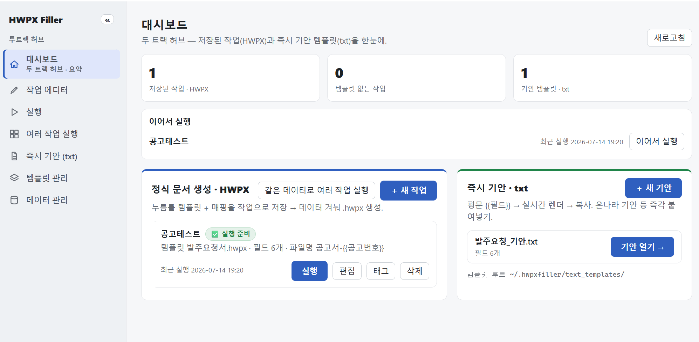

KPI·이어서 실행 확대(F13·F14):

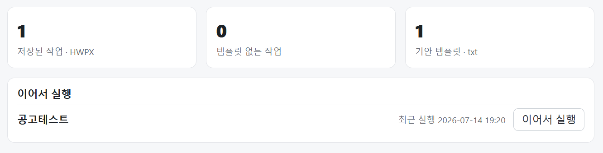

| ID | 위치 | 관측 | 판정 | 심각도 | 처분 | 상태 |
|---|---|---|---|---|---|---|
| **F1** | 레일 `.rl` + 대시보드 부제 (`web/index.html:24,60`) | "투트랙 허브" 개발결정 용어(ADR I) 누출 + "투트랙"/"두 트랙" 표기 불일치(드리프트) | 개발언어 누출 + 불일치 | 마찰 | R-copy | 기록 |
| **F2** | `.brand > #railToggle` (`index.html:22`) | 사이드바 접기 「«」 정렬 틀어짐 | 레이아웃 | 다듬기 | R-css | 기록 |
| **F3** | 트랙 패널 설명문 (home.js) | 문서생성/즉시기안 설명 난삽 + 개발용어 | 카피 | 마찰 | R-copy | 기록 (F9 하류) |
| **F4** | 트랙 명칭 "정식 문서 생성"/"즉시 기안" | 개발 관점 명칭 | 명명 | — | R-copy | **결정: 산출물 기준 → "HWPX 문서 만들기" / "기안문 채우기(txt)"** |
| **F5** | 트랙 헤더 파란 버튼(＋새 작업·같은 데이터로 여러 작업 실행·기안 열기) | 버튼이 둥둥 떠 겉돎(앵커·정렬 부재) | 시각 위계 | 다듬기 | R-css | 기록 |
| **F6** | 대시보드 헤더 「새로고침」 (`homeRefresh`) | 앱이 이미 nav 진입 시 자동 갱신(`app.js:24 REFRESH_ON_NAV`) → 수동 버튼 잉여 | 잉여 어포던스 | 다듬기 | 이슈화(제거) | 기록 |
| **F13** | KPI 3타일 (`index.html:65`) | 실재하나 무용한 허영 지표(작업 수·템플릿 수). "템플릿 없는 작업"만 >0일 때 경보값 | 장식성/altitude | 마찰 | R-info | **미결(토의 필수)** — 홈 정체성 문제 |
| **F14** | 「이어서 실행」 패널 | 아이디어 승인. "이어서 실행" 라벨이 제목+버튼 중복 | 라벨 중복 | 다듬기 | 즉시수정 | 기록 |

<b>F13 논의 경위 (허영 지표 → 대시보드 정체성 → 토의 유예)</b>

**트리거.** KPI 3타일(저장 작업 1·템플릿 없는 작업 0·기안 템플릿 1) + 이어서 실행 캡처. 사용자: "템플릿 수·작업
수가 사용자에게 대체 무슨 소용? **대시보드를 만들고 비어있으니 아무 정보나 넣은 거잖아 이거는.**"

**진단(실재≠유용).** 코드 주석은 "전부 실재 데이터·가짜 지표 없음"이라 자부(index.html:65)하나 함정은
**실재 ≠ 유용.** 셋을 가르면: 저장작업 수·기안템플릿 수 = 아래 카드에 이미 보임(허영); "템플릿 없는 작업"만
**>0일 때 경보값**이나 0일 때도 상시 떠 소음. → 1차 방향: 허영 제거 + 경보는 조건부(문제 있을 때만) =
confirm-or-alarm을 대시보드 chrome에 적용.

**격상(정체성 문제).** 사용자: "이건 **대시보드 정체성**과 관련된 문제라 '어떤 정보가 노출돼야 하는지' 토의가
필요하다." → F13은 "타일 3개 지우기"가 아니라 **"이 화면은 무엇인가."** 대시보드 **과적재**(한 화면 5역할:
KPI·resume·작업브라우저·트랙런처·txt런처)가 근본. 척추 후보 **A**(주의 라우터="무엇이 나를 필요로 하나",
정상이면 정직하게 빔) / **B**(액션 허브) / **C**(작업 표면). 레일=B·폴더트리 브라우저=C가 이미 있으니 대시보드만의
빈 역할은 **A(주의+resume)** — 허영의 정반대이자 우리 원칙과 같은 결.

**유예 결정.** 사용자: "이건 한참 걸릴 일이라 토의가 필수. 기록만 해두자." → **미결·R-info로**(F8·F12와 병합된
"홈 정체성/정보구조 재설계", 토의 필수·길게).

---

### 화면 B — 작업 카드 「태그」 → 네이티브 프롬프트
> 스크린샷: "127.0.0.1:6283의 메시지" 크롬 기본 prompt("'공고테스트'의 분류 태그 — '축=값' 쌍을…").

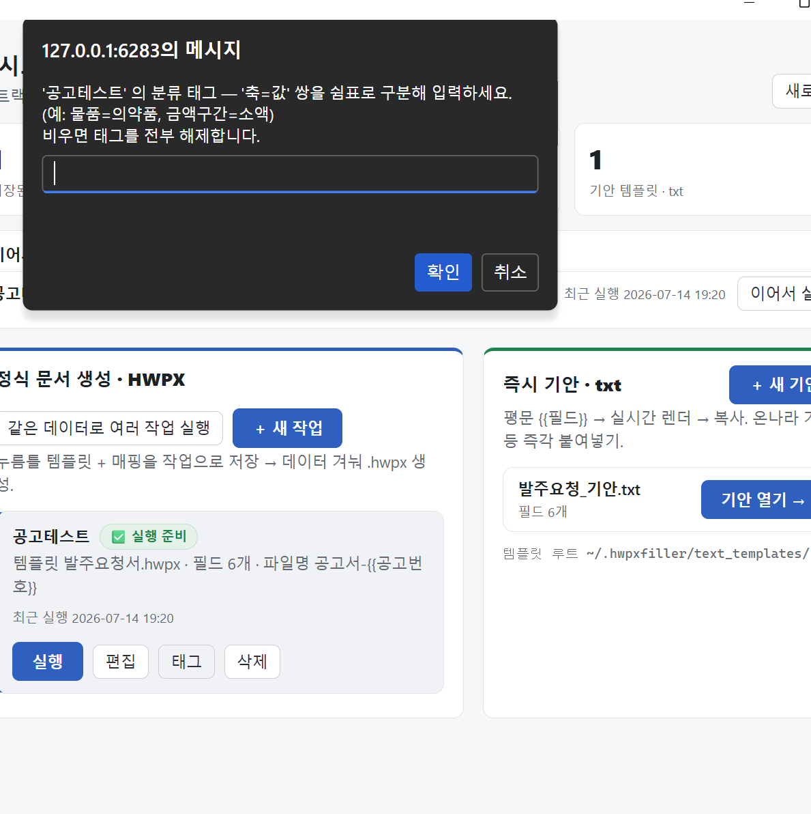

| ID | 위치 | 관측 | 판정 | 심각도 | 처분 | 상태 |
|---|---|---|---|---|---|---|
| **F7** | 태그 편집 (`home.js:246/252`) | `window.prompt`/`alert` 사용 — 기존 공유 `modal.js`(PR#31) 우회. 흐름 깨짐·톤 불일치 | 블로킹 다이얼로그 | 마찰 | 코드수정 | 기록 (F8 종속 — 삭제로 해소 유력) |
| **F8** | 작업/템플릿 분류 태그(facet) 설계 전반 | 패싯 태그 = 크고 이질적 코퍼스용 도구인데, 작업은 이름 가진 소수 손-큐레이션 집합. n=1에서 값 전에 비용부터 청구(D14 부담 실물화). 데이터 도메인 어휘가 작업 조직층에 얹혀 이물감 | 설계 재고 (D1~D16 뒤집기) | — | R-info | **방향 재확정 ↓** |

<b>F8 논의 경위 (트리거 → 진단 → 4단계 재고 → 확정)</b>

**트리거.** 사용자가 작업 카드 「태그」를 눌렀더니 네이티브 prompt가 떠 흐름이 깨짐(F7). 그 프롬프트가
`'축=값' 쌍을 쉼표로…`(예: 물품=의약품)를 요구 → "분류 태그 설계 자체를 전면 재검토하자. 템플릿 관리는
사용자 그룹화·이름순 정렬로 시각화가 맞지 않나?"

**진단(핵심).** 패싯(facet) 태그는 **크고 이질적인 코퍼스를 어떻게 썰까**에 답하는 도구인데, 작업(Job)은
**이름을 가진 소수의 손-큐레이션 집합**이다. 어긋남의 증거 셋: ①태그 예시(`물품=의약품`·`금액구간=소액`)가
**조달 데이터 도메인 어휘** — 그게 작업 조직층에 얹혀 이물감. ②101 첫 실행엔 작업 1개 → n=1에서 group-by·
축=값 입력은 **값이 나기 전에 비용부터** 청구(D14 수동 태깅 부담의 실물화). ③소수의 이름 있는 집합이 원하는 건
**정렬**이지 패싯이 아니다. **즉 사용자 직관이 옳았다.** 단 패싯 설계(D1~D16)엔 이유가 있었으니("작업이 쌓이면
평면 목록이 안 버틴다") 질문은 "패싯이 틀렸나"가 아니라 **"실제 운용 N에서 패싯이 값을 하나"**로 정련됨.

**N 확인.** "저장 작업이 보통 몇 개?" → 사용자 답 **수십~수백**. 그럼 패싯은 언젠가 값을 하니 **파괴가 아니라
강등**이 1차 결론(초안: 정렬 척추 + 패싯을 태그 있을 때만 뜨는 선택 렌즈로).

**Explorer 메타포 도입(사용자).** "정확히 윈도 파일탐색기의 그 철학 — 정렬 가능·자유 중첩 그룹화·일부 숨김."
이게 강등안을 **채워줌**: 정렬 헤더 + 중첩 그룹화(패싯 축이 다단 그룹으로 재활용됨) + 숨김. 즉 **패싯 데이터
모델은 버릴 게 아니라 그룹화 차원으로 재활용**하고, 바꾸는 건 표현·입력(태그 DSL → Explorer식).

**정정 ①: 숨김 → 접힘.** 사용자: "숨김이 아니라 '접힘', 탐색기가 하는 그 형식." → 항목이 사라지는 게 아니라
그룹 단위로 접히고 헤더에 "○○(N)"가 남음. **confirm-or-alarm 긴장 거의 소멸**(별도 "N개 숨김 표지" 불필요 —
접힌 헤더가 곧 표지).

**정정 ②(razor): 다축 → 단일 폴더 트리.** F12(폴더 단위 관리) 토의에서 "서브폴더를 그룹으로 자동반영할까,
평평 import 후 앱 그룹?"이 나오자 사용자: **"둘 다 반영하면 사용자가 배울 규칙이 하나 더 는다."** 이게 F9(직교성
부담)에서 쓴 칼과 같은 칼 → **그룹 소스는 하나여야 한다.** 후보(폴더 트리 하나 vs 앱 태그 하나) 중, 사용자의
일관된 발언("습관 고정"·"탐색기 분류 존중"·"규칙 늘리기 싫다")이 **폴더 트리**를 가리킴. "한 템플릿이 두 범주에
동시에?" → **"거의 없다"** → 단일 소속 폴더 트리로 확정.

**버려진 대안.** A′(폴더 파생축 + 사용자 태그축 공존, 비파괴 다축) — 깔끔했으나 **두 그룹 소스 = 배울 규칙 하나
더**라 razor에 걸려 철회. B(평평 import + 앱 태그) — 사용자의 탐색기 분류 노동을 버림. A-hard 단일이되 write-back —
접힘 정정으로 무의미(앱은 읽기만, 재분류는 탐색기에서).

**확정.** ①**척추 = 정렬**(이름/최근/작성일순 기본). ②**그룹 = 폴더 트리 하나**(단일 소속). 앱은 폴더 트리를
**읽어 미러링**(정렬·접힘), 재분류는 탐색기에서(write-back 없음). ③**패싯 다축 태그 = matrix처럼 제거 방향
재검토.** → **F7은 태그 삭제 시 통째 소멸**(modal.js 이관이 아니라 삭제로 해소). 접힘=비파괴 뷰상태·그룹헤더가
곧 표지. cf. [[job-browser-design-round]]의 "패싯이 기본 조직축" → **"정렬이 기본, 폴더 트리가 그룹"으로 뒤집힘**.

---

### 화면 C — 트랙 패널 「같은 데이터로 여러 작업 실행」(matrix)
> 스크린샷: 정식 문서 생성·HWPX 패널 확대 (여러 작업 실행 버튼 focus).

| ID | 위치 | 관측 | 판정 | 심각도 | 처분 | 상태 |
|---|---|---|---|---|---|---|
| **F9** | 여러 작업 실행(matrix): 레일+대시보드 이중 노출 | 데이터 모델 대칭(N작업×1데이터 ↔ 1작업×N레코드)은 맞으나 completeness≠UI 자리값. n=1에서 소음·「＋새작업」과 경쟁. **직교성이 "실행 두 종류"라는 부담을 심어 사용자 데이터모델 오염(치명) + F3 카피 장황함의 원인** | altitude/스코프 | — | **삭제 PR** | **결정(C): matrix 제거** |

<b>F9 논의 경위 (트리거 → 직교성 오염 → 제거 확정)</b>

**트리거.** 대시보드 트랙 패널의 「같은 데이터로 여러 작업 실행」 캡처. 사용자: "이게 왜 메인 대시보드에?
애초에 '여러 작업 실행'이 이 제품에 **동등하게 한 자리를 차지할 이유**가 있나? 데이터 모델 completeness는
알겠는데 사용이 너무 난해하고 사용자 모델이 혼란스러워."

**1차 진단.** matrix는 축이 직교(실행=1작업×N레코드 ↔ matrix=N작업×1데이터). 데이터 모델 대칭을 채우는 건
맞지만 **completeness ≠ UI 자리값.** 지금 레일+대시보드 **이중 노출**. n=1(첫 실행)에선 의미 없는데 정작
「＋새 작업」과 **시각적으로 경쟁** → 소음·혼란원. F8 패싯과 동형(N≥2에서만 값 나는 걸 n=1부터 들이밈).

**사용자 심화(치명타).** ①**낮은 ROI** — matrix가 푸는 문제는 "템플릿 n회 반복"으로도 풀림, 없어서 못 하는 게
아님. ②**사용자 데이터 모델 오염(fatal)** — `N작업×1데이터` vs `1작업×N레코드`의 **직교성**이 머릿속에 "실행이
두 종류"라는 부담을 심음. 기능이 하나 더가 아니라 **"실행" 개념 자체가 둘로 쪼개진 것.** 그리고 결정적 연결:
**이 직교성이 바로 F3의 장황한 카피를 낳았다** — 대시보드가 "이건 어떤 실행이지?"를 해설해야 하니 부풀 수밖에.
→ **F9 제거 → 단일 "실행"으로 붕괴 → F3 카피 짧아짐**(F3은 F9의 하류, 동일 라운드·제거 먼저).

**실재 확인.** "한 데이터를 여러 서식에 동시 적용이 실무에 실재해?" → 사용자 **"제거 — 사실상 안 쓴다."**

**확정(C): matrix 제거.** 제거 표면: 레일 `data-scr="matrix"`·대시보드 버튼·`web/js/screens/matrix.js`·
`screen_matrix.py`·관련 테스트·문서. 삭제 PR은 CSS/카피 일괄과 **분리**(기능 삭제라 참조 먼저 훑기, "삭제는
의무 상속"). 참조: [[textgen-tool-lessons]] "넓은 스코프=닫힌 구조의 세금".

---

### 화면 D — 「＋ 새 작업」 → 작업 에디터 1단계 (편집 모드 배너)
> 스크린샷: 트랙 패널 + 작업 에디터 step1. 초록 배너 "작업 '공고테스트'를 편집 모드로 열었습니다 — 매핑 6개 행 복원".

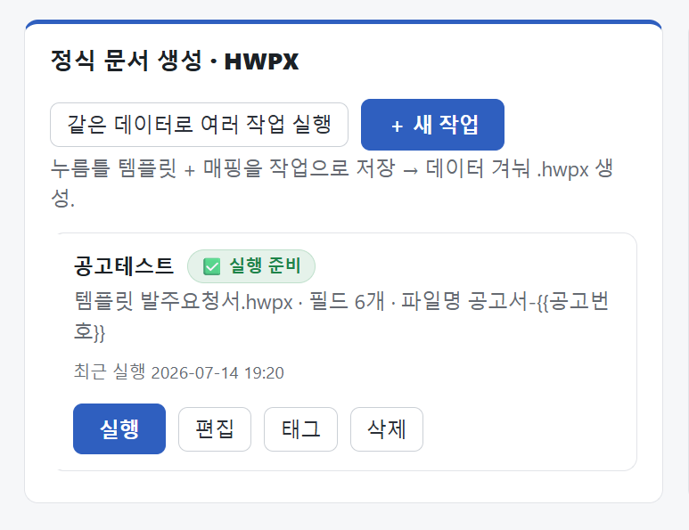

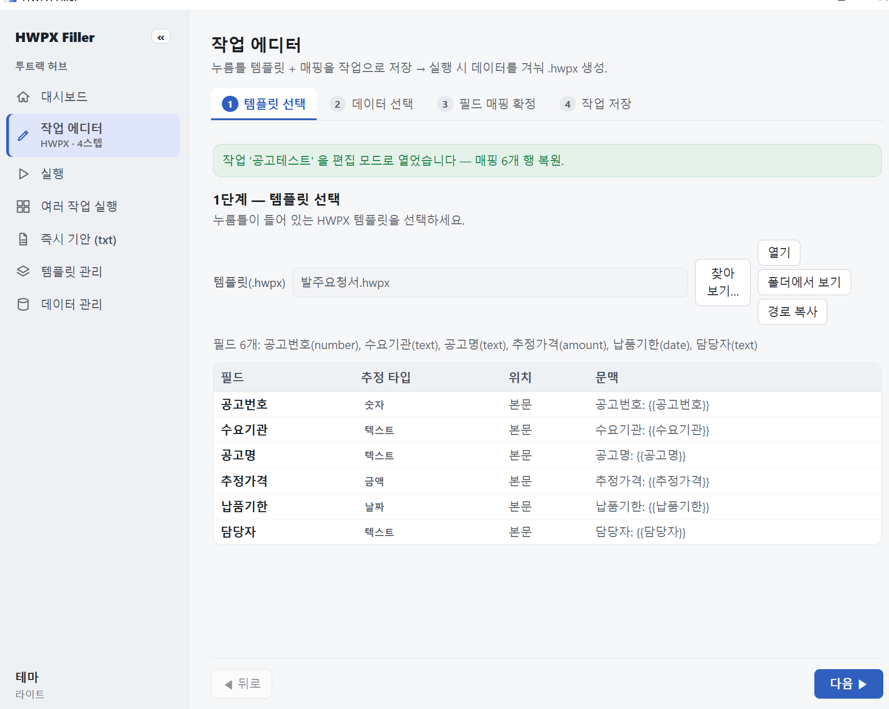

| ID | 위치 | 관측 | 판정 | 심각도 | 처분 | 상태 |
|---|---|---|---|---|---|---|
| **F10** | 홈 「＋ 새 작업」 (`home.js:312`) | 라벨 "새"인데 초기화·가드 없이 nav만 → 직전 편집 세션 그대로 복원. 사실상 "이전 작성 계속". 편집 경로(`editJob` home.js:197)엔 있는 미저장 가드도 없음(비대칭) | 표면-행동 불일치 + confirm-or-alarm 위반 | 마찰(중대) | 코드수정 | 기록 |
| **F11** | 홈 「＋ 새 기안」 (`home.js:314`) | F10과 동형(초기화 없는 bare nav, `txt`도 REFRESH_ON_NAV 밖). 라벨 "새"와 불일치. 단 txt는 일회성이라 소실 위험 없음 | 표면-행동 불일치 | 다듬기 | 코드수정(F10과 묶음) | 기록 |
| **F12** | txt=고정 루트 라이브러리 vs hwpx=자유 파일선택(에디터 1단계) | 앱에 「템플릿 관리」 라이브러리가 있는데 hwpx 진입만 무시 → 진입 모델 비대칭 | 설계 일관성 | — | R-info | **결정 ↓** |

**F10/F11 수정 방향.** 올바른 패턴이 이미 있음(`openTxt`/`runJob`이 `select_*` 먼저 → nav). "새 X"도
**"새 세션 초기화" 브리지 먼저 → nav.** 미저장 작업 있으면 `editJob`과 **대칭으로 시끄럽게 확인** 후 버림
(txt는 무해). "이어서 작성"을 원하면 명시적 어포던스로 분리(새 작업이 몰래 겸하지 않게).

<b>F12 논의 경위 (비대칭 발견 → 중앙화 결정 → 폴더트리 razor)</b>

**트리거.** 사용자 질문 2연: "즉시 기안에 템플릿 루트를 고정하는 건 합리적인가? **그렇다면 왜 hwpx엔 안 그러나?**"
관측: txt는 고정 루트 `~/.hwpxfiller/text_templates/`에서 라이브러리로 끌어오는데, hwpx는 「찾아보기…」로
디스크 아무 데서나 자유 선택. **핵심 발견**: 앱엔 이미 「템플릿 관리」가 hwpx·txt 라이브러리를 둘 다 관리하는데,
정작 hwpx *진입점*(에디터 1단계)만 그 라이브러리를 무시하고 생 파일 선택기를 씀.

**사용자 원칙(강경).** "템플릿은 라이브러리로 중앙 관리한다. 사용자 편의로 **뭐든 풀어주는 게 답이 아니지.**
루트가 파편화되면 당장은 편해도 **나중이 재앙적.** 사용자 습관을 아예 고정하는 게 맞아 보여." → 방향은
"txt 고정을 풀자"가 아니라 **"hwpx도 라이브러리를 기본으로, 파일선택은 import 보조로 강등."**

**하위 갈림(서브폴더↔그룹).** "사용자가 지정한 서브폴더를 템플릿 관리의 '그룹'으로 자동 반영할까(A), 평평하게
가져와 앱 자체 그룹을 지정하게 할까(B)?" → 사용자: **"둘 다 반영하는 순간 사용자가 배울 규칙이 하나 더 는다."**
이게 F9(직교성 부담)·razor 공유 → **그룹 소스는 하나.** "한 템플릿이 두 범주에 동시에?" → **"거의 없다"** →
폴더 트리(단일 소속)로 확정. 버려진 A′(폴더 파생축+앱 태그축 공존)는 "배울 규칙 하나 더"라 철회(F8 경위와 동일 razor).

**확정.** ①라이브러리 중앙 관리·루트 고정(습관 잡기). ②hwpx 라이브러리-우선 통일, 자유 파일선택→import 강등.
③서브폴더=폴더 트리 그룹(단일 소속), 앱은 읽어 미러링. → **F8과 한 덩어리(R-info).** cf. F41(저작 표면은
매체별로 달라도 관리 모델은 이 라이브러리로 수렴).

---

### 화면 E — 작업 에디터 1단계 (템플릿 선택, 전체)
> 스크린샷: 부제 "…실행 시 데이터를 겨눠 .hwpx 생성", 파일버튼 4개(찾아보기/열기/폴더에서보기/경로복사), 필드 6개 표.

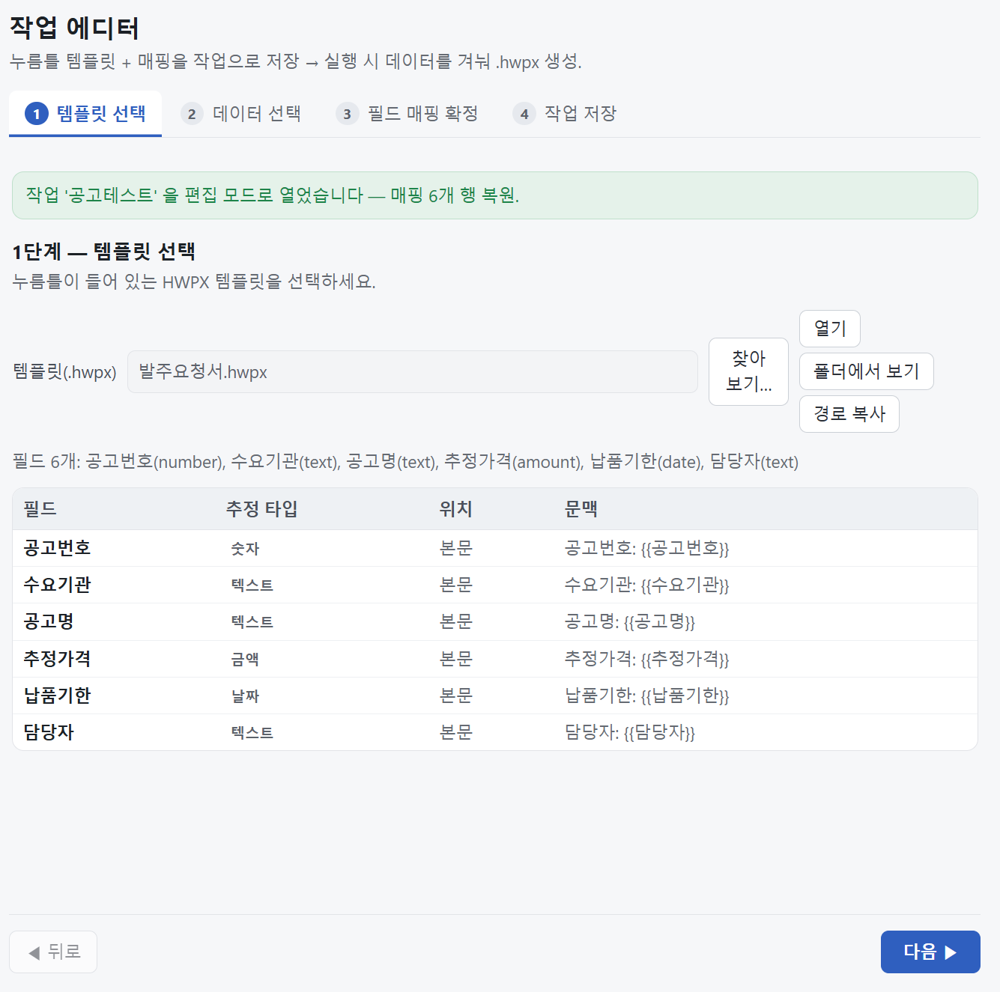

| ID | 위치 | 관측 | 판정 | 심각도 | 처분 | 상태 |
|---|---|---|---|---|---|---|
| **F15** | 에디터 부제 등 라벨·설명 전반 | 개발언어 누출("실행 시 데이터를 겨눠"). **제안: 카피/어휘를 단일 출처로 추출·고정** | 구조 제안(카피 레이어) | 마찰 | R-copy(우산) | 기록 |
| **F16** | 1단계 파일 버튼 4개 | 개행·정렬 깨짐 **+ 버튼 세트 자체가 F12(라이브러리 강제) 하류에서 재설계 필요** | CSS + 설계 종속 | 다듬기 | R-info(F12 병합) | 재분류 (독립 CSS수정 아님) |
| **F17** | "편집 모드로 열었습니다 — 매핑 6행 복원" 배너 (`screen_editor.py:478`) | 로그/개발어휘가 UI로 누출. "시끄러운 재진술"을 내부 용어로 냄 = 노이즈 (loud≠유용) | 어휘 누출(F15 하위) | 마찰 | R-copy | 기록 |

**F15 = R-copy 우산.** F1·F3·F4·F17·F25·F31·F35가 이 뿌리의 증상. 문자열이 `index.html`·Python 각처에
하드코딩돼 개발자 즉흥 표현이 샌다 → **사용자-대면 어휘를 단일 출처로 고정.**

---

### 화면 F — 작업 에디터 2단계 (데이터 선택)
> 스크린샷: "데이터 선택 (선택)" + 「데이터 없이 진행 →」 + "사용할 헤더 선택" 칩 6개 + "선택 항목만 사용" 버튼.

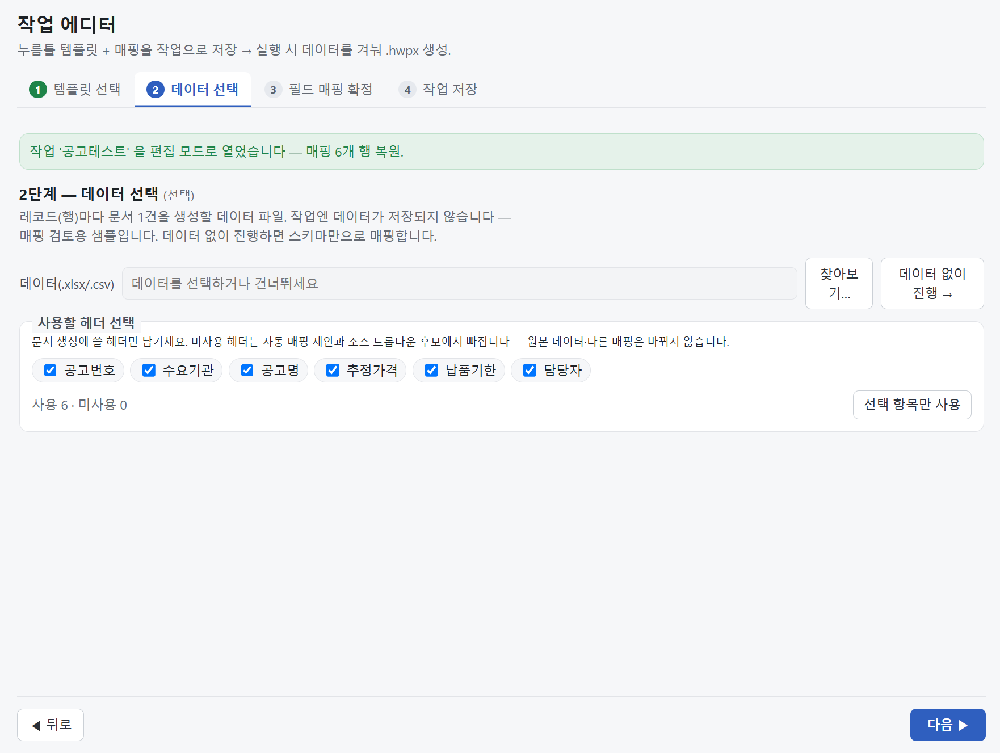

| ID | 위치 | 관측 | 판정 | 심각도 | 처분 | 상태 |
|---|---|---|---|---|---|---|
| **F18** | 2단계 "데이터 선택 (선택)" | 선택적 = 진짜 단계가 아님(미리보기 보조가 단계로 위장). 노이즈 > 실익 | altitude | 마찰 | R-flow | 방향: 단계2 → 단계3 인라인 보조로 접기 |
| **F19a** | "선택 항목만 사용" 버튼 + 전체선택 부재 | 라벨이 동작(배제/숨김)과 어긋남; 「전체 선택」 없음 | 라벨 정직+UX | 다듬기 | R-copy+코드 | F21로 해소경로 |
| **F19b** | 헤더 숨김 타이밍 | 즉시 숨김 = 투명성 희생·불투명도↑. 제안: 최초 투명→재진입 자동 접힘→펼침 가능(개수 표지) | 점진 노출(시간축) | 마찰 | R-flow(F8 접힘 공유) | 방향 확정 |
| **F20** | 데이터 = "매핑 검토용 샘플" + 에디터↔실행 단절 | 내부 작업/데이터 분리가 UX 흐름을 지배·방금 고른 데이터 버림. 사용자는 템플릿+데이터를 지금 손에 쥠 | 흐름 설계(내부모델 누출) | 마찰(중대) | R-flow | **방향 확정 ↓** |
| **F21** | 헤더 선택 ↔ 데이터 미리보기 | (제안) 토글 라이브 반영 — 사용/미사용 건수 즉시 갱신 + 미리보기 열을 선택분만 라이브 필터. 커밋 버튼 제거로 F19a 해소 | 인터랙션 향상 | 향상 | R-flow(F19 묶음) | 방향 확정 |

<b>F20 논의 경위 (내부모델 누출 → 분리 보존한 흐름 연결)</b>

**트리거.** F18(2단계 선택적)이 깊어짐. 사용자: "데이터가 '매핑 검토용 샘플'인 건 이상해. job 매핑과 실행
모델을 분리하면서 생긴 발상인데, **사용자 멘탈 모델대로면 이미 템플릿과 데이터가 존재하잖아.** 오히려 데이터
없이 진행이 선택이고, **기본은 데이터를 받고, 작업 생성이 끝나면 바로 그 작업으로 문서를 생성**하도록 흐름을
이어줘야 하는 것 아냐?"

**진단.** "데이터=미리보기 샘플" 프레이밍은 **내부 아키텍처(작업/데이터 분리)가 UX로 누출된 것**(F17과 같은 병).
분리 자체는 백엔드 생명주기론 타당(작업=재사용 레시피, 데이터는 매 실행 바뀜 → 작업에 안 굳힘). **하지만** 그
구현 사실이 **생성 시점 흐름을 지배해선 안 됨** — 사용자는 지금 템플릿·데이터를 둘 다 손에 쥐었는데 현재 흐름은
①데이터 미리보기로만 물림 → ②저장 → ③실행 화면 → ④**같은 데이터 재선택** → ⑤생성. 방금 고른 데이터를 버림.

**화해(분리 안 깨고).** ①**데이터-우선 기본**(무데이터=opt-out, 재사용 레시피만 미리 만들 때). ②**흐름 잇기**:
마법사 완료 → 죽지 않고 "작업 저장됨·이 데이터로 바로 생성"으로 이어짐(방금 데이터가 세션으로 흘러 재선택 없음).
③**작업은 여전히 데이터 영구 저장 안 함** → 재사용 모델 보존. "데이터는 미리보기"라는 거짓말 소멸.

**안전장치.** 마법사 완료가 **말없이 자동 생성하면 confirm-or-alarm 위반** → "완료 → 데이터 실린 실행 화면 착지
→ 한 번 확인 후 생성"(자동생성 아님).

**구현 메모(F21).** 헤더칩·샘플행이 같은 스냅샷 안 → 열 필터·카운트는 **클라이언트측**(토글마다 브리지 왕복 불필요).
**many-columns 스트레스**(나라 40필드급): 미리보기 표는 가로스크롤, "사용할 헤더 선택"은 칩의 벽 → F19b 강화.
(행은 `_SAMPLE_ROWS=3` cap + "외 M건"으로 처리됨 — 정상.)

---

### 화면 G — 작업 에디터 3단계 (필드 매핑 확정)
> 스크린샷: 6필드 매핑표(데이터항목·타입/고정값·표시형·미리보기), 노란 미확정 하이라이트, 버튼(프로파일 적용/저장/삭제·모두 확정/해제).

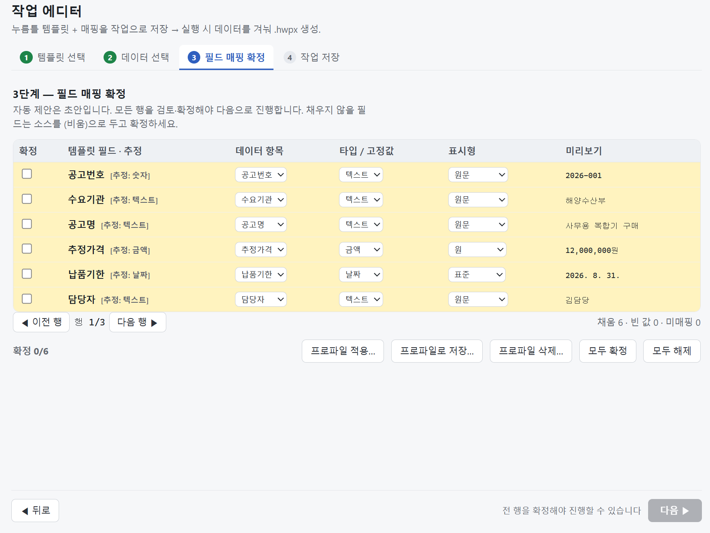

| ID | 위치 | 관측 | 판정 | 심각도 | 처분 | 상태 |
|---|---|---|---|---|---|---|
| **F22** | 3단계 매핑 프로파일(적용/저장/삭제) | 작업이 매핑을 자족 저장·재활용(`job.py:207 mapping`, `to_dict`/`from_dict`, run은 `job.mapping.apply_all`). `base_mapping_name`은 **순수 메타·run-path 무영향·자동 재투영 없음**(job.py:213). 자동 매칭 작동. → 프로파일 잉여 | altitude/스코프 | — | **삭제** | **결정: 제거, 재사용=작업 복제** |
| **F23** | 매핑표 열 너비 | 값 길이 따라 열폭 변동 → 이전/다음 행 스텝 시 레이아웃 튐 | 레이아웃 안정성 | 다듬기 | R-css | 기록 |
| **F24** | 「모두 확정」 행 피드백 | 현재 확정=색 제거+체크. 제안: **확정 시 녹색 토글**(완료=녹색 직관, 상태색은 액센트와 분리 유지 정합) | 시각 피드백 향상 | 다듬기 | 즉시수정(설계언어) | 제안 확정 |

<b>F22 논의 경위 (선결 코드 확인 → 프로파일 잉여 확증 → 제거)</b>

**트리거.** 3단계 매핑표 캡처(프로파일 적용/저장/삭제 버튼). 사용자: "'작업' 단위로 저장·관리되는 현 체계에서
**'매핑 프로파일'만 따로 저장/로드/삭제하는 게 의미가 있나? 과거 멘탈모델의 잔류** 아닌가."

**razor 적용.** matrix(F9)·패싯(F8)과 같은 가족 — "규모 재사용을 위한 파워 추상"이 실제 N에 비해 과건축.
결정타 후보: 헤더=필드명 자동 매칭이 이미 작동(이 화면도 전부 자동 채움) → 자동 제안이 되는데 프로파일 실익 약함.

**선결 조건(사용자 요구).** "다만 내부적으로 **job 추상이 매핑을 명시적으로 저장·재활용하는지 체크 필요.**"
→ `core/job.py` 확인:
- `Job.mapping: MappingProfile`(job.py:207) = **매핑이 작업의 1급 필드**. `to_dict`(250)/`from_dict` 직렬화.
  편집 시 "매핑 6행 복원"이 이것. 실행도 `RunRequest.mapped_records`→`job.mapping.apply_all`(406). **작업 자족.**
- `base_mapping_name`(213-216)이 프로파일과의 유일한 끈인데 주석 왈: **"순수 메타 — 엔진은 합성된 mapping만
  소비(run-path 무영향). 베이스 편집 시 경고 근거이지 자동 재투영 아님."** → 프로파일 고쳐도 작업들에 **자동
  반영 안 됨**(경고만). "공유 베이스"의 실익조차 약함. **matrix보다 completeness 논거가 더 약함.**

**확정: 제거, 재사용=작업 복제.** 의존성: "재사용=작업 복제" 성립하려면 **「작업 복제」 어포던스 추가**가 짝
(현 카드 버튼은 실행/편집/태그/삭제뿐 — 복제 없으면 재사용 공백). 제거 표면: 레일 「매핑 프로파일」·단계3 버튼3·
`MappingBaseRegistry`/`mapping_base.py`·"N개 작업이 베이스 참조" 경고(#67). `base_mapping_name`은 무해한 계보 메타라 잔존 가능.

---

### 화면 H — 작업 에디터 4단계 (작업 저장)
> 스크린샷: 작업 이름·파일명 패턴 + "선언 데이터 자동등록(#53-A)" 섹션 + "파일명에 넣을 수 있는 값" 토큰 나열.

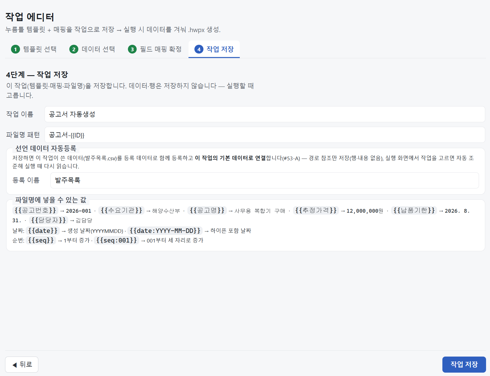

| ID | 위치 | 관측 | 판정 | 심각도 | 처분 | 상태 |
|---|---|---|---|---|---|---|
| **F25** | 4단계 부제·"선언 데이터 자동등록" | 개발언어 + **"(#53-A)" 이슈번호가 UI에 그대로 노출**(최악 표본) | 어휘 누출 | 마찰 | R-copy | 기록 |
| **F26** | "파일명에 넣을 수 있는 값" | 나열식 → 구조적 표현(그룹·표·정렬) 필요 | 표현 | 다듬기 | R-flow/설계 | 기록 |
| **F27** | 토큰 안내 상시 노출 | 유용하나 고급 사용법이 인라인 노이즈 → 전문성축 점진 공개("펼치기/고급" 뒤로) | 점진 노출(전문성축) | 마찰 | R-flow/설계 | 기록 |

> **상류 종속.** 이 화면은 F20(데이터-우선)·F18(단계 접기)·F22(프로파일 제거)로 재편됨. "선언 데이터
> 자동등록" 섹션도 F20의 "데이터가 실행으로 흐름"과 겹쳐 재검토. F26·F27은 **R-flow 재설계와 함께 착지.**

---

### 화면 I — 실행 화면
> 스크린샷: 작업 셀렉터 옆 jobMeta 한 줄(템플릿명·파일명패턴·열기/폴더/경로복사/템플릿 다시 연결) + 자동연결·검증완료 초록 배너 + 미입력 필드 배지 + 생성 대상 문서 목록(1·2·3 공고서-{{ID}}.hwpx) + 저장 폴더.

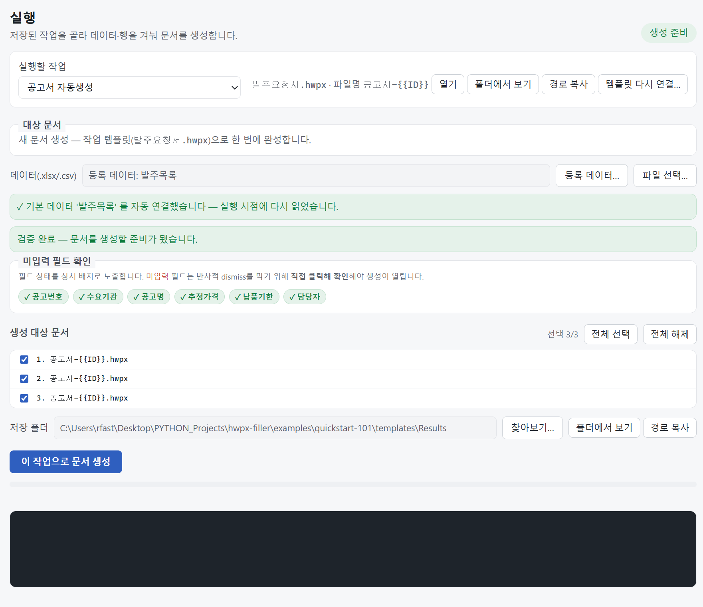

| ID | 위치 | 관측 | 판정 | 심각도 | 처분 | 상태 |
|---|---|---|---|---|---|---|
| **F28** | 실행 화면 전반 | 상하 정보밀도 과밀(촘촘). jobMeta 한 줄에 4버튼 욱여넣음(구조화 부재) | 레이아웃 리듬 | 마찰 | R-css | 기록 |
| **F29** | 「경로 복사」 vs 「폴더에서 보기」(공통) | 두 어포던스 중복 의심. `PathTrack.affordances` **공유 헬퍼**라 여러 곳 동시 출현(한 곳 고치면 전파) | 어포던스 잉여(공유 뿌리) | 다듬기 | R-css/R-scope | 기록 |
| **F30** | 「템플릿 다시 연결」 (`run.js:69`) | 복구 동선(파일 이동/삭제 시 재지정, #67)인데 **상시 노출**(홈은 `template_missing`일 때만). 정상일 때 노이즈 | confirm-or-alarm 어긋남 | 마찰 | 코드수정 | 기록 |
| **F31** | '대상 문서' 칸 | "…으로 한 번에 완성합니다" 불필요 필러 + 섹션 라벨과 관계 모호 | 카피/구조 | 다듬기 | R-copy+구조 | 기록 |
| **F32** | 자동연결·검증완료 초록 배너 | 정상상태 성공 배너 = 노이즈("✓ 발주목록 자동 연결", "검증 완료") | confirm-or-alarm 방향성 | 마찰 | 코드수정+원칙 | 기록 |
| **F33** | 생성 대상 문서 목록 | 레코드별 선택 가능하나 **어느 문서가 어느 데이터인지 알 방법 전무** — 3건이 전부 "공고서-{{ID}}.hwpx"로 동일 나열({{ID}} 미해소). 눈감고 선택 | 투명성 결함(headline) | 마찰(중대) | 코드수정(F34와 동뿌리) | 기록 |
| **F34** | 실행 화면 파일명 게이트 (`screen_run.py`·`vm.refresh`) | **GUI에 RC-20 파일명 토큰 검증 부재** → 미해소 {{토큰}} 무경고 출하. CLI엔 있음(`cli.py:486`, 비대칭). {{ID}} 리터럴이 실파일명이 됨 | **confirm-or-alarm 위반(correctness)** | **막힘(blocker)** | **즉시수정(최우선)** | 기록 |
| **F34b** | `DEFAULT_FILENAME_PATTERN="공고서-{{ID}}"` (`job.py:43`) | 기본 패턴이 존재하지 않는 토큰 {{ID}} 사용 → 보장된 미해소 + 3레코드 동일명 충돌 위험 | 기본값 지뢰 | 마찰 | 즉시수정 | 기록 |

**F33↔F34 동뿌리.** 둘 다 파일명이 레코드별로 해소 안 됨. **함께 고침**: RC-20 게이트 GUI 이식 + 레코드별
파일명 해소 표시(공고서-2026-001…) + 레코드 식별 컬럼. F20(데이터-우선)과 정합. **이번 세션 최고 수확.**

---

### 화면 J — 즉시 기안 (트랙 B / txt)
> 스크린샷: 템플릿 콤보 + 데이터 + 레코드 스테퍼(1/3) + 필드 상태(토큰) 6개 + 실시간 렌더("이 view가 진실") + 클립보드 복사(commit)/텍스트 저장. 렌더에 추정가격=12000000, 납품기한=2026-08-31 생값.

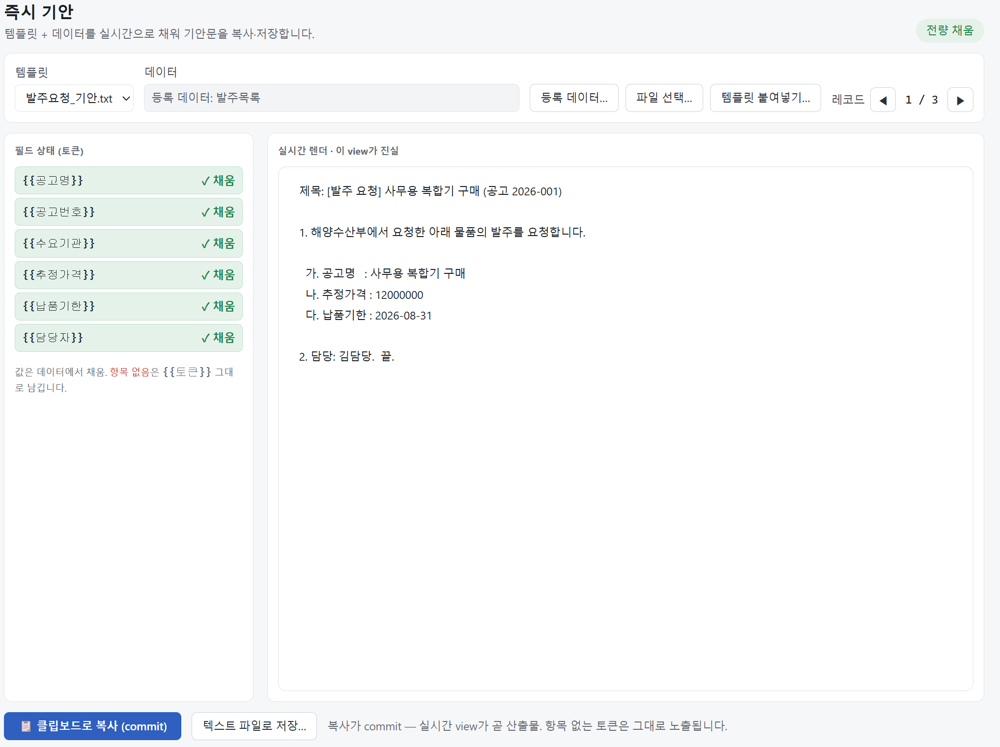

| ID | 위치 | 관측 | 판정 | 심각도 | 처분 | 상태 |
|---|---|---|---|---|---|---|
| **F35** | 즉시 기안 카피 | 개발용어 누출("commit"·"이 view가 진실"·"레코드") | 어휘 | 마찰 | R-copy | 기록 |
| **F36** | 트랙 간 표시형 선언 비대칭 | hwpx 마법사엔 있는 타입/표시형이 txt엔 없음 → 금액·날짜 생값 출하(순수 {{토큰}} 치환) | 트랙 파리티 갭(기능) | 마찰 | R-flow/R-info | **리프레임 ↓** |
| **F37** | 즉시 기안 저장 | 일괄 저장 부재(복사/저장 건별만). 분할 vs 라인구분 하위결정(기존=라인), **일괄복사는 제외**(건별 붙여넣기) | 기능 갭(배치 파리티) | 마찰 | R-flow | 기록 |
| **F38** | 레코드 넘김 | 클릭 스테퍼만 → **방향키 넘김**으로 copy-paste 루프 가속 | 인터랙션(주 루프) | 다듬기 | R-flow | 기록 |
| **F39** | 현재 레코드 식별 | 빠른 넘김 중 '어떤 데이터' 가시성 — 기안끼리 제목-본문 오붙임 방지(현 렌더 가시로 부분 충족) | 안전/투명성(F33 테마) | 마찰 | R-flow | 기록 |

<b>F36 논의 경위 (마법사 통일 제안 → 두 일관성 → 출력-가벼움 리프레임)</b>

**트리거.** F35(dev 카피) + F36(서식 갭: 추정가격 `12000000`·납품기한 `2026-08-31` 생값). 사용자: "즉시 기안도
**마법사 경로를 태우는 게 일관성 있지 않을까?**"

**되물음(정체성 방어).** 그냥 "예"하면 트랙 B의 존재 이유를 죽일 수 있음. 즉시 기안의 값어치는 "즉시" 자체 —
붙여넣기 빠른 길. 여기 4단계 마법사를 씌우면 트랙 A와 같아져 소멸. → **일관성 두 종류**로 분리: **흐름 일관성**
(같은 마법사, "즉시" 정체성 파괴) vs **역량 일관성**(둘 다 서식 선언 *가능*, 마법사 없이 F36 인라인 토큰
`{{추정가격:원}}`으로 달성 — 파일명 패턴이 이미 `{{date:…}}` 지원). → 1차: 우리가 원하는 건 역량 일관성.

**사용자 리프레임(핵심).** "**출력의 가벼움**에 방점 아닐까? 지금도 즉시라면 무슨 즉시야… 데이터로 라이브로
가벼운 템플릿 만들어 바로 기안. 결국 **작업의 임시성이냐 출력의 가벼움이냐** — 나는 출력의 가벼움 쪽." → 내가
쓴 "즉시성" 프레임이 흐릿했음이 드러남. **진짜 축은 두 개, 직교:**

| | 저장(재사용) | 일회성 |
|---|---|---|
| **hwpx 출력** | 트랙 A (현재) | *(빈칸)* |
| **텍스트 출력** | *(빈칸)* | 트랙 B (현재) |

**확정.** 현 "트랙 A/B"는 **출력 축 × 지속성 축**을 한 축으로 뭉쳐 2×2 중 두 칸만 채움. **트랙 B = 코어 저작의
텍스트 출력 모드**로 격상 → 같은 매핑/서식 상속 → **F36 서식 갭 구조상 소멸.** 마법사 vs 즉시 논쟁도 "같은 저작,
출력 선택"으로 해소. F37 일괄 저장 = 트랙 A 배치의 텍스트 판. (임시성 방향도 "훌륭한 방향"으로 인정하되 직교
축이라 배타 아님 — 출력을 주축, 임시성은 양쪽 토글.) → R-flow/R-info 최대 개념 정리.

---

### 조사 항목 (스크린샷 없음 · 코드/이력 확인)

| ID | 위치 | 관측 | 판정 | 심각도 | 처분 | 상태 |
|---|---|---|---|---|---|---|
| **F40** | 데이터 관리 파이프라인 빌더 (ADR K) | 명시 착지 기능(ADR K, 2026-07-12 KA·KB)이 웹 미이관 → **조용한 드롭**. 코어 `data/pipeline.py`·소스종류 `kind="pipeline"` 생존, 조립 UI 부재, `gui/pipeline_builder_state.py`+테스트 **고아**. 위젯 `gui/pipeline_builder.py`는 삭제(#23) | 조용한 마이그레이션 드롭 + 고아 코드 | 마찰(중대) | 명시적 결정 필요 | **후순위** |
| **F41** | txt 인앱 에디터 vs hwpx 외부저작 | 저작 표면 비대칭(매체-정당) **단 인앱 추가가 F12 폴더 단위 관리와 충돌 — "어디로 추가?" 미해결** | 관리 층 정합(F12 충돌) | 마찰 | R-info(F12 병합) | 방향 확정(원칙4) |

<b>F40 논의 경위 (기억 추적 → 코드/문서 발굴 → 조용한 드롭 판정 → 후순위)</b>

**트리거(사용자 기억).** "이전에 명시적 결정이 있었는지 모르겠는데… **원래 데이터 관리에 데이터 레코드별
파이프라인 조립이 있지 않았던가?**"

**코드 발굴.** ①`gui/pipeline_builder.py`(비주얼 쿼리빌더 위젯) = **삭제됨**(PySide6 철거 #23). ②`gui/
pipeline_builder_state.py`(뷰모델) = **고아 생존** — 자기 테스트 2개(`test_pipeline_builder_state`·`test_r3_py_core`)만
import, 앱은 아무도 안 씀. ③`data/pipeline.py`(코어 `PipelineSource`·`kind="pipeline"`) = **생존**, pool 화면이
소스 종류로 인지(로케이트 불가). → **코어·소스종류는 살아 데이터 모델이 pipeline을 기대하는데 만들 UI가 없음.**

**문서 발굴(명시적 결정 여부 = 질문의 핵심).** **ADR K "조립 소스 / 데이터 파이프라인"** — 2026-07-12 KA·KB
병합 **착지**(명시·문서화). 의도: "여러 소스 → 하나의 DataSource" Power-Query식 파이프라인(*데이터 가공방식
레시피*, 추론엔진 아님), 데이터셋 풀 하위종류(`kind="pipeline"`), **실행 화면엔 숨기고 데이터 관리 "고급
파이프라인"에서 조립**(정확히 사용자가 기억한 그 자리, UI_DESIGN_DECISIONS.md:186). → **"만든 결정"은 명시적으로
있음.** 그러나 웹 이관 착지 목록에 파이프라인 빌더는 없고 **"뺀다는 결정"은 못 찾음** → **조용한 마이그레이션 드롭**
(confirm-or-alarm의 프로세스판 위반).

**아이러니.** ADR K 문단 스스로 경고: **"파이프라인 표면은 무거운 능력이라 '능력 없는 슬롯 발명' 재발 위험이
가장 크다"**(:562). 사용자가 지금 의심한 지점을 문서가 예고 → R-scope 가족(matrix·패싯·프로파일)과 같은 계열.

**결정: 후순위 유예.** revive/freeze/retire **미결**(지금 쏟아진 것 대비 순위 낮음). **배치만 확정 = 데이터 관리 쪽**
(만약 부활 시, ADR K 원설계대로 실행/에디터 아님). 고아 코드는 **정리 보류**(revive salvage 자재 — 은퇴 확정 시
함께 걷음, "삭제는 의무 상속"). cf. [[nara-freeze-decision]] 판박이 — 단 **나라는 명시 동결, 파이프라인은 무결정.**

**F41 논의 경위.** 트리거: "TXT 템플릿의 관리 주체 문제 — 인앱 간이 에디터로 바로 추가/편집하는데, 이게 hwpx
템플릿 관리(외부 문서앱 작성 후 디렉터리 관리)와 **비대칭**이고, 명시적 폴더 단위 관리 결정(F12)과도 충돌
(**추가하면 어디로?**)." 진단: 저작 표면 비대칭은 **매체가 정당화**(평문은 인라인 저작이 자명, .hwpx는 한글 없이
못 만듦) — 자의적이 아님. 충돌은 **관리 층** — 인앱 txt 추가가 폴더 단위 라이브러리를 조용히 우회할 위험.
해소: **저작 표면(매체별) ≠ 관리 모델(단일 라이브러리)** — 인앱 txt 추가도 F12 폴더에 착지(어디 넣을지 묻기),
hwpx는 import로 진입, **둘 다 같은 라이브러리 폴더에.** → R-info(F12 병합). 원칙4로 결정화.

---

## 아직 안 본 화면 (다음 세션 이어가기)
- **데이터 관리(pool)** 화면
- **템플릿 관리** 화면 (F12·F41 라이브러리·폴더트리와 직결)
- 실제 **문서 생성 완료/결과** 화면 (덮어쓰기 확인·완료 요약)
- 트랙 B **텍스트 파일로 저장** 흐름 (F37 일괄)
- 오류·빈값·미입력 게이트 경로 (능동 빈칸 게이트 ADR-B)
