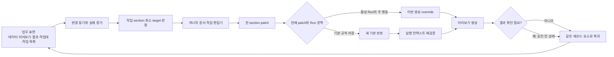
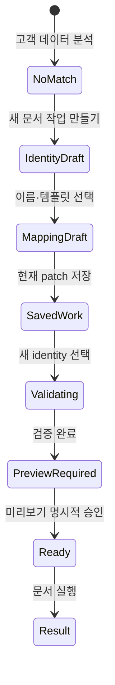
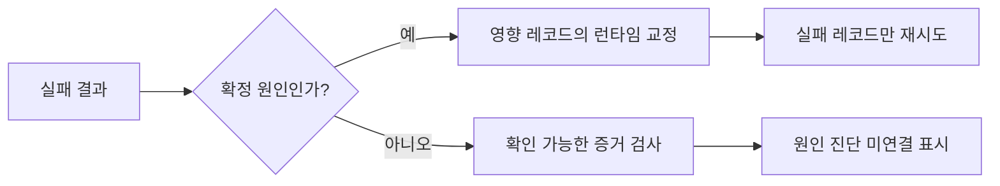
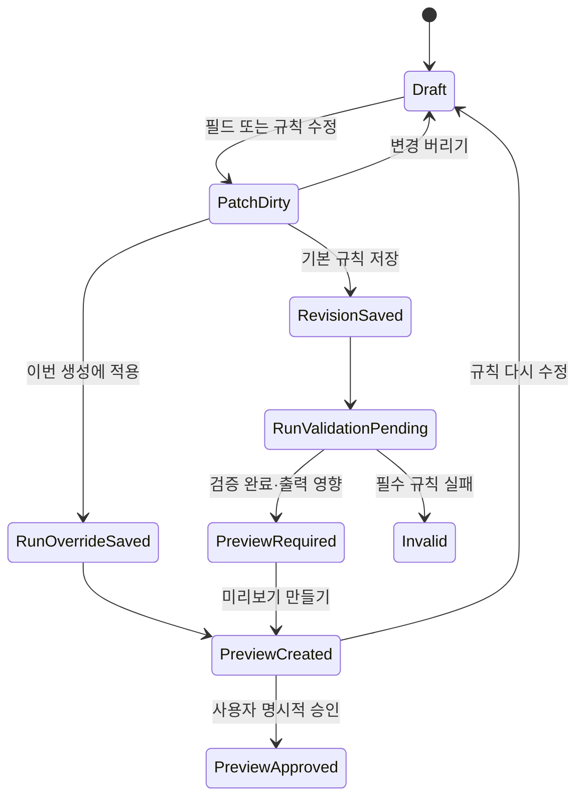
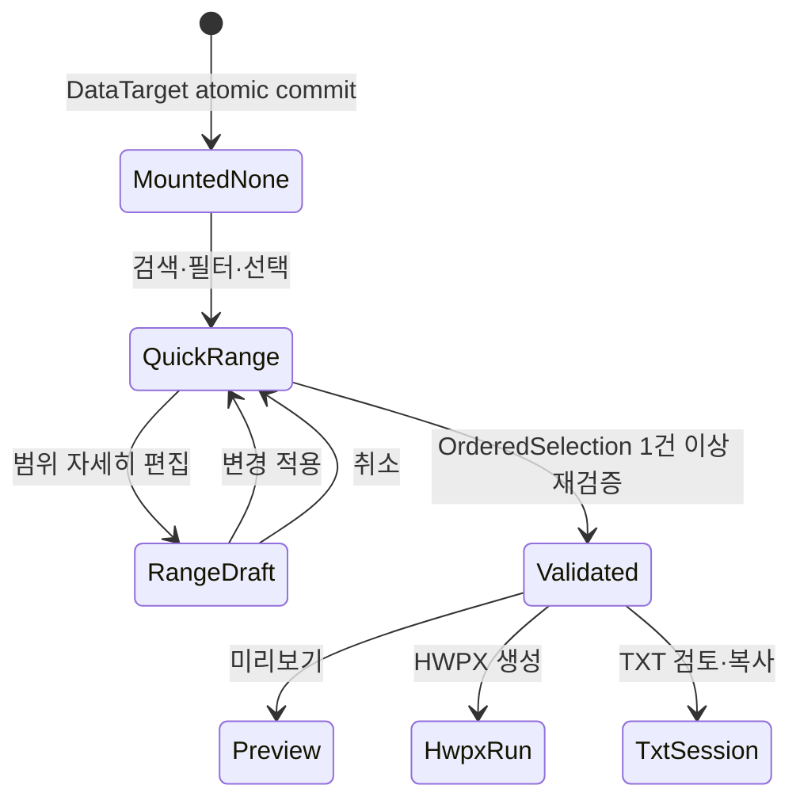
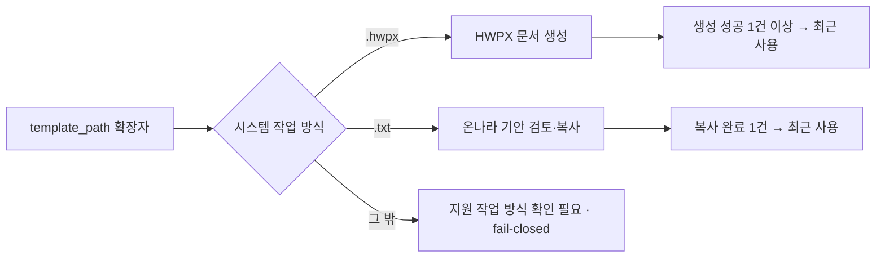
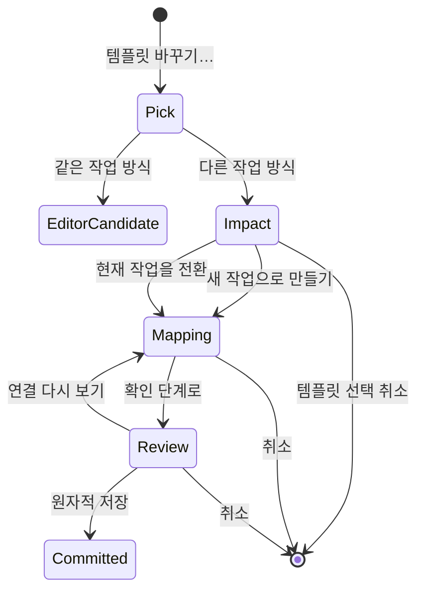
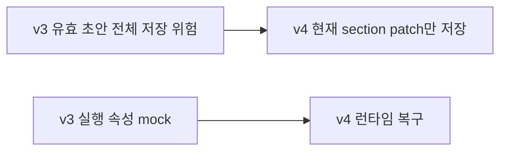
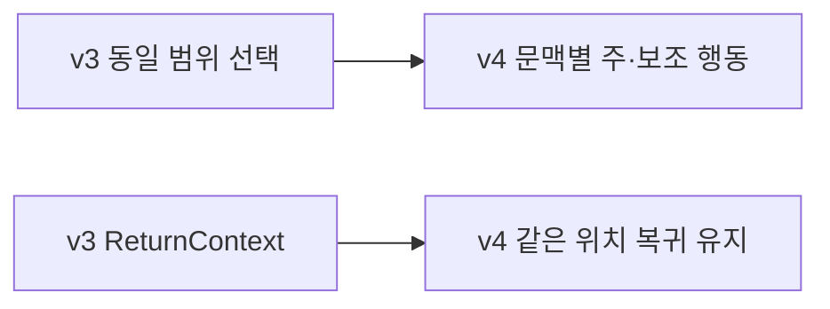

# 문서나르미 핵심 워크플로 계약

이 문서는 문서나르미의 제품·도메인 불변식과 v4 편집 워크플로의 정본이다.
화면 수가 아니라 사용자가 발견한 증거, 변경 소유자, patch 범위, 검증, 원래 업무 위치 복귀를
하나의 계약으로 정의한다.

## 1. v4 교정 요약

v4의 핵심 흐름은 다음과 같다.

```text
변경 증거
→ 한 문서 작업 편집기의 정확한 탭·항목
→ 한 EditContext에서 한 section patch
→ 이번 생성 또는 기본 규칙에 patch만 적용
→ 실행 재검증과 필요한 미리보기
→ 같은 레코드·결과 요소로 복귀
```

문서 작업의 영구 핵심은 다음 세 항목이다.

| 속성 | 의미 |
|---|---|
| `template_path` | 템플릿 파일과 매체의 근거 |
| `mapping` | 문서 필드별 데이터 항목·값 유형·표시 규칙 |
| `filename_pattern` | HWPX 결과 파일 이름 규칙 |

매체는 사용자가 바꾸는 옵션이 아니다. `.hwpx`는 HWPX 생성 흐름, `.txt`는 텍스트
검토·복사 흐름을 연다. 영구 출력 폴더와 파일 충돌 처리는 이 작업 편집기의 속성이 아니다.

## 2. 도메인 개념

| 개념 | 정의 |
|---|---|
| Document work | 하나의 `template_path`, `mapping`, 필요한 경우 `filename_pattern`을 가진 업무 객체 |
| Template revision | 템플릿 구조·토큰의 저장된 판본 |
| Binding revision | mapping과 표시 규칙의 저장된 판본 |
| DataSourceRef | 파일·시트·선택적 header row를 가리키는 출처 참조 |
| LoadedDataSnapshot | 성공적으로 마운트되어 현재 화면에 표시되는 필드와 레코드이며 현재 실행 데이터의 정본 |
| RecordRef | `snapshotId + snapshotRecordId`; `sourceRowNumber`는 진단용 |
| RecordRangeState | 검색, 열 필터, 전체 표시순서와 snapshot-local 선택 집합 |
| RecordRangeDraft | 전문 범위 편집기에서 적용 전 편집하는 범위 초안 |
| OrderedSelection | 전체 표시순서에 선택 집합을 투영한 실행 입력 |
| Run context | DataSourceRef, LoadedDataSnapshot, OrderedSelection, 문서 작업, 고정한 판본, 이번 실행 override와 runtime option |
| Run draft override | 특정 실행 또는 레코드에만 적용하는 patch |
| Validation evidence | 선택한 Run context와 판본을 자동 검사한 증거 |
| Value preview | 실제로 주입할 값과 HWPX 파일 이름의 대표 결과 |
| Preview approval | 사용자가 위험 변경의 결과를 명시적으로 확인한 사건 |
| EditContext | 작업·section·target·진입 사유·증거·복귀 위치를 고정하는 편집 입력 |
| ReturnContext | 원래 표면의 레코드, 요소, 검색, drawer, 작업점을 복원하는 계약 |

## 3. 매체별 정보 구조

### 3.1 HWPX 문서 작업

```text
템플릿 | 필드 연결·표시 | 파일 이름 | 시험
```

객체 메뉴는 `템플릿 열기`, `필드 연결·표시 수정`, `파일 이름 규칙`을 제공한다.

### 3.2 TXT 문서 작업

```text
템플릿 | 필드 연결·표시 | 시험
```

객체 메뉴는 `템플릿 열기`, `필드 연결·표시 수정`만 제공한다. 파일 이름 탭이나 HWPX 생성
속성을 보여주지 않는다.

### 3.3 편집기 밖에 남는 정책

- 실행 시 선택하는 임시 폴더와 충돌 복구
- 실패 레코드 한 건의 파일 이름 override
- 실제 파일 저장과 다운로드
- 외부 앱 열기와 외부 파일 변경 감지

시안은 앞의 두 항목을 Run context mock으로만 다루며, 뒤의 두 항목을 성공한 것처럼 표시하지 않는다.

## 4. 전체 워크플로



미리보기 생성과 승인은 다른 사건이다. 새 기본 판본을 저장해도 승인 상태로 자동 전이하지 않는다.

## 5. EditContext와 patch 거래

### 5.1 EditContext

```js
{
  workId: "salary",
  section: "template" | "binding" | "filename" | "test",
  target: { kind: "field" | "rule" | "paragraph" | "none", id: "date" },
  entryReason:
    "voluntary" | "library" | "schema_new_field" | "schema_missing_field" |
	    "preview_result" | "run_failure" | "output_result" | "workbench_result" |
	    "document_browser_repair" | "document_browser_new_work",
  evidence: {
    label: "지급일 표시형",
    rawValue: "2026-07-25",
    displayValue: "2026. 07. 25.",
    sourceField: "급여기준일",
    recordId: 4
  },
  returnContext: {
	    surface: "preview" | "data" | "result" | "workbench" | "library" | "documents",
    previewIndex: 3,
    workIndex: null,
    focusTarget: "preview-date",
    reopenDrawer: true
  }
}
```

허용 범위 배열은 진입할 때 고정하지 않는다. 현재 patch 종류와 활성 Run 존재 여부에서 행동을
렌더링할 때마다 산출한다.

### 5.2 거래 모델

```js
editSession = {
  baseSnapshot,
  inheritedRunOverrides,
  patch: null | {
    section: "binding",
    changes: {
      date: { format: "dateLongKo" }
    }
  },
  dirtySection: null | "binding"
}
```

화면에 보여주는 유효 초안은 다음 순서로 합성한다.

```text
baseSnapshot
+ inheritedRunOverrides
+ current patch
= effective draft
```

저장 단위는 `effective draft`가 아니라 `patch`다. 기본 규칙 저장은 상속된 Run override를
포함하지 않는다. 한 EditContext에서 다른 section을 수정하려면 현재 patch를 적용하거나 버린 뒤
이동한다. 사용자는 적용, 버리기, 머무르기 중 하나를 명시적으로 고른다.

## 6. 적용 범위

| 문맥 | 주 행동 | 보조 행동 |
|---|---|---|
| 미리보기·데이터·결과·작업대의 활성 Run | 이번 생성에 적용 | 기본 규칙으로 저장… |
| 문서 작업 목록 | 변경 저장 | 없음 |
| Template patch | 새 템플릿 판본으로 저장 | 별도 작업으로 만들기 |

동일한 라디오 선택지를 모든 문맥에 나열하지 않는다.

### 6.1 이번 생성에 적용

```text
현재 patch를 Run draft override에 저장
→ 기본 Binding revision 유지
→ 현재 preview approval 폐기
→ 대표 값 미리보기 갱신
→ ReturnContext 복원
```

레코드별 파일 이름은 다음처럼 전체 실행 규칙과 분리한다.

```js
runOverrides[workId].records[recordId].filename
```

### 6.2 기본 규칙으로 저장

```text
현재 patch만 새 Template 또는 Binding 판본에 저장
→ 저장 성공을 표시
→ 활성 작업이면 기존 validation과 필요한 approval 폐기
→ 현재 실행 컨텍스트 재검증
→ 새 미리보기 생성
→ 승인 전 상태로 ReturnContext 복원
```

문서 작업 목록에서 저장했더라도 활성 실행 작업과 같은 identity면 위 폐기 규칙을 적용한다.
목록으로 먼저 복귀하고, 문서 만들기로 돌아올 때 재검증 안내를 보여줄 수 있다.

## 7. 필드 연결·표시 규칙

각 행은 문서 필드, 데이터 항목, 값 유형, 표시형, 대표 결과, 출처를 보여준다. 출처는 다음 중
하나다.

- 추천 초안
- 저장된 연결
- 사용자 선택
- 의도적 미사용

`연결되지 않은 필드 추천`은 다음을 해결 대상으로 본다.

- source가 비어 있음
- source가 현재 데이터에 없음
- `missingSource`가 표시됨

다음은 덮어쓰지 않는다.

- 사용자가 선택한 source
- 직접 입력 고정값
- 의도적 미사용
- 이번 편집에서 사용자가 확인한 행

안전한 정확 일치가 없으면 추측하지 않는다. 특히 필수 `이름` 원본 열이 없으면 해당 행을 미해결로
남긴다.

새 `성과급` 열은 기존 Binding을 깨지 않는다. `상여금에 연결`은 추천 patch를 열고,
`이번에는 사용하지 않음`은 현재 분석의 suggestion만 dismiss한다.

## 8. 표면별 deep-link와 복귀

| 표면 | 진입 | 복귀 |
|---|---|---|
| 미리보기 필드 | `binding/<fieldId>` | 같은 `previewIndex`와 결과 행 |
| HWPX 파일 이름 | `filename/filenamePattern` | 같은 `previewIndex`와 파일 이름 행 |
| 문서 내용·구조 | `template` | 같은 미리보기의 템플릿 앵커 |
| 새 필드 | `binding/bonus` | 같은 데이터 경고 |
| 필수 누락 | `binding/name` | 같은 데이터 경고 |
| 작업 목록 | 매체별 첫 탭 | 검색·스크롤·작업 카드 |
| 작업대 결과 토큰 | 같은 화면의 규칙 행 | 같은 `workIndex`와 결과 토큰 |

미리보기에서 각 필드의 보이는 행동 이름은 `수정`으로 통일하고 접근 가능한 이름에 필드명을 넣는다.
템플릿은 별도 `템플릿 열기` 행동을 쓴다.

## 9. 신규 고객 데이터

정확히 일치하는 기존 작업이 없으면 기존 급여명세서 mapping을 바꾸지 않는다.



v4 시안은 이 수용 시나리오를 위한 최소 조합 흐름을 제공한다. 완전한 생성 마법사, 이름 충돌,
Template 복제 이력은 후속 범위다.

## 10. 성공과 실패

### 10.1 성공

기본 결과 표면은 완료 수, mock 결과라는 경계, `결과 닫기`, 더보기만 보여준다. 파일 이름 규칙은
더보기 안에 둔다. 실제 파일이 존재하는 다운로드 링크를 만들지 않는다.

### 10.2 일부 실패

이름 충돌은 영구 문서 작업 편집기의 속성이 아니라 런타임 복구다.

```text
성공 4건 보존
→ 실패 레코드와 확인된 충돌 증거 표시
→ 번호를 붙여 이 1건 재시도
   또는 이 레코드의 filename override
   또는 외부 폴더 선택 지원 경계
→ 실패 1건만 재실행
```

### 10.3 원인 미확정

원인을 꾸며내지 않는다. 실패 단계, 영향 레코드, 받은 메시지, 사용한 Template·Binding 판본과
`원인 진단 미연결`을 먼저 보여준다.



## 11. 텍스트 검토·복사 작업대

- 왼쪽 세션 patch는 오른쪽 결과에 즉시 반영한다.
- 오른쪽 결과를 누르면 같은 화면의 소유 규칙 행을 강조한다.
- 영구 저장 확인에는 모든 dirty 필드를 나열한다.
- 확인한 patch만 Binding 판본에 저장한다.
- 저장 뒤 재검증하고 같은 `workIndex`로 돌아온다.
- 이미 복사한 레코드는 다시 확인 필요로 표시한다.
- 최초 레코드 순서는 세션 동안 고정한다.

## 12. 상태와 사건



```text
RevisionSaved != RunContextValidated
PreviewCreated != PreviewApproved
```

## 13. 절대 불변식

1. 자동 검증 없이 Run을 생성하지 않는다.
2. 정상 반복 실행에서 미리보기는 선택이다.
3. 새 문서 작업 또는 출력 영향 기본 변경은 결과 확인 전 실행을 차단한다.
4. PreviewCreated와 PreviewApproved는 다른 사건이다.
5. RevisionSaved와 RunContextValidated는 다른 사건이다.
6. Template 또는 Binding revision 변경은 관련 validation과 필요한 approval을 폐기한다.
7. Run은 사용한 Template revision과 Binding revision을 고정한다.
8. 작업 목록 조회는 활성 실행 작업 선택 사건이 아니다.
9. 편집 중 다른 작업의 Binding으로 바뀌지 않는다.
10. 일부 성공을 전체 성공으로 표시하지 않는다.
11. 실패 뒤 첫 행동은 원인·영향 확인과 가능한 교정이다.
12. 사용하지 않는 새 데이터 열은 기존 Binding을 자동으로 깨지 않는다.
13. 작업대 최초 레코드 순서는 세션 동안 고정한다.
14. Run-only patch는 기본 판본을 바꾸지 않는다.
15. 기본 저장은 상속된 Run override를 포함하지 않는다.
16. 한 편집 진입은 한 section patch만 가진다.
17. 매체는 `template_path`에서 파생하며 사용자가 전환하지 않는다.

## 14. capability 판정

| 기능 | 판정 | 비고 |
|---|---|---|
| 메인 빠른 범위 선택 | composed | LoadedDataSnapshot + RecordRangeState |
| 열별 필터 | composed | 같은 열 값 OR, 열 간 AND, 텍스트·값·날짜·금액 |
| 최신 행 먼저 | composed | 날짜 추론이 아닌 snapshot ordinal 내림차순 |
| 전문 범위 편집기 | composed | draft 적용·취소·dirty guard |
| snapshot WYSIWYG | product contract | 같은 OrderedSelection을 미리보기·HWPX·TXT가 소비 |
| 저장된 레코드 뷰 | deferred | 이번 범위 밖 |
| 레코드 범위 영속 저장 | removed | 스냅샷과 범위는 세션 휘발 |
| 가상 스크롤 | benchmark pending | 병목 확인 전 도입하지 않음 |
| 증거 deep-link와 같은 위치 복귀 | composed | 프런트엔드 상태 계약 |
| patch-only 편집 거래 | composed | v4 시안 상태 |
| 이번 생성 override | composed | 실제 영속 API 아님 |
| 새 고객 작업 최소 흐름 | composed | 수용 시나리오용 |
| TXT 검토·복사 | supported/composed | 복사 큐와 세션 patch |
| HWPX 외부 편집 복귀 | composed | 실제 앱 실행 없음 |
| 실제 Template diff | deferred | 샘플 후보만 표시 |
| 실제 파일·폴더·다운로드 | unsupported | 성공 연출 금지 |
| 완전한 새 작업 마법사 | deferred | 최소 고객 흐름만 제공 |
| 여러 Binding을 가진 한 작업 | deferred | 현재 한 작업 한 mapping |
| 영구 출력 폴더·충돌 규칙 | removed | 작업 편집기 소유가 아님 |

## 15. 수용 시나리오

### 15.1 미리보기 지급일 · 이번 생성

```text
Given 급여명세서 미리보기 4/5를 보고 있을 때
When 지급일의 수정에서 표시형을 ‘2026년 7월 25일’로 바꾸고 이번 생성에 적용하면
Then Binding revision은 유지된다
And date 필드의 Run override patch만 저장된다
And 미리보기 승인은 폐기된다
And 미리보기 4/5의 지급일로 돌아간다
And 새 값과 이번 생성 적용 표지가 보인다
```

### 15.2 미리보기 지급일 · 기본 규칙

```text
When 같은 변경을 기본 규칙으로 저장하면
Then 현재 date patch만 새 Binding revision에 저장된다
And 다른 상속 Run override는 저장되지 않는다
And 저장 성공과 재검증이 따로 표시된다
And 새 미리보기는 승인 전 상태다
And 미리보기 4/5의 지급일로 돌아간다
```

### 15.3 취소와 section 변경

```text
When 저장하지 않은 patch가 있는데 다른 탭을 누르면
Then 적용, 버리기, 머무르기를 선택한다
When 편집 전체를 취소하면
Then patch는 적용되지 않고 원래 위치와 선택이 복원된다
```

### 15.4 매체별 작업

```text
Given HWPX 작업을 열면
Then 템플릿, 필드 연결·표시, 파일 이름, 시험 탭이 보인다
Given TXT 작업을 열면
Then 템플릿, 필드 연결·표시, 시험 탭만 보인다
And 매체 전환 선택은 없다
```

### 15.5 새 필드와 필수 누락

```text
Given 새 성과급 열이 있을 때
When 상여금에 연결하면 추천 patch와 샘플 근거가 상여금 행에 보인다
When 이번에는 사용하지 않음을 누르면 기존 Binding과 실행 준비 상태는 유지된다

Given 성명 열이 없을 때
When 이름 연결 복구를 누르면 이름 행과 현재 없음 증거가 보인다
And 해결 전 실행은 차단된다
When 원본 파일에서 수정을 누르면 외부 수정 뒤 재분석 경계를 보여주고 준비 상태를 바꾸지 않는다
```

### 15.6 고객 데이터 새 작업

```text
Given 고객 데이터와 선택 레코드 3건이 있을 때
When 새 문서 작업 identity와 템플릿을 고르고 mapping patch를 저장하면
Then 기존 급여명세서 mapping은 유지된다
And 새 작업이 목록에 추가되고 활성 작업으로 선택된다
And 레코드 선택 3건이 유지된다
And 자동 검증 뒤 PreviewRequired가 된다
When 미리보기를 승인하면 새 작업을 실행할 수 있다
```

### 15.7 결과와 실패

```text
Given 생성 성공 결과일 때
Then 기본 표면은 요약, 결과 닫기, 더보기만 보여준다
And 파일 이름 규칙은 더보기에서 연다

Given 4건 성공과 이름 충돌 1건 실패일 때
When 번호 붙이기 또는 레코드 파일 이름 변경을 선택하면
Then 성공 4건은 유지되고 실패 1건만 재시도한다

Given 원인 미확정 실패일 때
Then 원인을 꾸며내지 않고 확인 가능한 증거와 진단 미연결 상태를 보여준다
```

### 15.8 작업대와 목록 불변

```text
Given 작업대 2번째 레코드에서 여러 필드를 세션 조정했을 때
When 기본 규칙으로 저장을 누르면 모든 dirty 필드가 확인창에 보인다
And 확인한 patch만 저장·재검증된다
And 2번째 레코드와 고정 순서를 유지한다
And 복사 완료 레코드는 다시 확인 필요가 된다

Given 문서 만들기에서 급여명세서가 활성일 때
When 작업 목록에서 재직증명서를 조회하고 돌아오면
Then 활성 작업과 기존 validation·approval은 그대로다
```

## 16. 검증 기준

정적 검사:

- 중복 ID와 존재하지 않는 이벤트 target 없음
- interactive element 중첩 없음
- HWPX/TXT 탭과 메뉴가 계약과 일치
- v4에서 제거한 기능 문자열과 상태 키 없음
- 숨긴 drawer의 `inert`와 `aria-hidden` 일치

브라우저 검사:

- 기준 지급일 run/default/cancel 왕복
- cross-section dirty 보호
- 새 필드 연결과 dismiss
- 필수 누락과 원본 수정 경계
- 고객 새 작업 저장·검증·승인·실행
- 성공 더보기와 Escape 포커스 복귀
- 부분 실패 한 건 재시도와 미확정 증거
- 작업대 모든 dirty 필드 저장과 같은 작업점 복귀
- 작업 목록 조회 불변
- 920px, 580px 반응형과 키보드 포커스

## 17. 확인된 후속 결정

- 실제 Run override 저장 API와 수명
- 실제 Template diff와 외부 변경 감지
- 완전한 새 작업 생성·복제·이름 충돌 계약
- 런타임 폴더 선택과 충돌 복구 API
- 브라우저 history와 ReturnContext 통합
- 실제 실패 진단의 권위와 메시지 구조

결정되지 않은 항목은 시안에서 성공한 것처럼 표현하지 않는다.

## 18. v5 데이터 선택과 현재 데이터 문서 탐색

v5는 v4의 문서 작업 라이브러리, EditContext, section patch, 실행 override, 미리보기 승인과
복귀 계약을 유지하고 그 앞에 DataTarget 선택, 그 뒤에 현재 DataTarget 문서 탐색을 접합한다.

```text
데이터 선택
→ 필요한 경우 시트 선택
→ DataTarget 마운트 성공
→ LoadedDataSnapshot 확정
→ 선택 0건·최신 행 먼저
→ 메인 빠른 범위 선택 또는 전문 범위 편집
→ OrderedSelection 확정
→ 현재 데이터에서 사용할 수 있는 저장 문서 작업 계산
→ 즐겨찾기와 최근 성공 실행 우선 노출
→ 메인에서 최대 5개 표시
→ 필요한 경우 현재 DataTarget 문서 전체 탐색
→ 작업 선택 또는 연결·데이터 전환·새 identity 경로
→ 같은 데이터·레코드·탐색 위치로 복귀
```

### 18.1 DataTarget과 dataState

현재 데이터의 identity는 표시 이름이 아니다.

```text
Excel DataTarget = path + sheet + optional headerRow
CSV DataTarget   = path + optional headerRow
```

`dataState`는 `mountedDataRef`, `runtimeData`, `pendingMount`, `dataLoadState`,
`pinnedDataRefs`를 가진다. `runtimeData.fields`와 `runtimeData.records`는 성공한 load의
메모리 결과이며 영속하지 않는다. 문서 후보 계산은 오직 다음 조건에서 시작한다.

```js
dataState.runtimeData.loadState === "ready"
```

후보 계산에는 `runtimeData.target`, `runtimeData.fields`, `runtimeData.records`를 사용한다.
mock 시나리오 이름이나 파일 표시명으로 데이터 종류를 판정하지 않는다.

### 18.2 데이터 전환과 Dataset Pool

전환은 `inspect → choose sheet if needed → load → loss guard → atomic commit` 순서다. 새 후보의
검사와 실제 레코드 읽기가 모두 성공하기 전에는 현재 runtime을 지우지 않는다. 실패하면 현재
DataTarget, 레코드 선택, 검색·필터, 활성 작업, validation, preview·approval, Run override,
결과와 작업대 상태를 유지한다.

commit 뒤에는 새 `snapshotId`를 만들고 선택 0건, 검색 없음, 열 필터 없음, 최신 행 먼저,
Shift anchor 없음으로 `RecordRangeState`를 초기화한다. 데이터에 귀속된 실행 상태를
초기화하되 저장 문서 작업, Binding·Template
revision, 즐겨찾기, 라이브러리 검색과 Dataset Pool 참조를 보존한다. 다중 시트인데 시트가 없는
요청은 UI와 실제 load 경계 모두에서 fail-closed로 거부한다.

Dataset Pool은 이름, source kind, path 또는 query options, sheet, header row, active/archived만
저장한다. 레코드 스냅샷은 영속하지 않는다. Dataset Pool 참조를 `runtimeData`로 마운트할 때
원본을 읽고, 마운트 뒤 Run은 화면에 적재된 LoadedDataSnapshot을 사용한다. CreateRun이나
생성 버튼 클릭 시 원본을 다시 읽지 않는다. 끊어진 참조는 준비 완료로 표시하지 않고
`데이터 참조 다시 연결`로 구분한다. v5 시안의 localStorage는 이 참조 계약을 흉내 낼 뿐 제품
저장 정본이 아니다.

### 18.3 데이터 전환 뒤 활성 작업 선택

우선 노출과 선택 사건을 분리한다. 즐겨찾기 1위나 최근 실행 1위를 자동 선택하지 않는다.

```text
preferredWorkId가 있고 새 DataTarget에서 사용 가능
→ 명시적 기본 데이터 전환의 대상 작업 선택

기존 activeWorkId가 새 DataTarget에서도 사용 가능
→ 유지

그 밖에 사용 가능한 작업이 정확히 1개
→ 자동 선택 가능

사용 가능한 작업이 0개 또는 2개 이상
→ activeWorkId 비움
```

### 18.4 호환성 판정의 단일 출처

`compatibilityFor(workId, runtimeFields)`가 문서 탐색의 최소 호환성 판정이다. 모든 소비자는
이 결과를 재사용한다.

```text
available
= 저장 문서 작업 identity 존재
+ 모든 필수 필드 source 선언
+ 필수 직접 입력 상수의 비어 있지 않은 값
+ source가 현재 runtime fields에 존재
```

필수 source 빈 문자열, 현재 fields에 없는 source, 빈 필수 직접 입력 상수는 `needsAction`이다.
선택 필드의 미연결과 작업이 사용하지 않는 새 데이터 열은 호환성을 깨지 않는다.
`compatibleWorks()`, 메인 후보, 전체 탐색, `hasRequiredIssue()`, 작업 선택 gate, 연결 복구
target과 비호환 이유는 같은 판정을 소비한다.

`available`은 최소 Binding 호환성일 뿐 실행 완료 가능성을 보장하지 않는다. Template 읽기,
구조 drift, 파일 이름 토큰, 선택 레코드의 빈 값, 출력 폴더, 이름 충돌과 강제 확인 gate는 작업
선택 뒤 권위 있는 `validateRun`에서 따로 검사한다.

### 18.5 메인 문서 선택기

메인에는 draft와 손상 작업을 제외한 `available` 저장 작업만 최대 5개 표시한다. 전체 합계가
5개이며 구획별 5개가 아니다.

1. 즐겨찾기: `favoritedAt` 최신순, 동률이면 표시 이름순
2. 즐겨찾기가 아니며 성공 실행 이력이 있는 작업: `last_run_at` 최신순, 동률이면 표시 이름순
3. 성공 실행 이력이 없는 작업: 표시 이름순

필요한 `즐겨찾기`, `최근 사용`, `다른 문서` 구획만 렌더링한다. 비호환 즐겨찾기는 메인에서
숨기지만 즐겨찾기 메타데이터를 유지하며, 다시 호환되면 원래 우선순위로 복원한다. 각 카드는
문서 작업 이름, 매체에서 파생한 실행 방식, 연결 상태, 작업 identity 전체의 마지막 성공 실행,
즐겨찾기, 객체 메뉴를 보여준다.

즐겨찾기는 데이터 참조의 `고정`과 다른 사용자 어휘다. 즐겨찾기 변경은 정렬 메타데이터만
바꾸며 active work, mapping, filename pattern, revision, validation과 preview approval을
폐기하지 않는다.

### 18.6 현재 DataTarget 문서 탐색

`screen-documents`는 전역 `문서 작업` 라이브러리가 아니라 `문서 만들기`의 하위 화면이다.
상단 내비게이션에서는 계속 `문서 만들기`가 활성이다. 제목은 현재 파일과 Excel 시트를 포함한다.

탐색 상태는 탭, 문서 이름 검색어, 스크롤, 마지막 focus target을 분리해 보관한다.

```js
documentBrowser = {
  tab: "available" | "needsAction",
  query: "",
  scrollY: 0,
  focusTarget: null
}
```

탭은 `사용 가능 N`과 `확인 필요 M`이다. 좌우 방향키로 이동하며 탭 전환 뒤 검색어를 유지한다.
검색은 저장 작업 표시 이름과 Template-only 표시 이름만 대상으로 하고 그룹, 태그, 매체,
필드·source 이름과 데이터 경로를 검색하지 않는다.

사용 가능한 작업을 명시적으로 선택할 때만 `activeWorkId`가 바뀐다. DataTarget,
LoadedDataSnapshot, RecordRangeState는 유지하고 이전 실행 결과와 preview 상태만 작업 선택
정책에 따라 초기화한다. 문서 만들기로 복귀한 뒤 같은 OrderedSelection으로 `validateRun`을
다시 수행한다.

### 18.7 확인 필요 분기

| 원인 | 사용자 행동 | 저장·전환 계약 |
|---|---|---|
| 같은 업무 계열의 Binding drift | 연결 복구 | 첫 누락 `binding/<fieldId>`로 deep-link하고 기본 Binding revision 저장 |
| active·복원 가능한 `default_dataset_ref` | 기본 데이터 사용 | 사용자 확인, 참조 재읽기, load 성공 뒤 atomic commit, preferred work 선택 |
| 끊어진 기본 데이터 참조 | 데이터 참조 다시 연결 | 성공적으로 다시 읽기 전 현재 데이터와 참조 불변 |
| 다른 데이터 구조의 저장 작업 | 이 템플릿으로 새 작업 | 새 work identity와 Binding draft, 기존 작업 불변 |
| Template-only 자산 | 이 템플릿으로 새 문서 작업 만들기 | 새 work identity 생성, 기존 저장 작업 수정 없음 |
| Job 또는 Template 손상 | 지원 범위 확인 | 연결 문제로 추측하지 않고 실제 점검 필요 상태 표시 |

Binding 복구와 새 identity 편집은 기존 v4 편집기를 사용한다. 진입 사유
`document_browser_repair`, `document_browser_new_work`는 Run-only patch가 아니며 주 행동은
각각 `연결 저장`, `문서 작업 저장`이다. 다른 데이터 구조에 맞추려고 기존 Binding을 자동
덮어쓰지 않는다.

`Job.default_dataset_ref`는 조준 힌트이며 자동 전환 명령이 아니다. 사용자가 전환을 거부하거나
참조 read/load가 실패하면 현재 DataTarget, 선택, validation과 결과를 보존한다.

### 18.8 ReturnContext 확장

`surface = "documents"`를 v4 ReturnContext에 추가한다.

```js
{
  surface: "documents",
  documentTab: "needsAction",
  documentQuery: "급여",
  scrollY: 420,
  focusTarget: "document-work-salary"
}
```

취소와 저장 모두 현재 DataTarget, mounted ref, LoadedDataSnapshot, RecordRangeState, 활성 작업,
탭, 검색어, 스크롤과 원래 항목 focus를 복원한다. 저장 뒤에는 현재 runtime fields로 호환성을
다시 계산한다.

### 18.9 최근 성공 실행과 시안 저장 경계

최근 사용 표시는 작업 identity의 백엔드 `Job.last_run_at` 의미만 사용한다. 데이터·파일·시트·
레코드별 이력이라고 표현하지 않는다. HWPX는 성공 완주에서만 기록한다. TXT 전체 복사 완료를
백엔드가 기록하지 않으면 TXT 작업에는 최근 실행을 꾸며내지 않는다.

현재 v5 시안은 즐겨찾기와 마지막 mounted DataTarget을 localStorage mock으로만 보존한다.
Template-only 목록과 작업 메타데이터도 샘플이다. 완전한 신규 작업 마법사, 실제 파일·폴더·
외부 앱·다운로드는 제공하지 않으며 성공한 것처럼 표시하지 않는다.

ERP 파일 이력, 데이터 카탈로그, 파일 버전 관리, 레코드 저장, 복수 시트 조인, 유사 스키마 자동
식별, 문서 추천 점수, 여러 Binding을 한 작업에 저장, 데이터별·레코드별 실행 이력은 비범위다.

### 18.10 레코드 범위와 OrderedSelection

메인 문서 만들기 화면은 simple-intent, 별도 `screen-record-range`는 complex-scope 표면이다.
행 수로 전문 편집기 이동을 강제하지 않는다. 두 표면은 별개의 선택 시스템이 아니라 같은
LoadedDataSnapshot과 같은 파생 함수를 사용한다.

```js
recordRange = {
  snapshotId,
  selectedIds: new Set(),
  search: "",
  columnFilters: {},
  viewOrder: "sourceDesc",
  shiftAnchorId: null
}
```

레코드에는 `snapshotRecordId`, `snapshotOrdinal`, `sourceRowNumber`를 부여한다. 선택 정체성은
snapshot-local ID이며 원본 행 번호는 영구 ID가 아니다.

```text
sourceDesc = snapshotOrdinal 내림차순
sourceAsc  = snapshotOrdinal 오름차순

OrderedSelection
= orderedSnapshotRecords(viewOrder)
→ selectedIds에 포함된 레코드만
```

검색과 열 필터는 가시성만 바꾸고 선택을 자동 제거하지 않는다. 전역 검색은 현재 runtime
fields 전체의 부분일치다. 서로 다른 열 조건은 AND, 같은 열의 값 선택은 OR이며 빈 값도 일급
값이다. 텍스트 부분일치와 날짜·금액 비교는 백엔드 FilterModel의 현재 의미를 재사용한다.

헤더 체크는 현재 가시 결과를 기존 선택에 가산하고, 헤더 해제는 현재 가시 결과만 해제한다.
`전체 선택 해제`만 검색·필터와 무관하게 모든 선택을 제거한다. Shift 범위는 현재
`visibleOrderedRecords()` 순서이며 검색·필터·표시순서·selected-only 전환 때 anchor를 지운다.

필터 밖 선택은 최대 3건만 표본 chip으로 보여주고 나머지는 `외 N건`으로 요약한다. 전문
편집기는 진입 때 RecordRangeState를 draft로 깊은 복제한다. 적용 전 메인 범위, validation,
approval, 결과를 바꾸지 않는다. 적용 때 selection fingerprint가 바뀐 경우에만 실행 증거를
폐기하고 재검증한다. 취소는 draft만 버린다.

TXT 작업대는 진입 시 OrderedSelection을 복사한 고정 session을 만들며 이후 메인 검색·필터·
정렬·선택 변화가 현재 작업점 순서를 바꾸지 않는다.



수용 기준은 다음과 같다.

1. 새 데이터 commit 뒤 선택은 0건이고 마지막 원본 레코드가 맨 위다.
2. load 실패와 전환 취소는 기존 범위·validation·approval·결과를 보존한다.
3. 검색·필터만 바뀌고 OrderedSelection이 같으면 approval을 폐기하지 않는다.
4. 문서 작업 선택과 즐겨찾기 변경은 RecordRangeState를 바꾸지 않는다.
5. 전문 편집기 취소는 메인 범위와 실행 증거를 바꾸지 않는다.
6. 선택 0건에서는 미리보기·HWPX·TXT에 진입하지 않고 첫 전체 레코드를 대신 쓰지 않는다.
7. 미리보기·HWPX record IDs·파일 이름·TXT session은 같은 순서를 사용한다.

### 18.11 v5 절대 불변식

1. 데이터 마운트 성공 전 기존 runtime data를 지우지 않는다.
2. 다중 시트는 사용자 확정 없이 로드하지 않는다.
3. 작업 선택은 현재 데이터를 자동 변경하지 않는다.
4. `default_dataset_ref`는 사용자 확인 없는 전환 명령이 아니다.
5. 데이터 전환은 저장 문서 작업이나 Binding을 삭제하지 않는다.
6. 다른 데이터 구조에 맞추기 위해 기존 Binding을 자동 덮어쓰지 않는다.
7. 문서 즐겨찾기는 데이터 고정과 다른 메타데이터다.
8. 즐겨찾기 변경은 validation과 approval을 폐기하지 않는다.
9. 우선 노출은 활성 작업 선택 사건이 아니다.
10. 현재 DataTarget이 준비되지 않으면 문서 호환성을 계산하지 않는다.
11. 현재 실행 데이터의 정본은 성공적으로 마운트된 `runtimeData`다.
12. 새 DataTarget commit 뒤 최초 선택은 0건이다.
13. 새 스냅샷은 최신 행 먼저로 시작한다.
14. 검색과 필터는 선택을 자동으로 제거하지 않는다.
15. 필터 결과 전체 선택은 가산적이다.
16. 헤더 해제는 현재 가시 결과만 해제한다.
17. 전체 선택 해제는 전역적이다.
18. 생성 순서는 전체 표시순서에 선택 집합을 투영한 결과다.
19. 필터 밖 선택 수를 침묵시키지 않는다.
20. 메인과 전문 편집기는 같은 범위 판정을 사용한다.
21. 전문 편집기 draft는 적용 전 메인 범위를 바꾸지 않는다.
22. 문서 탐색과 즐겨찾기 변경은 RecordRangeState를 바꾸지 않는다.
23. 문서 작업 선택은 RecordRangeState를 바꾸지 않는다.
24. HWPX와 TXT는 같은 OrderedSelection을 소비한다.
25. 작업대 진입 뒤 레코드 순서는 세션 동안 고정한다.
26. 선택 0건에서 첫 레코드를 실행 미리보기로 대신하지 않는다.
27. 행 수만으로 전문 범위 편집기 이동을 강제하지 않는다.
28. 생성 버튼 클릭 때 DataSourceRef를 다시 읽지 않는다.

## 19. v6 시스템 작업 방식과 문서 작업 라이브러리

v6는 v4의 편집 거래와 v5의 데이터 선택·현재 데이터 문서 탐색을 그대로 두고, 그 위에 네 가지를
한 계약으로 접합한다. 새 home 화면은 만들지 않는다. 최상위 구조는 `문서 만들기 | 문서 작업`이다.

```text
HWPX 문서 생성과 온나라 기안 검토·복사를 시스템 작업 방식으로 판정
→ 문서 만들기에서는 선정된 상위 작업을 작업 방식별로 구획
→ 문서 작업에서는 사용자 그룹이 기본 구조, 작업 방식은 필터·라벨
→ 다른 작업 방식의 템플릿 교체는 안내 연쇄와 원자적 draft로 처리
```

### 19.1 시스템 작업 방식

작업 방식은 사용자 group이나 tag가 아니라 실행·편집·결과를 결정하는 시스템 축이다. 값은 불변
명목형이며 `template_path` 확장자에서만 파생한다.

```js
WORK_MODE = {
  HWPX: "hwpx_generate",
  TEXT_REVIEW_COPY: "text_review_copy",
  UNSUPPORTED: "unsupported"
}
```

| 내부 값 | 짧은 표시 | 전체 표시 |
|---|---|---|
| `hwpx_generate` | HWPX 생성 | HWPX 문서 생성 |
| `text_review_copy` | 온나라 기안 | 온나라 기안 검토·복사 |
| `unsupported` | 작업 방식 확인 | 지원 작업 방식 확인 필요 |

`.txt`가 아니면 모두 HWPX로 간주하던 v5의 fallback은 제거한다. `unsupported`는 메인 후보에서
제외하고, 현재 데이터 문서 선택을 허용하지 않으며, 전역 `확인 필요`에서 실제 이유를 표시하고,
일반 실행과 잘못된 편집기 분기를 fail-closed로 차단한다.

### 19.2 분류축의 역할

```text
사용자 group  = 단일 소속, 안정적인 전역 목록 구조
시스템 작업 방식 = 불변 명목형, 실행 결과와 허용 행동 결정
사용자 tags   = 다중 facet
즐겨찾기      = 사용자 우선순위
최근 사용      = 의미 있는 결과 행동의 시간 순위
확인 필요      = 작업 자체의 건강 상태에서 계산한 보기
```

화면당 공간을 나누는 primary grouping은 하나만 쓴다. 문서 만들기와 현재 데이터 문서 탐색은
작업 방식, 전역 문서 작업의 모든 작업 보기는 사용자 group이다.

### 19.3 메인 순위와 작업 방식 구획

현재 데이터에서 사용 가능한 작업 전체를 즐겨찾기 → 최근 사용 → 미사용 순으로 정렬한 뒤 전체
상위 5개를 고른다. 방식별 최소 자리 보장이나 방식별 5개는 없다.

```text
전체 후보 정렬 → Top 5 선택 → Top 5 결과를 작업 방식으로 구획
```

세부 정렬은 즐겨찾기는 `favoritedAt` 최신순, 즐겨찾기가 아닌 최근 사용은 `lastUsedAt` 최신순,
미사용은 표시 이름순이며 동률은 모두 이름순이다. 두 작업 방식이 모두 있으면 섹션을 렌더링하고,
섹션 순서는 각 섹션에 포함된 항목 중 가장 높은 전역 순위 위치를 따른다. 한 방식만 있으면 중복
정보를 줄이기 위해 헤더 없는 평면 목록으로 퇴화하되 카드 부제의 작업 방식 텍스트는 유지한다.

v5의 `즐겨찾기 / 최근 사용 / 다른 문서` 시각 구획은 제거한다. 즐겨찾기와 최근 사용은 카드의
표지와 정렬 근거로 남는다. 색만으로 작업 방식을 구별하지 않고 텍스트와 아이콘을 함께 쓴다.

### 19.4 최근 사용 사건

최근 사용은 성공 완료보다 민감하게 판정하되 결과 행동에서만 기록한다.

| 작업 방식 | 기록 | 기록하지 않음 |
|---|---|---|
| HWPX 문서 생성 | 생성 결과가 한 건 이상 성공(일부 성공 포함) | 전부 실패, 실행 시작, 미리보기, validation |
| 온나라 기안 검토·복사 | 한 레코드라도 복사 완료 mock 사건 | 작업대 진입만 |

시안은 별도 mock 값 `work.lastUsedAt`을 쓰고 백엔드 `Job.last_run_at`의 성공 실행 의미를 덮어쓰지
않는다. 영속은 `narmi.prototype.work-usage.v1`이라는 명시적 prototype key이며 제품 저장 정본이
아니다. 즐겨찾기와 `lastUsedAt`의 제품 저장 소유자는 아직 확정된 백엔드 API가 아니다. 작업대의
`복사`는 실제 클립보드 호출이 아니라 mock 완료 사건이며 UI와 도움말에 이 경계를 유지한다.

### 19.5 현재 데이터 문서 탐색

`사용 가능 / 확인 필요` 탭은 primary classification으로 유지하고, 각 탭 안의 결과만 작업 방식으로
구획한다. 한 방식만 있으면 평면 목록으로 퇴화한다. 이 화면에는 사용자 group 구획과 tag facet을
넣지 않는다. 현재 데이터와 실행 가능성이 주인공이며 검색은 문서 이름만 대상으로 한다.

### 19.6 전역 문서 작업 라이브러리

전역 화면은 평면 카드 나열 대신 구조화된 browser + detail이다.

```js
libraryBrowser = {
  view: "all" | "recent" | "favorites" | "needsAction",
  modeFilter: "all" | "hwpx_generate" | "text_review_copy",
  query: "",
  tagFilters: {},
  collapsedGroups: new Set(),
  selectedWorkId: null,
  scrollY: 0,
  focusTarget: null
}
```

| 보기 | 투영 | 정렬 |
|---|---|---|
| 모든 작업 | 사용자 group별 구획, `그룹 없음` 마지막 | 그룹 이름순 → 그룹 안 이름순 |
| 최근 사용 | 평면 | `lastUsedAt` 최신순 |
| 즐겨찾기 | 평면 | `favoritedAt` 최신순 |
| 확인 필요 | 평면 | 심각도 → 이름순 |

작업 방식 필터는 모든 보기에 AND로 결합한다. 저장된 이름 있는 group이 하나도 없으면 헤더 없는
이름순 평면 목록으로 퇴화하고, 필터 적용 뒤 빈 group은 숨기되 저장된 group이 있으면 한 개만
남더라도 위치 정보로서 헤더를 유지한다. group 접힘은 보기만 바꾼다.

tag facet은 축이 하나도 없으면 UI 전체를 숨긴다. 같은 축의 복수 값은 OR, 다른 축은 AND이며 작업
방식 필터와도 AND다. 검색 대상은 작업 이름, 사용자 group 이름, tag 값뿐이고 데이터 열, source
이름, 데이터 경로는 검색하지 않는다. 태그 축별 group-by 전환은 범위 밖이다.

행은 이름, 작업 방식 텍스트, 사용자 group, 최근 사용, 작업 건강, 즐겨찾기를 보여준다. 행 선택
버튼 안에 즐겨찾기나 메뉴 버튼을 중첩하지 않는다. 상세 패널은 작업 방식에 따라 HWPX는 파일 이름
규칙을, 온나라 기안은 실행 방식을 보여주고, 상시 행동은 `작업 편집`과 `문서 만들기에서 사용`,
관리 행동은 복제·그룹 이동·태그 편집·삭제(지원 범위 안내)다.

master-detail의 공간 배분은 목록 길이에 끌려다니지 않는다. 넓고(≥921px) 충분히 높은(≥760px)
화면에서는 두 pane이 뷰포트 높이를 나눠 갖고 각자 스크롤하며, 페이지 자체는 스크롤하지 않는다.
상세는 저장된 Binding을 그대로 읽는 `필드 연결` 표(문서 필드 · 데이터 항목 · 표시형)와 태그 칩,
판본을 함께 보여주어 열을 정보로 채운다. 현재 데이터가 준비된 경우에만 원본 열 표시 이름을 쓰고,
없으면 저장된 항목 키를 그대로 보여주며 그 사실을 명시한다. 상시 행동은 상세 스크롤과 분리해
pane 아래에 고정한다. 그보다 좁거나 낮은 화면에서는 세로 배치와 페이지 스크롤로 퇴화한다.

### 19.7 전역 작업 건강

현재 데이터 호환성과 전역 작업 건강을 섞지 않는다. `compatibilityFor()`는 현재 데이터 호환성만,
`libraryHealthFor()`는 전역 작업 건강만 소유하며 서로 호출하지 않는다.

| 원인 | 심각도 | 실행 차단 |
|---|---|---|
| 작업 JSON 또는 identity 손상 | 4 | 차단 |
| 템플릿 경로 없음·읽기 실패 | 3 | 차단 |
| 지원하지 않는 작업 방식 | 3 | 차단 |
| 확인된 Template/Binding drift | 2 | 차단하지 않음 |
| 끊어진 `default_dataset_ref` | 1 | 차단하지 않음 |

현재 데이터의 source 누락과 compatibility 실패는 전역 `확인 필요`에 포함하지 않는다. 목록에는
가장 높은 심각도 하나를 표시하고 상세에서 모든 실제 원인을 보여준다. 상단 내비게이션 건강 숫자
배지는 이번 범위가 아니다.

### 19.8 라이브러리 ReturnContext와 실행 문맥 이관

```js
{
  surface: "library",
  libraryView, libraryModeFilter, libraryQuery, libraryTagFilters,
  libraryCollapsedGroups, librarySelectedWorkId, libraryVisibleIds,
  scrollY, focusTarget
}
```

편집 저장으로 현재 항목이 `확인 필요` 보기에서 사라지면 보기와 필터를 유지한 채 결과를
재계산하고, 성공을 알린 뒤 다음 인접 행 또는 목록 제목으로 포커스를 옮긴다. 해결된 항목을 필터
결과에 억지로 남기지 않는다.

`문서 만들기에서 사용`은 명시적 버튼만 실행 문맥을 바꾼다.

```text
현재 데이터 ready + 호환됨
→ RecordRangeState 유지 → 명시적 active 선택 → 문서 만들기 복귀 → validateRun

현재 데이터 ready + 비호환
→ 현재 데이터의 모든 문서 보기 · 확인 필요 탭 · 해당 작업으로 focus

현재 데이터 없음
→ preferredWorkId만 보관 → 문서 만들기로 이동 → 데이터 선택 뒤 호환성 판정
```

기본 데이터 참조가 있어도 사용자 확인 없이 데이터를 자동 교체하지 않는다.

### 19.9 템플릿 바꾸기와 작업 방식 전환

다른 작업 방식의 템플릿 선택을 즉시 막지도, 조용히 적용하지도 않는다. 진입점은 편집기 `템플릿`
탭의 `템플릿 바꾸기…`이며, 일반 `editSession.patch`에 템플릿과 Binding을 함께 밀어 넣지 않는다.

```js
templateTransitionDraft = {
  sourceWorkId, originReturnContext, candidateTemplateId, candidateTemplatePath,
  fromMode, toMode, choice: null | "fork" | "convert_current",
  stage: "pick" | "impact" | "mapping" | "review",
  candidateFields, candidateBindings, fieldDiff, dirty
}
```

후보 mode가 현재와 같으면 기존 Template 판본 후보 흐름으로 돌려보낸다. 다르면 영향 안내를 먼저
보여주고 `새 작업으로 만들기 / 현재 작업을 전환 / 템플릿 선택 취소` 중 하나를 명시적으로 받는다.

| 선택 | 계약 |
|---|---|
| 새 작업으로 만들기 | 새 work identity 생성, group·tags 복사, 즐겨찾기·`lastUsedAt`·`last_run_at` 미복사, 기존 작업과 Binding 불변 |
| 현재 작업을 전환 | 같은 identity에 candidate template·Binding·판본을 한 번에 적용, group·tags·즐겨찾기·이력 유지 |

mapping review는 `재사용 가능 / 확인 필요 / 신규 / 기존 템플릿에만 존재` 네 범주만 보여준다.
안전한 정확 일치가 없는 필드는 추측하지 않는다. 실제 HWPX·텍스트 diff 엔진은 연결되어 있지
않으며 mock임을 명시한다.

현재 작업 전환의 commit에서는 HWPX `filenamePattern`을 TXT mode에서 삭제하지 않고
`dormantFilenamePattern`으로 비활성 보관하며, HWPX로 돌아오면 복원 후보가 된다. 현재 active
작업이면 RecordRangeState는 유지하고 validation, preview approval, result, 기존 작업대 세션을
폐기한 뒤 새 mode로 재검증한다. 어느 단계에서 취소해도 기존 templatePath, work mode, Binding,
revisions, activeWorkId, validation·approval, RecordRangeState, result와 작업대가 그대로이며
`templateTransitionDraft`만 버린다.

### 19.10 상태 무효화 규칙

| 사건 | activeWorkId·RecordRangeState·validation·approval·result |
|---|---|
| 즐겨찾기 토글, group 이동, tag 편집 | 바꾸지 않음 |
| 라이브러리 보기·검색·필터·접힘·행 선택 | 바꾸지 않음 |
| Template·Binding revision 변경 | 관련 증거 폐기 후 재검증 |
| 현재 작업의 work mode 전환 | 관련 증거 폐기 후 재검증(레코드 선택은 유지) |
| 실행 입력의 OrderedSelection 변경 | 기존 v4·v5 계약대로 폐기 후 재검증 |

### 19.11 v6 절대 불변식

1. 작업 방식은 `template_path` 확장자에서만 파생한다.
2. 모르는 확장자를 HWPX로 추측하지 않는다.
3. `unsupported` 작업은 실행 후보와 작업 선택에서 fail-closed로 제외한다.
4. 메인은 전체 합계 5개이며 방식별 할당이 아니다.
5. 한 방식만 남으면 중복 섹션 헤더를 만들지 않는다.
6. 작업 방식을 색만으로 구별하지 않는다.
7. 작업대 진입만으로 최근 사용을 기록하지 않는다.
8. 한 건의 복사 완료도 최근 사용이다.
9. 전부 실패한 실행은 최근 사용이 아니다.
10. 전역 목록의 공간 구조는 사용자 group이며 두 작업 방식이 같은 group에 공존한다.
11. `libraryHealthFor()`와 `compatibilityFor()`는 서로를 호출하지 않는다.
12. 라이브러리 행 선택은 `activeWorkId`를 바꾸지 않는다.
13. group 이동과 tag 편집은 validation과 approval을 폐기하지 않는다.
14. 해결된 항목을 현재 필터 결과에 억지로 남기지 않는다.
15. 다른 작업 방식의 템플릿은 안내와 명시적 선택 없이 적용되지 않는다.
16. 템플릿 전환 commit 전에는 기존 작업이 전혀 바뀌지 않는다.
17. 전환 취소는 `templateTransitionDraft`만 버린다.
18. TXT 전환은 HWPX 파일 이름 규칙을 삭제하지 않고 비활성 보관한다.
19. 시안의 복사·즐겨찾기·최근 사용은 제품 저장 구현이 아니라 명시적 mock이다.





### 19.12 시각 문법 — 제품 토큰 직접 소비

v6는 자체 색 팔레트를 두지 않는다. `core-workflow-ui-mvp-demo-v6.html`이 제품 생성물
`../web/css/tokens.css`를 직접 링크하고, `core-workflow-prototype/v6.css`는 그 토큰만 소비한다
(`docs/UI_GALLERY.html`과 같은 방식 — 드리프트 0). 따라서 색·여백·모서리·글자크기·모션·
라이트/다크의 단일 출처는 `src/hwpxfiller/gui/design_tokens.json`이며, 토큰이 바뀌면 시안도
같이 바뀐다.

| 축 | 계약 |
|---|---|
| 색 | `--a-*`·`--fb-*`·`--n-*`·`--log-*` 만. v6.css에 색 리터럴 0 |
| 깊이 | 1px 헤어라인 + surface 사다리. 그림자는 오버레이(부유 메뉴·다이얼로그·드로어·토스트)에만 |
| 액센트 | `--a-primary`는 동작·활성·포커스에만. 값 상태는 상태색(`--fb-*`)이 따로 맡는다 |
| 제목 | H-01 3역할 — 화면 `--fs-section`/700 · 구획 `--fs-strong`/700 · 존 `--fs-dense`/700 |
| 모서리 | 컨트롤 `--rad-control` · 표면 `--rad-surface` · 오버레이 `--rad-overlay` · 알약 `--rad-pill` |
| 포커스 | `outline:2px solid var(--a-primary)` |
| 작업 방식 열 틴트 | 제품 트랙 계약 승계 — HWPX 파랑(액센트) · TXT 초록(`--a-ok`) · 미지원 빨강(`--a-danger`) |

리터럴로 남는 것은 구조 치수뿐이다: 토바 64px(라이브러리 2-pane의 `calc(100vh - 64px)`가 소비),
브레이크포인트(920·580·921/760), 판·표 최소폭, 1px 보더, 50% 원형.

테스트 전용 하니스는 제품 표면이 아니므로 점선 테두리와 경보 계열 머리로 이질성을 유지하되,
색은 같은 토큰에서 가져온다(종전 하드코딩 보라는 다크 테마에서 대비가 무너졌다).

## 부록 A. v3 계약의 역사적 대응

v3에서 사용하던 표현을 회귀 비교를 위해 아래에만 남긴다. 문서 설정은 독립 단계가 아니다.
`ExecutionProfile`은 v3 시안의 별도 mock이었으며 v4 영구 작업 편집기에서는 제거했다.
`RunDraftOverride`는 v4의 patch-only 거래로 좁혔다.

### 7.3 EditContext 계약

v3의 EditContext·ReturnContext deep-link 원칙은 v4에 유지했다.

### 7.4 적용 범위

v3의 동일 라디오 목록은 문맥별 주·보조 행동 계층으로 대체했다.

### 7.5 ReturnContext와 복귀 불변식

preview index, work index, 검색, 실행 문서, 결과 요소 복원은 그대로 유지한다.

- 미리보기 지급일 deep-link: v4 15.1과 15.2
- 온나라 작업대 영구 규칙: v4 15.8




