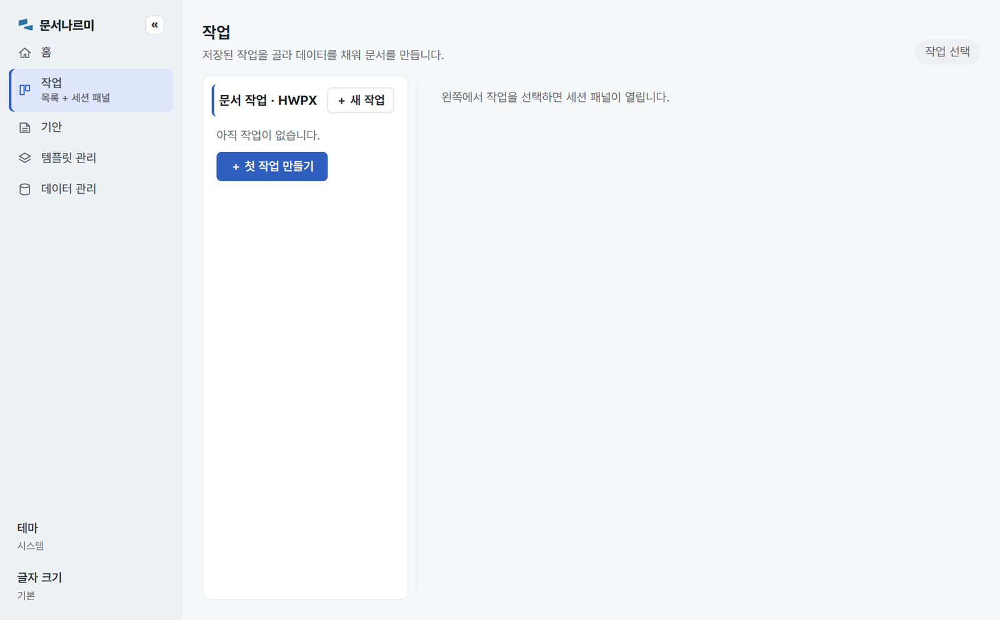
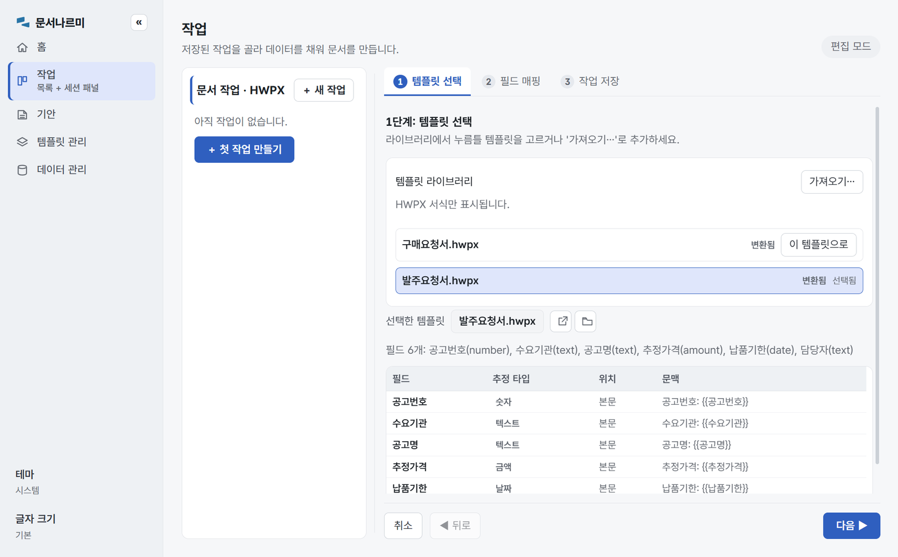
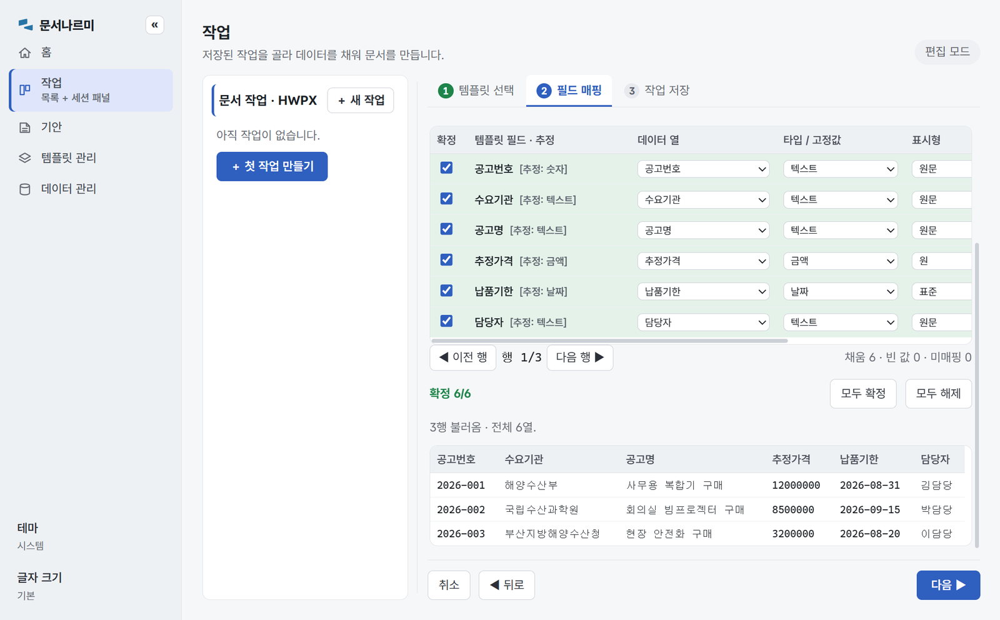
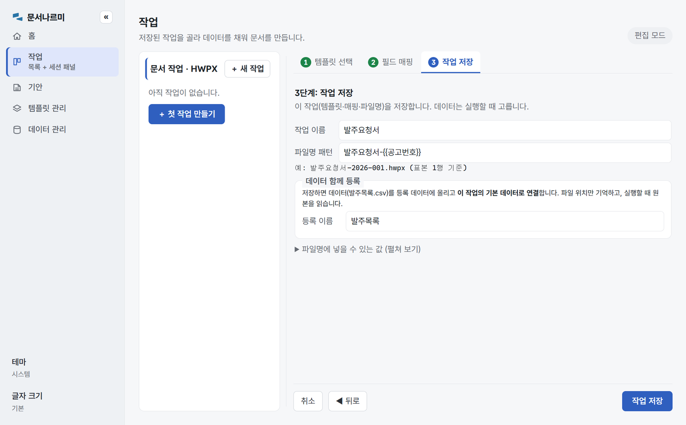
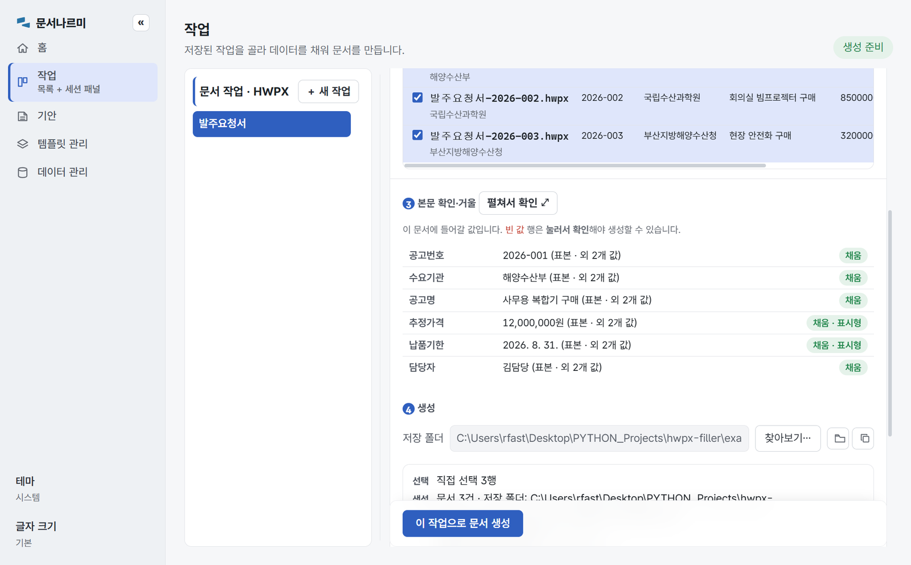
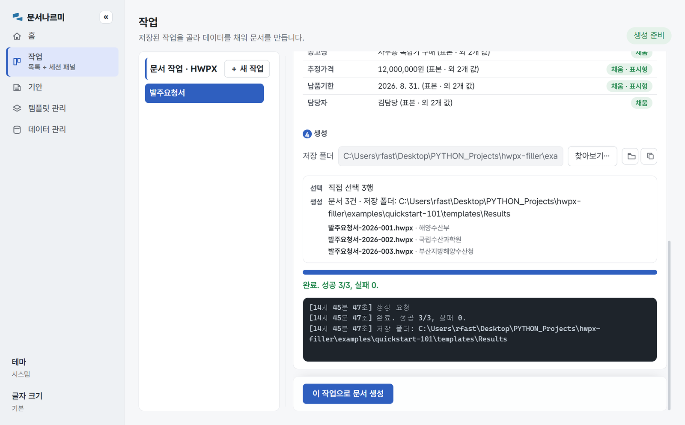
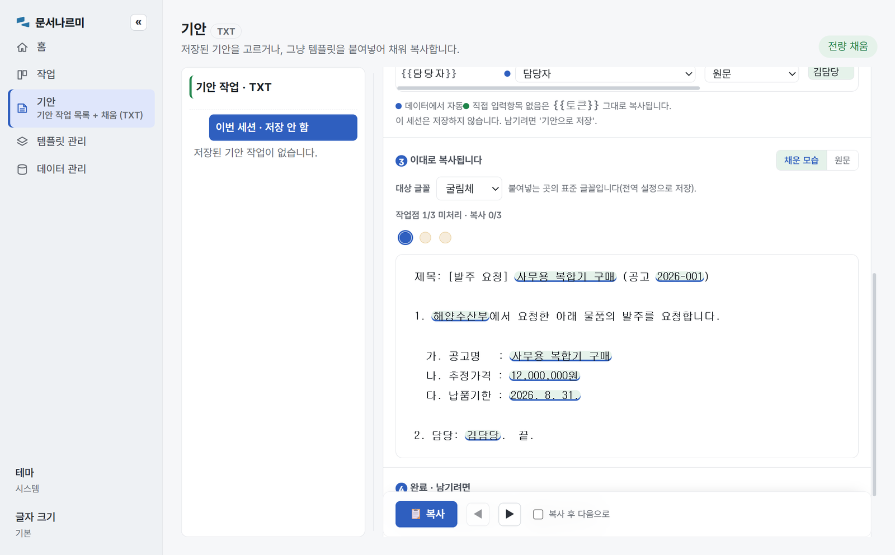
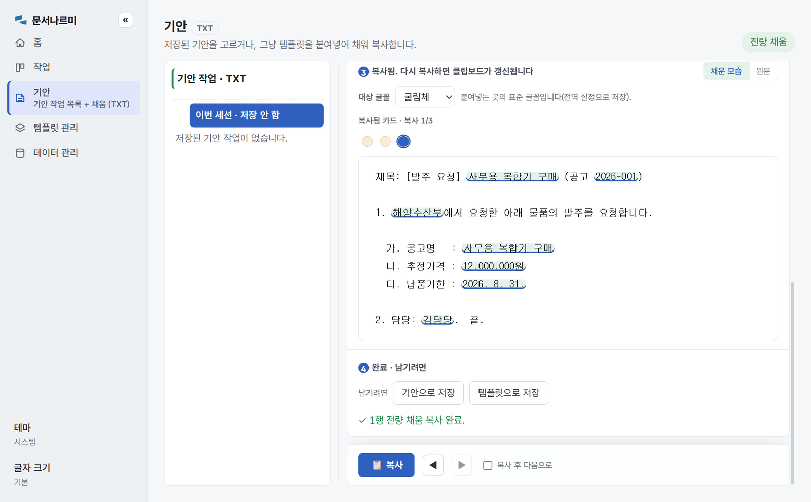
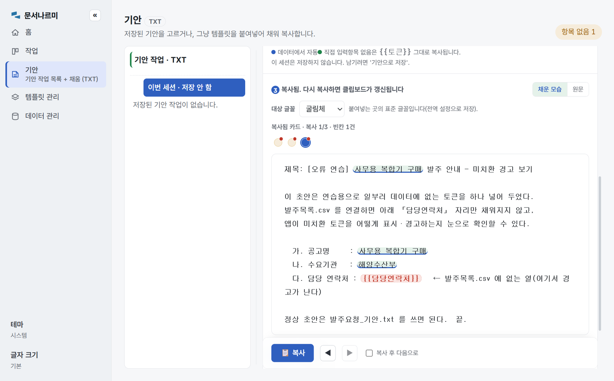

# 문서나르미 101 — 화면만 보고 첫 문서 만들기

**대상**: 문서나르미를 처음 실행하는 사람(개발 지식 불필요).
**소요 시간**: 15~20분.
**준비물**: Windows PC + 이 저장소 체크아웃(아래 「준비」).
**실습 결과**: ① 완성 HWPX 문서 3건 ② 클립보드에 채워진 기안 텍스트 1건.

한글 CSV 한 벌로 두 가지를 만든다 — **HWPX 완성 문서**(작업으로 저장 → 생성)와
**즉시 기안 텍스트**(채워서 바로 복사). 이 폴더 하나로 처음부터 끝까지 화면에서 실습된다.

> 이 튜토리얼은 **CLI 를 쓰지 않는다.** 실무자는 앱으로 일한다는 전제다.
> 자동화용 명령줄이 필요하면 [루트 README](../../README.md) 의 CLI 절을 보라.
>
> **설치본(exe) 사용자**: 이 실습 세트는 아직 배포본에 들어 있지 않다 — 저장소를
> 내려받아 진행하거나, 예제 동봉(후속 #284)을 기다리면 된다.

## 이 폴더에 뭐가 있나

```
quickstart-101/
├─ start-101.cmd             ← 더블클릭 = 이 폴더를 홈으로 앱 실행
├─ reset-101.cmd             ← 더블클릭 = 실습 생성물·설정만 지우고 처음 상태로
├─ README.md                 ← 지금 이 문서(101 따라 하기)
├─ PATTERNS.md               102 — 세 가지 실전 조합(여러 템플릿·여러 데이터·작업 전환)
├─ templates/                누름틀 템플릿(.hwpx) — 앱의 템플릿 라이브러리에 자동으로 뜬다
│   ├─ 발주요청서.hwpx        6필드 템플릿
│   └─ 구매요청서.hwpx        4필드 부분집합(102 용)
├─ text_templates/           평문 {{필드}} 초안 — "기안" 화면에 자동으로 뜬다
│   ├─ 발주요청_기안.txt      정상 초안(6필드 전부 CSV 에 있음)
│   └─ 오류연습_미치환.txt    ⚠ 일부러 없는 토큰을 넣은 오류 연습용(정상 경로와 분리)
├─ data/                     채울 값(한글 헤더 = 필드 이름 → 직접 매칭)
│   ├─ 발주목록.csv           3건. utf-8-sig — 트랙 A·B 가 같은 파일을 쓴다
│   └─ 발주목록_2.csv         같은 헤더·다른 2건(102 용)
├─ img/                      이 문서의 스크린샷(자동 생성 — 아래 참고)
└─ make_template.py          위 템플릿·CSV 를 다시 만드는 스크립트(맨 아래 참고)
```

실습 중 앱이 만드는 것(작업·설정·산출물)은 이 폴더 밑에 생기고 `.gitignore` 로 커밋에서
빠진다. **`reset-101.cmd`** 를 더블클릭하면 실습 생성물·설정만 지워져(예제 자산은 불가침)
언제든 처음부터 다시 시작할 수 있다.

## 자산 ↔ 배우는 것 대응표

| 자산 | 목적 | 배우는 기능 | 기대 결과 |
|---|---|---|---|
| `발주요청서.hwpx` + `발주목록.csv` | 첫 HWPX 생성 | 필드 확인 → 자동 제안 확정 → 작업 저장 → 생성 | 완성 HWPX 3건 |
| `구매요청서.hwpx` + 같은 CSV | 템플릿 재사용(102) | 한 데이터 → 여러 템플릿, 여분 열 무시 | 다른 서식 HWPX 3건 |
| `발주목록_2.csv` | 데이터 교체(102) | 여러 데이터 → 한 템플릿, 같은 폴더 누적 | 추가 HWPX 2건 |
| `발주요청_기안.txt` + 같은 CSV | 즉시 기안 | 레코드 이동·미리보기·복사 | 채워진 평문 초안 |
| `오류연습_미치환.txt` | 경고 표면 학습 | 데이터에 없는 `{{담당연락처}}` 토큰의 미치환 경고 | 빨간 토큰·`항목 없음` 신호 |

필드 ↔ 데이터 열 대응: 템플릿 필드명 = CSV 한글 헤더 **정확 일치**가 101 의 핵심이다
(그래서 매핑이 자동 제안된다). `발주요청서` 는 6열 전부(공고번호·수요기관·공고명·
추정가격·납품기한·담당자), `구매요청서` 는 그중 4개(수요기관·공고명·추정가격·담당자)만
쓰고 나머지 열은 무시된다.

## 준비 — 더블클릭으로 실행

**최초 1회만** 저장소 루트에서 의존성을 받는다(docs/DEVELOPMENT_ENVIRONMENT.md 참고):

```powershell
uv sync --locked --all-extras --group dev --group build
```

이후로는 이 폴더의 **[`start-101.cmd`](start-101.cmd) 를 더블클릭**하면 끝이다. 런처가
자동으로 이 예제 폴더를 앱의 홈(`HWPXFILLER_HOME`)으로 잡아 준다 — 그래서 실제
`~/.hwpxfiller` 를 건드리지 않으면서 **이 폴더의 템플릿·기안 초안이 화면에 바로 뜬다.**
(터미널이 편하면 `examples\quickstart-101\start-101.cmd` 로 실행해도 된다.)

<details>
<summary>런처 없이 직접 실행하려면 (수동)</summary>

저장소 루트에서:

```powershell
$env:HWPXFILLER_HOME = "$PWD\examples\quickstart-101"
uv run --extra gui python -m hwpxfiller.webapp
```

macOS/Linux: `HWPXFILLER_HOME="$PWD/examples/quickstart-101" python -m hwpxfiller.webapp`
</details>

## 화면 한눈에 — 왼쪽 탐색 레일

앱이 뜨면 **「작업」 화면**이 먼저 열리고, 왼쪽에 세로 메뉴(탐색 레일)가 있다. 위에서부터:

| 메뉴 | 하는 일 |
|---|---|
| **홈** | 작업·템플릿·데이터의 경보와 상태 요약. 「＋ 새 작업」·「＋ 새 기안」 지름길 |
| **작업** | HWPX 작업 목록 + 세션 패널 — 데이터를 채워 문서를 만드는 곳(트랙 A) |
| **기안** | 평문 초안(TXT)을 채워 복사하는 곳(트랙 B) |
| **템플릿 관리** | HWPX·TXT 라이브러리 — 상태 점검·누름틀 변환·그룹 정리 |
| **데이터 관리** | 자주 쓰는 데이터 파일을 등록(경로 참조)해 재사용 |

레일 맨 아래에 **테마**(시스템→라이트→다크)와 **글자 크기**(기본→크게→더 크게) 토글이
있다. 101 은 **작업**(트랙 A)과 **기안**(트랙 B) 둘만 쓴다.


*그림 1. 부팅 직후. 「작업」 화면이 랜딩이고, 작업이 없으면 「＋ 첫 작업 만들기」가 보인다.*

---

## 트랙 A — HWPX 문서 만들기

앱의 뼈대는 **작업(Job)** 이다. 작업 = `{템플릿 + 매핑 + 파일명 패턴}` 한 벌에 이름을
붙여 저장한 것. **데이터는 작업에 저장하지 않는다** — 만들 때마다 그 순간의 파일을
겨눈다. 그래서 순서는 늘 **① 작업 만들기(한 번) → ② 데이터 겨눠 생성(반복)** 이다.

### ① 작업 만들기 — 3단계

1. **[＋ 첫 작업 만들기]**(작업이 이미 있으면 목록 위 **[＋ 새 작업]**)를 누른다.
   오른쪽 패널이 **편집 모드**로 바뀌고 3단계가 뜬다: *템플릿 선택 → 필드 매핑 → 작업 저장*.

2. **1단계 — 템플릿 선택**: 템플릿 라이브러리 목록에서 `발주요청서.hwpx` 행의
   **[이 템플릿으로]** 를 누른다. 아래에 **필드 6개**의 스키마 표(필드·추정 타입·위치·
   문맥)가 뜬다. 확인했으면 **[다음 ▶]**.
   (라이브러리 밖의 파일을 쓰려면 **[가져오기…]** — 파일을 라이브러리로 복사해 온다.)

   
   *그림 2. 템플릿을 고르면 필드 스키마 표가 뜬다. 6개 필드가 모두 보이는지 확인한다.*

3. **2단계 — 필드 매핑**: 머리의 **[파일 선택…]** 으로 `data/발주목록.csv` 를 고른다.
   CSV 헤더가 필드명과 같아서 **데이터 열이 자동으로 제안**되어 있고, 표 오른쪽 끝
   미리보기에 실제 값이 붙는다 — **[모두 확정]** 을 눌러 **확정 6/6** 을 만든다 →
   **[다음 ▶]**. (자동 제안은 초안이라, 맞더라도 한 번 확정해야 넘어간다 — "조용히
   추측하지 않는다"는 원칙. 표 아래 ◀ ▶ 스테퍼로 행 1/3 을 넘기며 다른 행 값도
   미리 볼 수 있고, 오른쪽 끝 요약이 **채움 6 · 빈 값 0 · 미매핑 0** 인지 확인한다.)

   
   *그림 3. 「모두 확정」 후 — 전 행 확정 체크와 채움 6 · 빈 값 0 · 미매핑 0 요약.*

4. **3단계 — 작업 저장**: **작업 이름**에 `발주요청서`, **파일명 패턴**을
   `발주요청서-{{공고번호}}` 로 바꾼다(기본값 `공고서-{{date}}-{{seq:001}}`). 입력하면
   바로 아래 "예: 발주요청서-2026-001.hwpx" 라이브 예시가 따라온다. **데이터 함께
   등록**이 켜져 있어(등록 이름 `발주목록`) 저장하면 방금 그 CSV 가 등록 데이터로
   올라가 **이 작업의 기본 데이터**로 연결된다 → **[작업 저장]**.
   (패턴에는 이 작업이 채우는 필드 이름과 `{{date}}`·`{{seq:001}}` 만 쓸 수 있다 —
   "파일명에 넣을 수 있는 값 (펼쳐 보기)" 참고.)

   
   *그림 4. 파일명 패턴은 라이브 예시로 결과를 미리 보여 주고, 데이터 함께 등록이 기본으로 켜져 있다.*

왼쪽 **문서 작업 · HWPX** 목록에 `발주요청서` 가 생긴다.

### ② 데이터 겨눠 생성 — 세션 패널

1. 목록에서 `발주요청서` 를 클릭한다. 오른쪽에 **세션 패널** 4개 구획이 열린다:
   *① 템플릿·헤더 확인 → ② 데이터 연결 → ③ 본문 확인·거울 → ④ 생성*. 방금 데이터를
   함께 등록했으므로 **"기본 데이터 '발주목록' 를 자동으로 연결했습니다."** 고지와 함께
   **생성 대상 문서** 표에 3건이 이미 로드되어 있고(기본 전체 선택, 행마다 실제 파일명
   미리보기), 상태 pill 이 **생성 준비**다. 저장 폴더는 기본으로 `templates\Results`.
   (다른 파일로 바꾸려면 **[파일 선택…]**, 등록해 둔 다른 데이터는 **[등록 데이터…]**.)

   
   *그림 5. 작업만 골라도 기본 데이터가 자동 연결된다 — 자동 연결 고지와 3건 로드.*

2. **③ 본문 확인·거울**로 내려가 문서에 들어갈 값을 훑는다. 필드마다 표본 값과
   **채움** 칩이 보이면 정상이다(빈 값이 있으면 여기 빨간 행이 뜬다 — 아래 안전장치).

   
   *그림 6. 거울 표 — 이 문서에 실제로 들어갈 값과 채움 상태를 생성 전에 확인한다.*

3. 하단 **[이 작업으로 문서 생성]** 을 누른다. 진행바("생성 중… 1/3")가 돌고, 끝나면
   **"완료. 성공 3/3, 실패 0."** 요약과 생성 파일 목록·로그·저장 폴더 열기 어포던스가 남는다.

   
   *그림 7. 완료 요약·파일 3건 목록·로그. 「저장 폴더」 옆 버튼으로 결과 폴더를 바로 연다.*

`templates\Results\` 에 `발주요청서-2026-001.hwpx` 등 3개가 생긴다. 한컴오피스로 열어
값을 확인한다(한컴 없이 실습만 해도 무방 — 생성 자체에 한컴은 필요 없다).

### 알아둘 안전장치 (조용히 넘어가지 않는다)

원칙은 **"묻고 확정하게 하라, 아니면 시끄럽게 알려라"** — 애매하면 조용히 진행하지 않는다.

- **빈 값이 있으면 생성이 잠긴다.** 어떤 필드가 비면 거울 표에 **빈 값 · 클릭=확인**
  칩이 뜨고, 클릭해 **확인됨** 으로 바꿔야 생성이 열린다. 확인하고 생성하면 그 자리에
  `〘미입력·필드명〙` 표식이 들어간다 — 빈칸인 채로 사라지지 않는다.
- **같은 이름 파일이 있으면 덮어쓰기 확인.** 저장 폴더에 같은 파일명이 있으면
  **"덮어쓰기 확인"** 대화상자가 목록과 함께 뜨고, **[덮어쓰고 생성]** 을 눌러야
  진행한다(손보정했을 수 있는 기존 산출물을 말없이 파괴하지 않으려고).
- **템플릿에 미해결 토큰이 있으면 1단계가 막힌다.** `{{토큰}}` 이 누름틀로 컴파일되지
  않은 채 남아 있으면 **[비우고 진행 확인 (N개 토큰)]** 을 눌러 직접 확인해야 넘어간다.
  (101 예제 템플릿은 전부 컴파일돼 있어 이 게이트를 만나지 않는다.)

---

## 트랙 B — 기안 (텍스트 초안 바로 채우기)

완성 문서(.hwpx)가 아니라 **평문 초안**을 값으로 채워 곧바로 메일·메신저·온나라 기안창에
붙여넣고 싶을 때다. 저장 없이 **채워서 바로 복사**한다.

1. 레일에서 **기안**. 오른쪽 세션 패널의 **① 데이터** 구획에서 템플릿 콤보를
   `발주요청_기안.txt` 로 고른다. 미리보기 카드에 원문이 뜬다.
   (내 초안을 바로 쓰려면 **[템플릿 붙여넣기…]** 로 텍스트를 부어 넣어도 된다.)
2. 같은 구획의 **[파일 선택…]** → `data/발주목록.csv`. **기안 대상 행** 표에 3건이
   뜨고, 카드가 첫 행 값으로 채워진다. 카드 제목은 **"이대로 복사됩니다"** — 보이는
   그대로가 복사 결과다.

   
   *그림 8. 값 자리는 음영으로 표시된다. ② 맞추기 표에서 토큰↔열 대응을 손볼 수 있다.*

3. 하단 액션바의 **◀ / ▶** 로 행(작업점)을 넘기며 미리보기를 확인한다.
4. **[📋 복사]** — 클립보드에 들어간다. **"복사 후 다음으로"** 를 켜 두면 복사할 때마다
   작업점이 다음 행으로 넘어가 여러 건을 연달아 처리하기 좋다. 완료 노트가
   **"✓ 1행 전량 채움 복사 완료."** 처럼 상태를 남긴다.

   
   *그림 9. 복사 뒤 — 카드 제목이 「복사됨」으로 바뀌고 「✓ 1행 전량 채움 복사 완료.」 노트가 남는다.*

여기서도 **없는 필드는 조용히 사라지지 않는다.** 초안이 데이터에 없는 토큰을 참조하면
그 `{{토큰}}` 이 미리보기에 **빨갛게 그대로 남고**, 상태 pill 이 **항목 없음 N** 으로
바뀌며, 복사 직전에도 "빈칸이 있습니다" 확인이 한 번 더 선다.

남기고 싶으면 **④ 완료 · 남기려면** 구획에서 — **[기안으로 저장]**(이 조합을 왼쪽
목록에 등록해 다음에 재사용) 또는 **[템플릿으로 저장]**(붙여넣은 초안을 라이브러리로
승격).

---

## 막히면 — 문제 해결

**직접 재현해 보기**: 템플릿 콤보를 `오류연습_미치환.txt` 로 바꿔 보라(진행 중 기안을
떠난다는 확인이 뜨면 [바꾸기]). 이 초안은 일부러 데이터에 없는 `{{담당연락처}}` 토큰을
갖고 있다 — 아래 그림처럼 **경고가 어떻게 생겼는지** 미리 봐 두면 실무에서 당황하지 않는다.


*그림 10. 데이터에 없는 토큰은 빨간 `{{담당연락처}}` 로 남고 상태 pill 이 「항목 없음 1」이 된다.*

| 증상 | 원인·해법 |
|---|---|
| 템플릿 라이브러리가 비어 있다 | 앱을 `start-101.cmd` 로 실행했는지 확인 — 홈이 이 폴더로 잡혀야 `templates/` 가 뜬다 |
| 매핑이 자동 제안되지 않는다 | CSV 헤더와 필드명이 정확히 같아야 한다(공백·괄호 차이도 다른 이름) — ② 매핑표에서 직접 열을 고르면 된다 |
| 생성 버튼이 잠겨 있다 | 게이트 캡션이 이유를 서수로 알려 준다(①…②…). 대개 데이터 미연결이거나 빈 값 미확인 |
| 미리보기에 빨간 `{{토큰}}` | 데이터에 그 이름의 열이 없다 — ② 맞추기에서 다른 열을 대응시키거나 그대로 복사 후 손으로 채운다 |
| 실습을 처음부터 다시 | `reset-101.cmd` 더블클릭(예제 자산은 남고 실습 상태만 지워진다) |

---

## 다음 걸음

| 하고 싶은 것 | 어디로 |
|---|---|
| 한 데이터→여러 템플릿 / 여러 데이터→한 템플릿 / 작업 전환 | [102 — 세 가지 실전 조합](PATTERNS.md) |
| 내 초안(평문 {{토큰}} hwpx)을 누름틀 템플릿으로 | **템플릿 관리** → 카드 **[누름틀 변환]** |
| 데이터 파일을 등록해 생성 때마다 재사용 | **데이터 관리** (작업·기안의 **[등록 데이터…]** 로 연결) |
| 템플릿이 많아지면 그룹으로 정리 | **템플릿 관리** — 그룹 지정·접기 |
| 더 큰 실사용 예제 | [`tests/corpus/scenario/`](../../tests/corpus/scenario/README.md) |

## (참고) 예제 자산·스크린샷 다시 만들기

`templates/*.hwpx` 와 `data/*.csv` 는 손으로 편집하지 말고 스크립트에서 파생한다
(같은 입력 → 같은 출력). 필드·데이터를 바꾸려면 `make_template.py` 안의
`FIELDS`·`RECORDS`·`TEMPLATES` 를 고치고 다시 실행한다:

```powershell
uv run python examples/quickstart-101/make_template.py
```

`text_templates/*.txt` 는 평문이라 스크립트 없이 그냥 손으로 편집하면 된다
(단, 정상 초안의 토큰은 `FIELDS` 에 있는 이름만 써야 채워진다 —
`오류연습_미치환.txt` 만 예외로, 없는 토큰 `{{담당연락처}}` 를 **일부러** 갖고 있다).

이 문서의 스크린샷(`img/`)도 자동 재생성이다 — UI 가 바뀌면 실앱을 띄워 실습을 통째로
완주하며 다시 찍는다(깨끗한 상태 전제, `reset-101.cmd` 먼저):

```powershell
uv run --with pillow --extra gui python scripts/capture_101_screenshots.py
```

자산과 문서가 어긋나지 않게 저장소 테스트(`tests/test_quickstart_101_assets.py`)가
필드·헤더·토큰 대응과 인코딩을 기계로 비준한다. 경계는 이렇다 — **학습 자산**
(템플릿·CSV·txt)은 앱에서 열리는 데 이 폴더 밖 의존이 없지만, **런처·재생성 스크립트·
테스트는 저장소 체크아웃 전제**다(`start-101.cmd` 는 저장소 루트의 uv 환경으로 실행한다).
그래서 이 실습은 저장소 안에서 한다 — 설치본(exe) 사용자용 예제 동봉 경로는 별도
후속(#284)이다.
