# 문서나르미 101 — 화면만 보고 첫 문서 만들기

**대상**: 문서나르미를 처음 실행하는 사람(개발 지식 불필요).
**소요 시간**: 15~20분.
**준비물**: Windows PC + 이 저장소 체크아웃(아래 「준비」).
**실습 결과**: ① 완성 HWPX 문서 3건 ② 클립보드에 채워진 기안 텍스트 1건.

한글 CSV 한 벌로 두 가지를 만든다 — **HWPX 완성 문서**(작업으로 저장 → 생성)와
**기안 텍스트**(작업으로 저장 → 검토·복사). 두 트랙 모두 같은 「작업」 리듬이고,
이 폴더 하나로 처음부터 끝까지 화면에서 실습된다.

> 이 튜토리얼은 **CLI 를 쓰지 않는다.** 실무자는 앱으로 일한다는 전제다.
> 자동화용 명령줄이 필요하면 [루트 README](../../README.md) 의 CLI 절을 보라.
>
> **설치본(exe) 사용자**: 이 실습 세트는 아직 배포본에 들어 있지 않다 — 저장소를
> 내려받아 진행하거나, 예제 동봉(후속 #284)을 기다리면 된다.

## 이 폴더에 뭐가 있나

```
quickstart-101/
├─ start-101.cmd             ← 더블클릭 = 이 폴더를 홈으로 앱 실행
├─ reset-101.cmd             ← 더블클릭 = 실습 생성물·설정만 지우고 처음 상태로
├─ README.md                 ← 지금 이 문서(101 따라 하기)
├─ PATTERNS.md               102 — 세 가지 실전 조합(여러 템플릿·여러 데이터·작업 전환)
├─ templates/                누름틀 템플릿(.hwpx) — 앱의 템플릿 라이브러리에 자동으로 뜬다
│   ├─ 발주요청서.hwpx        6필드 템플릿
│   └─ 구매요청서.hwpx        4필드 부분집합(102 용)
├─ text_templates/           평문 {{필드}} 초안 — 편집기 「＋ 새 작업」의 TXT 구획에 뜬다
│   ├─ 발주요청_기안.txt      정상 초안(6필드 전부 CSV 에 있음)
│   └─ 오류연습_미치환.txt    ⚠ 일부러 없는 토큰을 넣은 오류 연습용(비움 확정·빈 값 표면)
├─ data/                     채울 값(한글 헤더 = 필드 이름 → 직접 매칭)
│   ├─ 발주목록.csv           3건. utf-8-sig — 트랙 A·B 가 같은 파일을 쓴다
│   └─ 발주목록_2.csv         같은 헤더·다른 2건(102 용)
├─ img/                      이 문서의 스크린샷(자동 생성 — 아래 참고)
└─ make_template.py          위 템플릿·CSV 를 다시 만드는 스크립트(맨 아래 참고)
```

실습 중 앱이 만드는 것(작업·설정·산출물)은 이 폴더 밑에 생기고 `.gitignore` 로 커밋에서
빠진다. **`reset-101.cmd`** 를 더블클릭하면 실습 생성물·설정만 지워져(예제 자산은 불가침)
언제든 처음부터 다시 시작할 수 있다.

## 자산 ↔ 배우는 것 대응표

| 자산 | 목적 | 배우는 기능 | 기대 결과 |
|---|---|---|---|
| `발주요청서.hwpx` + `발주목록.csv` | 첫 HWPX 생성 | 필드 확인 → 자동 제안 확정 → 작업 저장 → 생성 | 완성 HWPX 3건 |
| `구매요청서.hwpx` + 같은 CSV | 템플릿 재사용(102) | 한 데이터 → 여러 템플릿, 여분 열 무시 | 다른 서식 HWPX 3건 |
| `발주목록_2.csv` | 데이터 교체(102) | 여러 데이터 → 한 템플릿, 같은 폴더 누적 | 추가 HWPX 2건 |
| `발주요청_기안.txt` + 같은 CSV | 기안 텍스트 | TXT 작업 저장 → 작업대 검토·복사 | 채워진 평문 초안 |
| `오류연습_미치환.txt` | 경고 표면 학습 | 데이터에 없는 `{{담당연락처}}` 항목의 비움 확정·빈 값 표시 | 비움 확정 게이트·`(빈 값)` 표시 |

필드 ↔ 데이터 열 대응: 템플릿 필드명 = CSV 한글 헤더 **정확 일치**가 101 의 핵심이다
(그래서 매핑이 자동 제안된다). `발주요청서` 는 6열 전부(공고번호·수요기관·공고명·
추정가격·납품기한·담당자), `구매요청서` 는 그중 4개(수요기관·공고명·추정가격·담당자)만
쓰고 나머지 열은 무시된다.

## 준비 — 더블클릭으로 실행

**최초 1회만** 저장소 루트에서 의존성을 받는다(docs/DEVELOPMENT_ENVIRONMENT.md 참고):

```powershell
uv sync --locked --all-extras --group dev --group build
```

이후로는 이 폴더의 **[`start-101.cmd`](start-101.cmd) 를 더블클릭**하면 끝이다. 런처가
자동으로 이 예제 폴더를 앱의 홈(`HWPXFILLER_HOME`)으로 잡아 준다 — 그래서 실제
`~/.hwpxfiller` 를 건드리지 않으면서 **이 폴더의 템플릿·기안 초안이 화면에 바로 뜬다.**
(터미널이 편하면 `examples\quickstart-101\start-101.cmd` 로 실행해도 된다.)

<details>
<summary>런처 없이 직접 실행하려면 (수동)</summary>

저장소 루트에서:

```powershell
$env:HWPXFILLER_HOME = "$PWD\examples\quickstart-101"
uv run --extra gui python -m hwpxfiller.webapp
```

macOS/Linux: `HWPXFILLER_HOME="$PWD/examples/quickstart-101" python -m hwpxfiller.webapp`
</details>

## 화면 한눈에 — 위쪽 탭 두 개

앱이 뜨면 **「문서 만들기」 화면**이 먼저 열리고, 위쪽에 탭이 있다.

| 탭 | 하는 일 |
|---|---|
| **문서 만들기** | 데이터를 고르고, 그 데이터로 쓸 문서 작업을 실행하는 곳(HWPX 생성·TXT 검토·복사) |
| **문서 작업** | 저장된 작업을 찾고 상태를 확인·정리하는 곳. 「＋ 새 작업」도 여기 |

탭은 이 둘뿐이다. 템플릿 라이브러리(상태 점검·누름틀 변환·그룹 정리)는 별도 탭이 아니라
**편집기의 「템플릿」 자리**로 들어갔다 — **[＋ 새 작업]** 으로 편집기에 들어가면 1단계가
그 라이브러리다.

자주 쓰는 데이터 파일은 별도 화면이 아니라 **[데이터 선택…]** 창 안의 「고정한 데이터」에
모인다 — 데이터는 작업의 입력이라 고르는 자리에서 함께 관리한다.

탭 줄 오른쪽 끝에 **테마**(시스템→라이트→다크)와 **글자 크기**(기본→크게→더 크게) 토글이 있다.

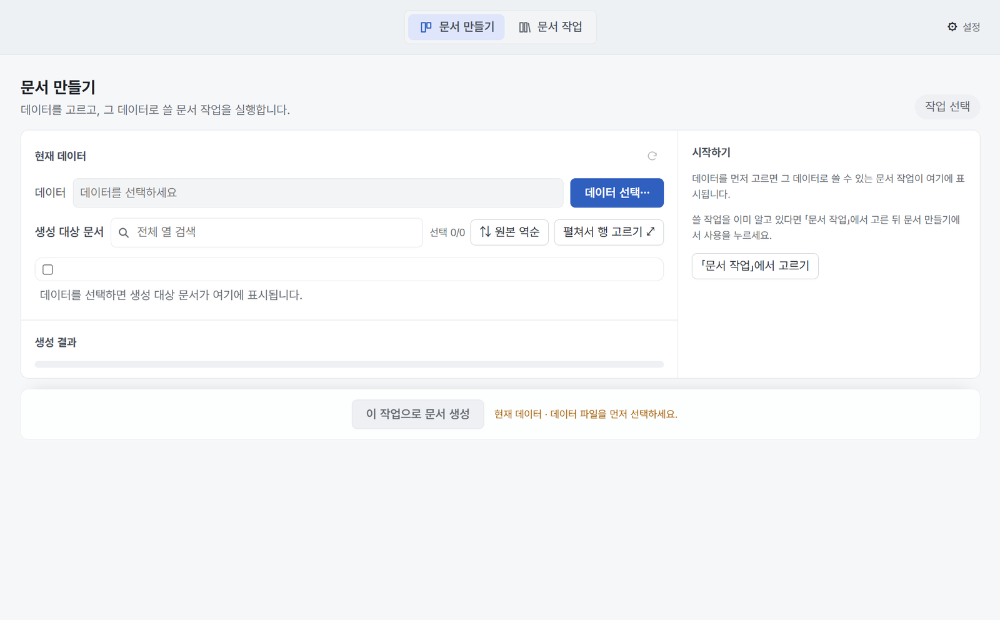
*그림 1. 부팅 직후. 데이터도 작업도 없으면 오른쪽에 「「문서 작업」에서 고르기」 출구가 선다.*

---

## 트랙 A — HWPX 문서 만들기

앱의 뼈대는 **작업(Job)** 이다. 작업 = `{템플릿 + 매핑 + 파일명 패턴}` 한 벌에 이름을
붙여 저장한 것. **데이터는 작업에 저장하지 않는다** — 만들 때마다 그 순간의 파일을
겨눈다. 그래서 순서는 늘 **① 작업 만들기(한 번) → ② 데이터 겨눠 생성(반복)** 이다.

### ① 작업 만들기 — 3단계

1. 오른쪽 **[「문서 작업」에서 고르기]**(또는 위쪽 탭 **문서 작업**)로 넘어가
   화면 머리의 **[＋ 새 작업]** 을 누른다. **문서 작업 편집기**가 열린다 — 편집 중에는
   위쪽 탭이 감춰지고 나가는 길은 왼쪽 위 **[← 원래 업무로 돌아가기]** 하나다.
   새 작업은 세 자리를 순서대로 지난다: *템플릿 → 필드 연결·표시 → 파일 이름*.
   (작업 **이름**은 화면 머리에서 언제든 고칠 수 있다.)

   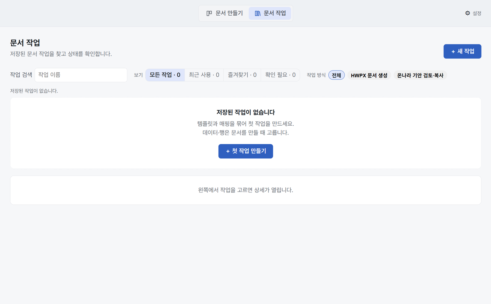
   *그림 2. 저장된 작업이 모이는 자리. 처음엔 비어 있고 「＋ 새 작업」이 시작점이다.*

2. **템플릿**: 템플릿 라이브러리 목록에서 `발주요청서.hwpx` 행의
   **[이 템플릿으로]** 를 누른다. 아래에 **필드 6개**의 스키마 표(필드·추정 타입·위치·
   문맥)가 뜬다. 확인했으면 **[다음 ▶]**.
   (라이브러리 밖의 파일을 쓰려면 **[가져오기…]** — 파일을 라이브러리로 복사해 온다.
   폴더째 들여올 땐 **[폴더에서 가져오기…]**.)

   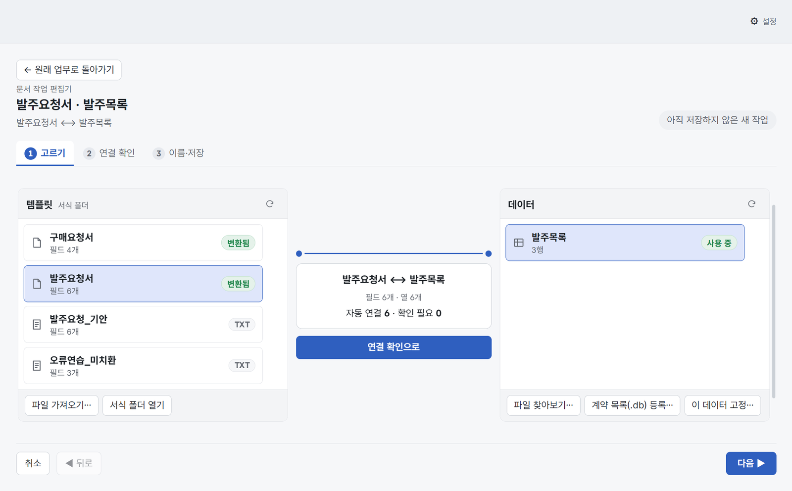
   *그림 3. 템플릿을 고르면 필드 스키마 표가 뜬다. 6개 필드가 모두 보이는지 확인한다.*

3. **필드 연결·표시**: 머리의 **[파일 선택…]** 으로 `data/발주목록.csv` 를 고른다.
   CSV 헤더가 필드명과 같아서 **데이터 열이 자동으로 제안**되어 있고, 표 오른쪽 끝
   미리보기에 실제 값이 붙는다 — **[모두 확정]** 을 눌러 **확정 6/6** 을 만든다 →
   **[다음 ▶]**. (자동 제안은 초안이라, 맞더라도 한 번 확정해야 넘어간다 — "조용히
   추측하지 않는다"는 원칙. 표 아래 ◀ ▶ 스테퍼로 행 1/3 을 넘기며 다른 행 값도
   미리 볼 수 있고, 오른쪽 끝 요약이 **채움 6 · 빈 값 0 · 미매핑 0** 인지 확인한다.)

   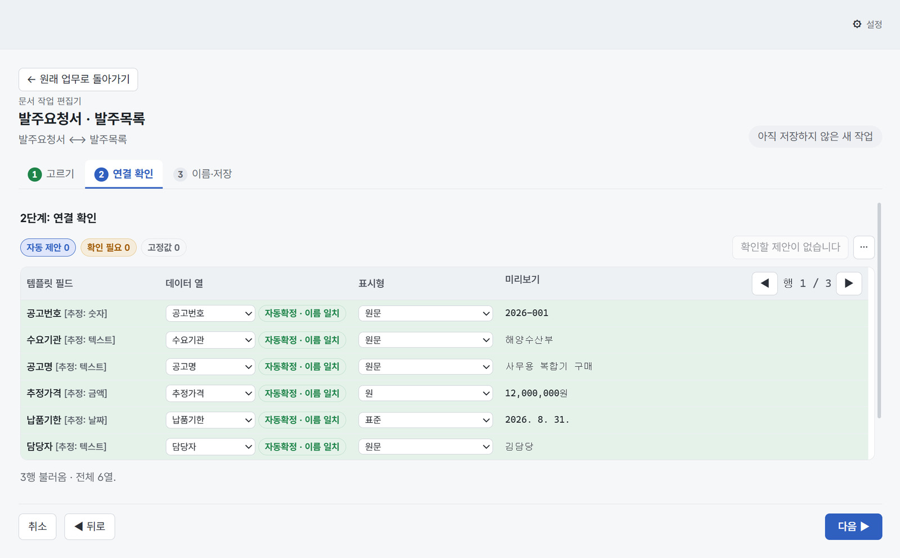
   *그림 4. 「모두 확정」 후 — 전 행 확정 체크와 채움 6 · 빈 값 0 · 미매핑 0 요약.*

4. **파일 이름**: 화면 머리의 **작업 이름**에 `발주요청서`, 탭 안 **파일명 패턴**을
   `발주요청서-{{공고번호}}` 로 바꾼다(기본값 `공고서-{{date}}-{{seq:001}}`). 입력하면
   바로 아래 "예: 발주요청서-2026-001.hwpx" 라이브 예시가 따라온다 → **[작업 저장]**.
   **저장은 데이터를 등록하지도, 이 작업에 묶지도 않는다** — 작업이 기억하는 것은
   템플릿·매핑·파일명 규칙뿐이고, 데이터는 만들 때마다 겨눈다. 자주 쓰는 파일은
   **[데이터 선택…]** 창의 **[이 데이터 고정…]** 으로 따로 남긴다.
   (패턴에는 이 작업이 채우는 필드 이름과 `{{date}}`·`{{seq:001}}` 만 쓸 수 있다 —
   "파일명에 넣을 수 있는 값 (펼쳐 보기)" 참고.) 저장하면 화면 머리가
   **저장됨 · 템플릿 r1 · 연결 r1** 로 바뀐다 — 규칙을 고쳐 저장할 때마다 그 자리의
   숫자가 오르고, 실행 결과와 미리보기가 "어느 판본으로 만들었는지"를 그 숫자로 말한다.

   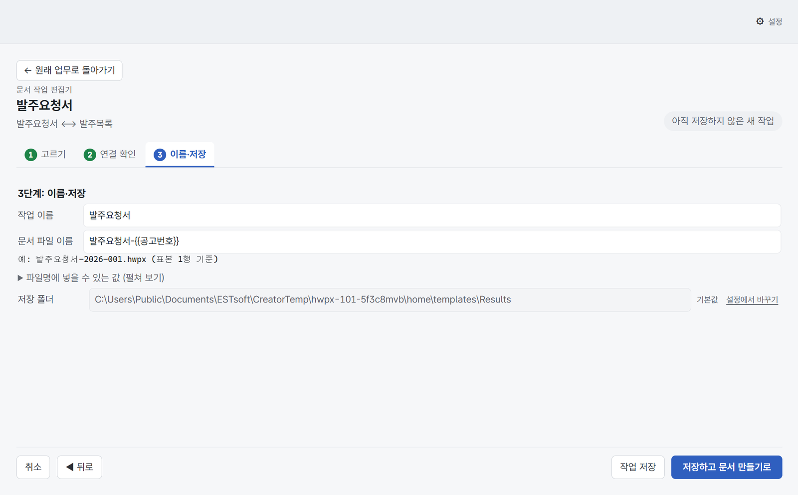
   *그림 5. 파일명 패턴은 라이브 예시로 결과를 미리 보여 준다. 이 탭이 정하는 것은 이름 규칙뿐이다.*

**[← 원래 업무로 돌아가기]** 로 편집기를 나오면 **문서 작업** 탭 목록에 `발주요청서` 가
생긴다. (규칙을 고치다 나가려 하면 **저장하고 나가기 / 버리고 나가기 / 머무르기** 를
묻는다 — 한 번에 한 곳만 고치고, 그 처분을 사람이 정한다.)

### ② 데이터 겨눠 생성 — 세션 패널

1. **문서 작업** 탭에서 `발주요청서` 행을 고르면 오른쪽에 상세가 열린다. 아래 고정된
   **[문서 만들기에서 사용]** 을 누른다 — 「문서 만들기」로 넘어간다. 아직 데이터가
   없으므로 `발주요청서` 작업은 열리지 않고, 먼저 데이터를 고르라는 순서만 이어진다.

   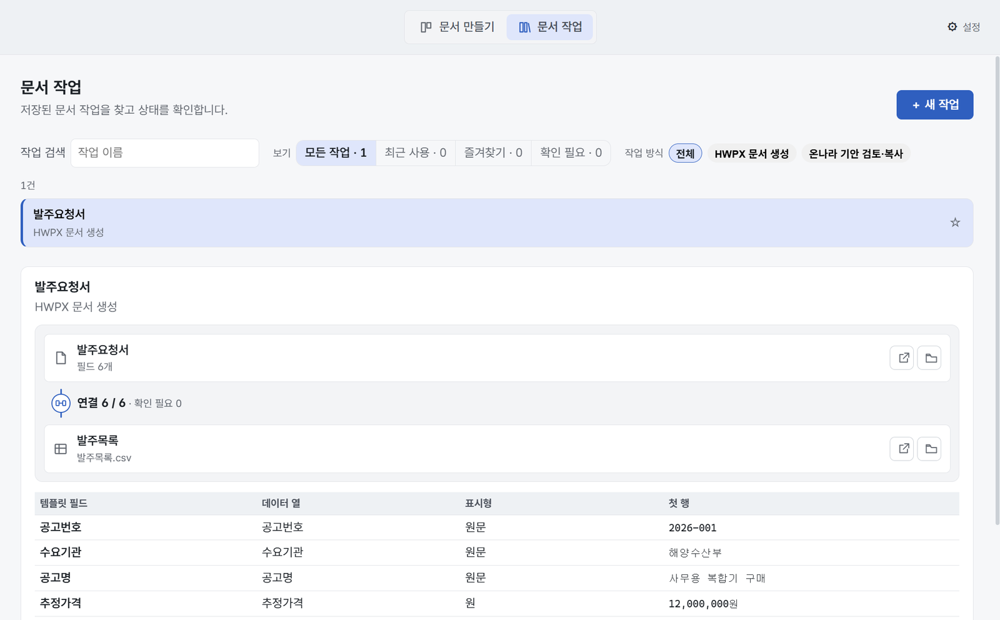
   *그림 6. 행을 고르면 상세가 열린다. 템플릿 행에는 열기·폴더에서 보기가 붙고, 아래 두 버튼(문서 만들기에서 사용·작업 편집)은 상세 스크롤과 무관하게 고정.*

2. **데이터를 고른다.** 「문서 만들기」로 넘어가면 **[데이터 선택…]** 을 눌러
   **[파일 찾아보기…]** 로 `data/발주목록.csv` 를 고른다. **작업은 데이터를 기억하지
   않으므로** 이 걸음은 건너뛸 수 없다 — 어느 데이터로 만드는지는 매번 사람이 정한다.
   고르고 나도 창은 닫히지 않고 「현재 데이터」가 방금 고른 파일로 바뀌며 그 자리에
   **[이 데이터 고정…]** 이 선다(자주 쓸 파일이면 여기서 「고정한 데이터」 목록에 남긴다).
   이대로 쓸 것이면 **[닫기]**. 창이 닫히면 3건이 로드되지만, 앞에서 고른
   `발주요청서` 작업은 아직 자동으로 열리지 않는다. 오른쪽 「이 데이터에 사용할 문서」가
   이 작업을 사용할 수 있다고 알려 주며 직접 고르라고 안내한다.

3. 화면은 **두 열**이다: 왼쪽 *현재 데이터 → 생성 대상 문서 표 → 본문 확인 → 생성 결과*,
   오른쪽 *이 데이터에 사용할 문서 · 생성 준비*. 오른쪽에서 `발주요청서` 후보 카드를
   **직접 누른다**. 그 뒤에야 카드가 강조되고 하단 액션바 왼쪽에 작업 이름이 나타나며
   현재 작업이 된다. **만들 행도 직접 고른다** — **[전체 선택]** 을 누르면 3건에 체크가
   들어가고 행마다 실제 파일명 미리보기가 붙는다.
   저장 폴더는 기본으로 `templates\Results`.

   행을 골라도 **[이 작업으로 문서 생성]** 은 아직 잠겨 있다 — 방금 만든 작업이라
   상태 pill 이 **승인 필요**이고, 버튼 옆에도 같은 표지가 붙는다.
   **[생성 값 미리보기]** 를 누르면 첫 문서에 실제로 들어갈 값과 파일 이름이 그대로 뜬다.
   `‹ ›` 로 문서를 넘겨 보고 **[이 이름과 값으로 승인]** 을 누르면 pill 이 **생성 준비**로
   바뀌고 생성이 열린다. 한 번 승인한 뒤로는 같은 규칙으로 다시 만들 때 이 단계가 없다 —
   규칙을 고치면 그때 다시 묻는다.

   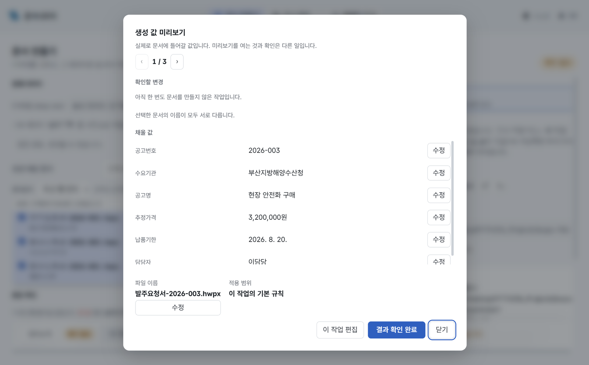
   *그림 7. 확인 면 — 이 문서가 받을 값·파일 이름·확인할 변경이 한 면에 선다. 빈 값이 있으면 「빈 값 있는 건만 보기」로 그 건들만 넘겨볼 수 있다. 승인은 면을 여는 것과 다른 일이다.*

   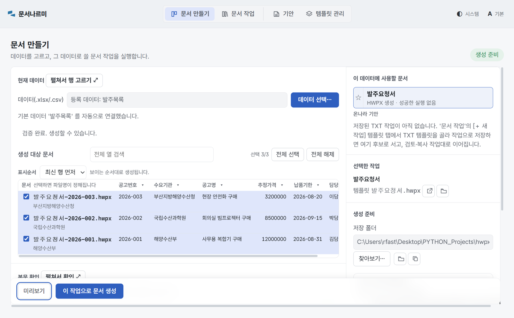
   *그림 8. 승인 뒤의 세션 패널 — 3건 선택 + 오른쪽 후보 카드에 이 작업이 활성, 아래 액션바가 작업 이름을 말하고 pill 은 생성 준비.*

   행이 많으면 **[펼쳐서 행 고르기 ⤢]** — 큰 화면에서 검색·필터로 좁히고 **표시순서**를
   고른다. 표시순서는 곧 **만들어지는 순서**다(파일 이름에 순번을 쓰면 그 번호도 이 순서를
   따른다). 여기서 만진 것은 **[선택 적용]** 을 눌러야 반영되고, **[취소]** 로 나오면 원래
   범위가 그대로 남는다 — 적용하지 않은 채 닫으면 버릴지 다시 묻는다.

   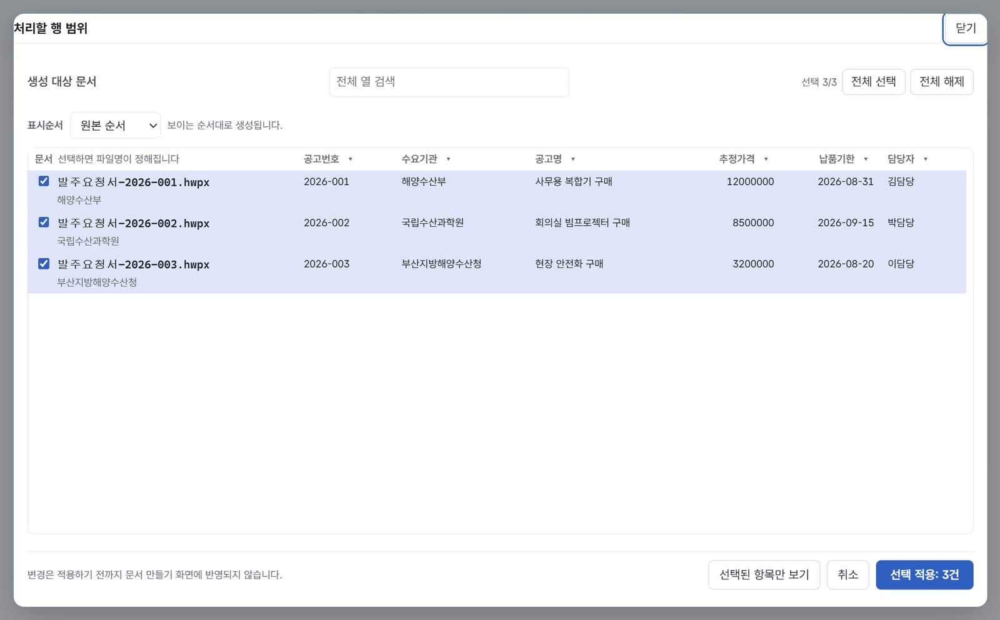
   *그림 9. 펼침 면에서 표시순서를 「원본 순서」로 바꾼 상태. 아래 줄이 적용 전임을 말한다.*

4. **본문 확인**으로 내려간다. 여기는 한 줄이다 — **빈 값 없음 · 이름 3건** 처럼
   *빈 값이 있는지*와 *이름이 몇 건인지*만 말하고, 값 자체는 **[생성 값 미리보기 ⤢]** 로
   확인 면에서 본다(값을 말하는 표면은 그 면 하나다). 빈 값이 있으면 이 줄이 어느 필드가
   비는지 이름으로 지목한다.

   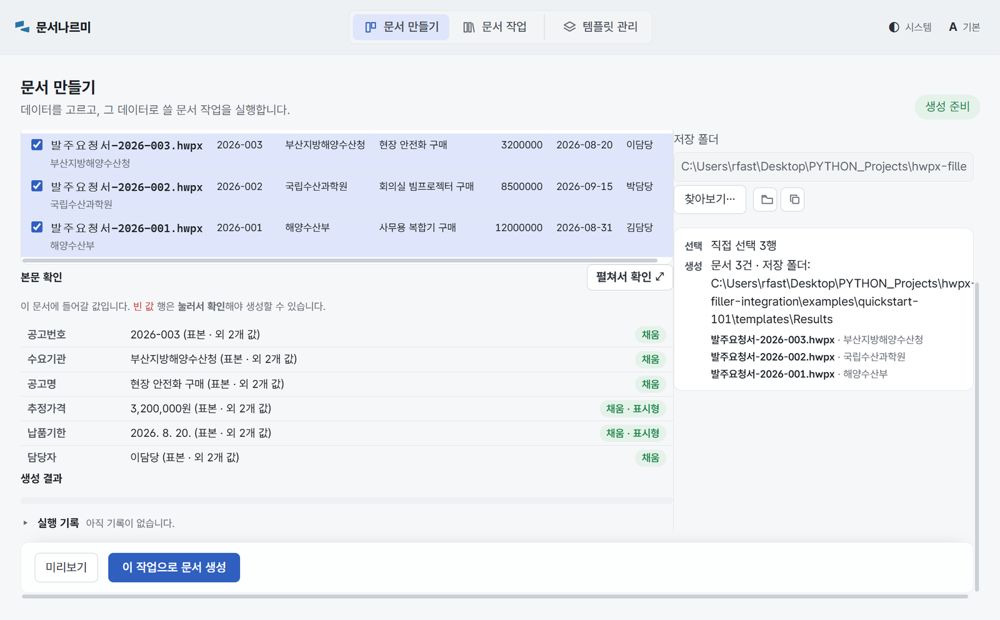
   *그림 10. 본문 확인 한 줄 — 빈 값 유무·이름 건수, 그리고 값으로 가는 출구.*

5. 하단 **[이 작업으로 문서 생성]** 을 누른다. 진행바("생성 중… 1/3")가 돌고, 끝나면
   **생성 결과** 구획이 선다: **"문서 생성 완료 · 3개"** 제목, `완료. 성공 3/3, 실패 0.`
   요약, 저장 폴더와 열기·복사 버튼. 일부만 실패하면 같은 자리가 **"N개 성공 · M개 실패"**
   로 서고 실패한 행이 *어느 항목인지·왜인지*와 함께 남는다(원인을 못 찾았으면 「원인 진단
   미연결」이라고 말한다 — 지어내지 않는다). 그 아래 **실행 기록**은 접혀 있고
   (평상시 노이즈), 마지막 한 줄만 요약에 보인다 — 펼치면 이 세션의 사건 이력이 나온다.

   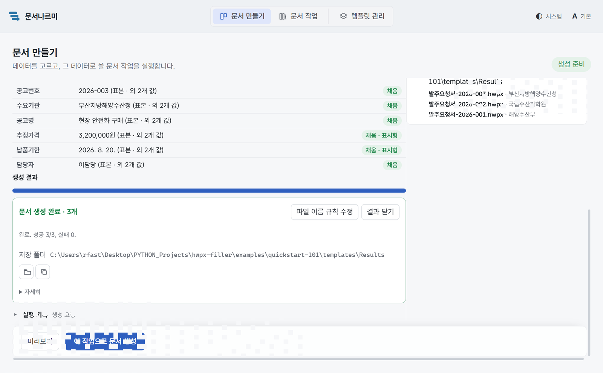
   *그림 11. 생성 결과 구획 — 완료 태·요약·저장 폴더 어포던스, 그 아래 실행 기록.*

`templates\Results\` 에 `발주요청서-2026-001.hwpx` 등 3개가 생긴다. 한컴오피스로 열어
값을 확인한다(한컴 없이 실습만 해도 무방 — 생성 자체에 한컴은 필요 없다).

### 알아둘 안전장치 (조용히 넘어가지 않는다)

원칙은 **"묻고 확정하게 하라, 아니면 시끄럽게 알려라"** — 애매하면 조용히 진행하지 않는다.

- **빈 값은 승인을 다시 받는다.** 어떤 필드가 비면 **본문 확인** 한 줄이 그 필드 이름을
  지목하고, 확인 면의 **[이 이름과 값으로 승인]** 이 그 빈 값까지 함께 승인한다. 이미
  한 번 만든 작업이라도 **새 데이터에서 빈 값이 새로 생기면 승인을 다시 묻는다.**
  그렇게 생성하면 그 자리에 `〘미입력·필드명〙` 표식이 들어간다 — 빈칸인 채로 사라지지
  않는다.
- **같은 이름 파일이 있으면 덮어쓰기 확인.** 저장 폴더에 같은 파일명이 있으면
  **"덮어쓰기 확인"** 대화상자가 목록과 함께 뜨고, **[덮어쓰고 생성]** 을 눌러야
  진행한다(손보정했을 수 있는 기존 산출물을 말없이 파괴하지 않으려고).
- **템플릿에 미해결 토큰이 있으면 1단계가 막힌다.** `{{토큰}}` 이 누름틀로 컴파일되지
  않은 채 남아 있으면 **[비우고 진행 확인 (N개 토큰)]** 을 눌러 직접 확인해야 넘어간다.
  (101 예제 템플릿은 전부 컴파일돼 있어 이 게이트를 만나지 않는다.)

---

## 트랙 B — 기안 텍스트 (TXT 작업으로 채워 복사)

완성 문서(.hwpx)가 아니라 **평문 초안**을 값으로 채워 메일·메신저·온나라 기안창에
붙여넣고 싶을 때다. 저장 없이 채워 복사하던 '기안' 화면은 없어졌다 — 같은 일을
**TXT 작업을 한 번 저장한 뒤 검토·복사 작업대**에서 한다. 작업이 저장돼 있으니
다음번엔 데이터만 겨눠 바로 검토·복사로 간다(트랙 A 와 같은 리듬).

### ① TXT 작업 만들기 — 한 번

1. **문서 작업** 탭 → **[＋ 새 작업]**. 편집기 템플릿 목록의 **TXT 기안** 구획에서
   `발주요청_기안` 행의 **[이 템플릿으로]** 를 누른다. TXT 작업은 파일을 만들지
   않아 자리(탭)가 *템플릿 → 필드 연결·표시* 둘뿐이다(「파일 이름」 없음).
2. **[다음 ▶]** → **[파일 선택…]** 으로 `data/발주목록.csv` → **[모두 확정]** 으로
   **확정 6/6** → 화면 머리의 작업 이름에 `발주요청 기안` → **[작업 저장]**.
   (여기서 고른 CSV 는 이 단계의 매핑을 맞추는 데만 쓰인다 — 트랙 A 와 마찬가지로
   저장이 데이터를 등록하지 않는다.)
3. **[← 원래 업무로 돌아가기]** 로 나온다.

### ② 검토·복사 — 반복

1. **문서 작업** 탭에서 `발주요청 기안` → **[문서 만들기에서 사용]**. 트랙 A 에서 고른
   `발주목록` 이 아직 물려 있으므로 **데이터를 다시 고를 필요가 없다** — 데이터는 작업이
   아니라 화면이 들고 있어서 작업만 바뀐다(하단 액션바 이름이 `발주요청 기안` 으로
   바뀌는 것으로 확인한다). 3건이 그대로 있으니 → **[전체 선택]**. 실행 버튼이
   **[검토·복사 시작 · 3건]** 으로 서 있다 — TXT 작업은 파일을 만들지 않으니 실행이 곧
   검토·복사다.
2. 누르면 **검토·복사 작업대**가 열린다. 오른쪽 카드가 현재 항목 값으로 채워져 있고
   (값 자리는 음영 — 보이는 그대로가 복사 결과다), 왼쪽 **필드 연결·표시** 표에서
   토큰↔열 대응을 그 자리에서 손볼 수 있다(고친 것을 작업에 남기려면
   **[기본 규칙으로 저장…]**).

   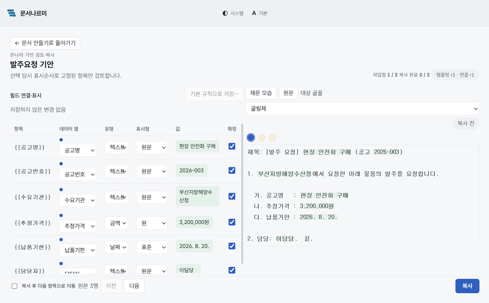
   *그림 12. 검토·복사 작업대 — 왼쪽 필드 연결, 오른쪽 채운 카드. 상단이 작업점·복사 진행을 센다.*

3. 하단 **[이전] / [다음]** 으로 행(작업점)을 넘기며 확인하고 **[복사]** — 클립보드에
   들어간다. **"복사 후 다음 항목으로 이동"** 을 켜 두면 복사할 때마다 다음 행으로
   넘어가 여러 건을 연달아 처리하기 좋다. 상단 **복사 완료 1 / 3** 카운터가 진행을
   말한다.

   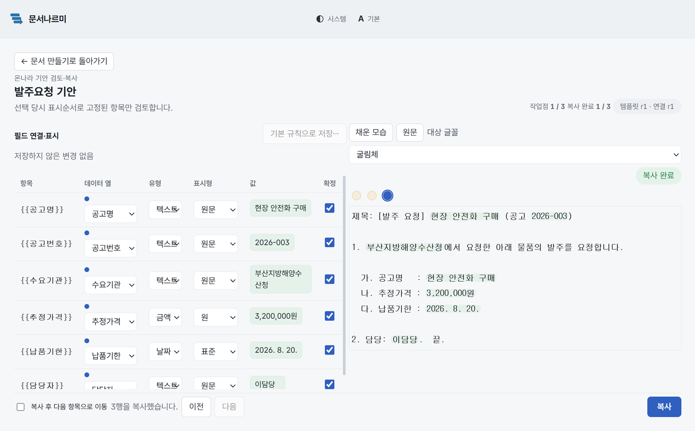
   *그림 13. 복사 뒤 — 카운터가 오르고 완료 노트가 남는다. 남은 건이 있는 채로 나가면 확인을 묻는다.*

여기서도 **없는 항목은 조용히 사라지지 않는다.** 초안이 데이터에 없는 토큰을 참조하면
작업 저장 때 편집기가 **'비움으로 확정'** 을 묻고, 작업대 카드에는 그 자리가
**(빈 값)** 으로 남는다 — 왼쪽 표에서 다른 열을 연결하거나 값을 직접 입력해 채울 수 있다.

---

## 막히면 — 문제 해결

**직접 재현해 보기**: `오류연습_미치환` 으로 TXT 작업을 하나 더 만들어 보라(트랙 B ①과
같은 순서). 이 초안은 일부러 데이터에 없는 `{{담당연락처}}` 토큰을 갖고 있다 —
**[모두 확정]** 때 **'비움으로 확정'** 게이트가 서고, 작업대 카드에는 아래 그림처럼 그
자리가 **(빈 값)** 으로 남는다. 어떻게 생겼는지 미리 봐 두면 실무에서 당황하지 않는다.

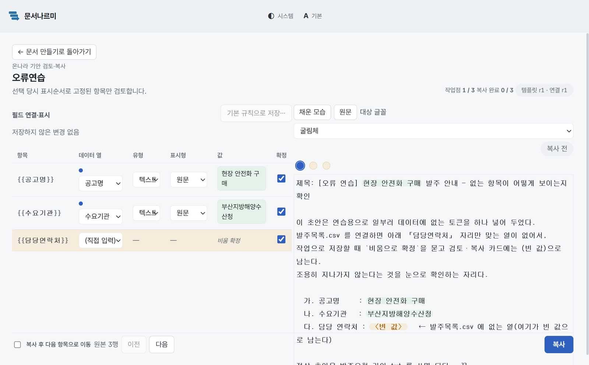
*그림 14. 데이터에 없는 항목은 비움 확정을 거쳐 (빈 값)으로 남는다 — 왼쪽 표에서 채울 수 있다.*

| 증상 | 원인·해법 |
|---|---|
| 템플릿 라이브러리가 비어 있다 | 앱을 `start-101.cmd` 로 실행했는지 확인 — 홈이 이 폴더로 잡혀야 `templates/` 가 뜬다 |
| 매핑이 자동 제안되지 않는다 | CSV 헤더와 필드명이 정확히 같아야 한다(공백·괄호 차이도 다른 이름) — 매핑표에서 직접 열을 고르면 된다 |
| 생성 버튼이 잠겨 있다 | 버튼 옆 캡션이 이유를 말한다. 대개 데이터를 안 골랐거나, 행을 안 골랐거나, 「생성 값 미리보기」에서 승인을 안 한 것 |
| 작업대 카드에 `(빈 값)` | 데이터에 그 이름의 열이 없다 — 왼쪽 「필드 연결·표시」에서 다른 열을 연결하거나 값을 직접 입력한다 |
| 실습을 처음부터 다시 | `reset-101.cmd` 더블클릭(예제 자산은 남고 실습 상태만 지워진다) |

---

## 다음 걸음

| 하고 싶은 것 | 어디로 |
|---|---|
| 한 데이터→여러 템플릿 / 여러 데이터→한 템플릿 / 작업 전환 | [102 — 세 가지 실전 조합](PATTERNS.md) |
| 내 초안(평문 {{토큰}} hwpx)을 누름틀 템플릿으로 | 편집기 「템플릿」 자리 → 카드 **[누름틀 변환]** |
| 데이터 파일을 고정해 생성 때마다 재사용 | **[데이터 선택…]** → **[이 데이터 고정…]** |
| 템플릿이 많아지면 그룹으로 정리 | 편집기 「템플릿」 자리 — 그룹 지정·접기 |
| 더 큰 실사용 예제 | [`tests/corpus/scenario/`](../../tests/corpus/scenario/README.md) |

## (참고) 예제 자산·스크린샷 다시 만들기

`templates/*.hwpx` 와 `data/*.csv` 는 손으로 편집하지 말고 스크립트에서 파생한다
(같은 입력 → 같은 출력). 필드·데이터를 바꾸려면 `make_template.py` 안의
`FIELDS`·`RECORDS`·`TEMPLATES` 를 고치고 다시 실행한다:

```powershell
uv run python examples/quickstart-101/make_template.py
```

`text_templates/*.txt` 는 평문이라 스크립트 없이 그냥 손으로 편집하면 된다
(단, 정상 초안의 토큰은 `FIELDS` 에 있는 이름만 써야 채워진다 —
`오류연습_미치환.txt` 만 예외로, 없는 토큰 `{{담당연락처}}` 를 **일부러** 갖고 있다).

이 문서의 스크린샷(`img/`)도 자동 재생성이다 — UI 가 바뀌면 실앱을 띄워 실습을 통째로
완주하며 다시 찍는다(깨끗한 상태 전제, `reset-101.cmd` 먼저):

```powershell
uv run --extra gui python scripts/capture_101_screenshots.py capture
```

같은 실습을 **그림 없이 동작만** 검사할 수도 있다. 이쪽은 이 폴더가 아니라 임시 홈에
자산을 복사해 돌기 때문에 실습 상태를 건드리지 않는다:

```powershell
uv run --with pillow --extra gui python scripts/capture_101_screenshots.py check
```

두 명령 모두 실습을 **실제로** 완주하므로 OS 클립보드를 한 번 덮어쓴다(작업대의
**[복사]** 를 진짜로 누른다). 지금 클립보드에 둔 것이 있으면 먼저 챙겨 두자.

자산과 문서가 어긋나지 않게 저장소의 live101 게이트(`tests/test_quickstart_101_live.py`)가
커밋된 자산으로 이 101 여정을 실제 완주하고 산출물·캡처 지점을 판정한다. 경계는 이렇다 — **학습 자산**
(템플릿·CSV·txt)은 앱에서 열리는 데 이 폴더 밖 의존이 없지만, **런처·재생성 스크립트·
테스트는 저장소 체크아웃 전제**다(`start-101.cmd` 는 저장소 루트의 uv 환경으로 실행한다).
그래서 이 실습은 저장소 안에서 한다 — 설치본(exe) 사용자용 예제 동봉 경로는 별도
후속(#284)이다.
